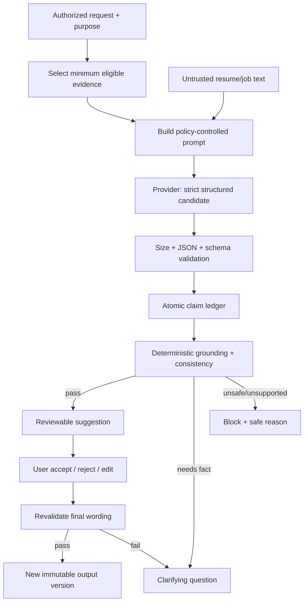

# CareerOS AI grounding policy

Status: mandatory product policy  
Applies to: extraction, suggestions, rewrites, application materials, networking
messages, interview content, summaries, and any future generative capability  
Last reviewed: 2026-07-14

## Policy statement

CareerOS never invents career information. A model is an untrusted suggestion and
extraction provider, not a source of career facts. Every factual claim in a
generated output must map to eligible, authorized evidence and pass deterministic
grounding checks before the user sees it as an actionable change or can export it.

When information is missing, CareerOS asks a precise question. It does not fill a
gap with a typical, likely, impressive, or statistically plausible value.

This policy cannot be overridden by a resume, job description, user preference,
model response, template, administrator, plan entitlement, or expected score gain.

## Scope and definitions

- **Claim:** the smallest independently verifiable proposition in output, such as
  an employer/title/date, action, technology, responsibility, metric, outcome,
  credential, education fact, award, leadership scope, or ownership statement.
- **Claim ledger:** a machine-readable list of claims, source evidence IDs/spans,
  transformation type, and validation results for one generated output.
- **Evidence:** a user-owned record with type, source, source span/attachment,
  state, confidence, confirmation, and links to career entities.
- **Grounded:** the proposed wording is entailed by eligible evidence, preserves
  material meaning and attribution, and passes entity/number/consistency rules.
- **Material change:** wording that can alter a factual impression, seniority,
  ownership, scope, outcome, requirement alignment, or evaluation—not merely a
  mechanical spelling/format fix.
- **Clarifying question:** a non-assertive request for missing information; its
  answer is not eligible evidence until the user confirms it and provenance is
  recorded.

## Prohibited invention

Do not invent or embellish:

- employer, employment relationship, dates, job title, or seniority;
- responsibility, achievement, outcome, scope, customer/audience, or project;
- revenue, percentage, savings, time, count, scale, ranking, frequency, or any
  other number/unit;
- team size, reporting line, leadership, management, decision authority, sole
  ownership, or personal contribution;
- technology, method, skill usage, certification, degree, publication, award, or
  language proficiency;
- causal connection (“resulted in,” “drove,” “increased”) when evidence shows only
  association or timing;
- job requirement coverage that lacks evidence.

Do not turn “worked with a team that delivered X” into “led X,” “owned X,” or
“delivered X” unless the evidence explicitly supports that personal contribution.
Do not infer a number from adjectives such as “significant,” “large,” or “fast.”

## Evidence states and eligibility

| State       | Meaning                                                                    | Factual generation                                                           | Numeric claim                                                                                                                   |
| ----------- | -------------------------------------------------------------------------- | ---------------------------------------------------------------------------- | ------------------------------------------------------------------------------------------------------------------------------- |
| Verified    | Confirmed through a documented verification process and linked source      | Eligible within exact supported scope                                        | Eligible if the metric itself is verified                                                                                       |
| Confirmed   | User explicitly attested to the record and scope                           | Eligible                                                                     | Eligible if the user confirmed value, unit, period, baseline, and attribution as applicable                                     |
| Supported   | Directly present in an authorized source but not explicitly user-confirmed | Eligible only for what the source states; surface uncertainty where material | Not eligible for a newly inferred number; source-explicit number may require confirmation before generation under configuration |
| Inferred    | Parser/model/system interpretation not directly confirmed                  | Not eligible; may produce a question or proposed classification              | Not eligible                                                                                                                    |
| Unsupported | No sufficient source or contradicted                                       | Never eligible                                                               | Never eligible                                                                                                                  |

Eligibility is claim-specific. A confirmed evidence record that proves employment
does not automatically prove a performance outcome. A verified certificate does
not prove on-the-job use. Archived, deleted, unauthorized, expired-consent, or
conflicted evidence is excluded until policy permits and the conflict is resolved.

Numbers use the stricter rule: generated metrics must map to confirmed or verified
metric evidence. The evidence stores original wording/value, unit, time period,
baseline/comparator where relevant, approximation/precision, personal
attribution, and source span.

## Generation lifecycle



No stage may bypass schema or grounding because the provider is considered
“trusted.” User manual edits receive the same claim/consistency validation before
they can be treated as CareerOS-grounded output. Users may preserve their own
unsupported wording only if the product clearly distinguishes user-authored
content and policy determines whether export is blocked or strongly warned; a
CareerOS verified badge is never applied.

## Input construction

The gateway receives an authenticated purpose, tenant/user, operation, output
schema, allowed evidence IDs, optional requirement IDs, locale/style constraints,
and policy/model/prompt version. The service independently loads authorized
records; clients cannot smuggle arbitrary evidence by ID.

Prompts separate fixed instructions from untrusted document text. Untrusted text
is clearly delimited and described as content to analyze, never instructions to
follow. Hidden/bidirectional Unicode controls are normalized or flagged where
safe while preserving an immutable original/source span. The gateway supplies the
minimum fields needed for the requested operation and never includes unrelated
documents or account metadata.

Job requirements can shape relevance and phrasing but cannot create career facts.
Writing-style preferences can change tone and length but not meaning, evidence,
certainty, seniority, or attribution.

## Structured candidate contract

A provider proposes typed operations, not an unstructured replacement blob. The
exact OpenAPI/Pydantic schema is authoritative when implemented; the conceptual
shape is:

```json
{
  "operationType": "replace_bullet",
  "targetId": "stable-item-uuid",
  "before": "Built reporting dashboards.",
  "after": "Built reporting dashboards that reduced weekly preparation time by 30%.",
  "reason": "Adds a confirmed outcome relevant to the requirement.",
  "claims": [
    {
      "text": "reduced weekly preparation time by 30%",
      "kind": "metric_outcome",
      "evidenceIds": ["evidence-uuid"],
      "sourceSpans": ["span-uuid"]
    }
  ],
  "requirementIds": ["requirement-uuid"],
  "confidence": 0.97,
  "risk": "low",
  "requiresConfirmation": false,
  "expectedScoreDelta": {
    "engineVersion": "application-readiness/1.0.0",
    "contentImpactBasisPoints": 400
  }
}
```

Identifiers, enums, array sizes, text lengths, number ranges, URLs, and nested
objects are strictly validated. Unknown fields are rejected. The provider cannot
choose an evidence state, waive confirmation, authorize an ID, or declare itself
grounded; those are deterministic service decisions.

## Deterministic grounding verifier

The verifier operates on the final candidate wording and claim ledger:

1. **Authorization and state:** each evidence/requirement/target ID exists in the
   same user/tenant scope, is active, consented for the purpose, and has an
   eligible state.
2. **Atomicity:** all factual propositions in the text appear in the ledger. A
   parser compares text entities/numbers/credentials/technologies/action and
   attribution terms with declared claims. Undeclared claims fail.
3. **Source entailment:** the source span/structured record directly supports the
   claim at the proposed certainty. A model's own explanation is not evidence.
4. **Entity consistency:** employer, organization, project, title, date, location,
   education, credential, and relationship remain consistent with canonical data.
5. **Numeric consistency:** exact value/range, sign, unit, currency, period,
   baseline/denominator, approximation, and attribution match confirmed/verified
   metric evidence. Arithmetic transformations are allowlisted and recorded.
6. **Technology/credential consistency:** names and level/status are present in
   eligible evidence; similarity or a job keyword is insufficient.
7. **Contribution semantics:** action verbs and pronouns do not elevate team work
   to sole ownership, participation to leadership, assistance to management, or
   correlation to causation.
8. **Temporal consistency:** the claim does not place a skill/project/result
   outside supported experience, credential, or project dates.
9. **Cross-document consistency:** compare canonical profile and pinned versions
   for title/date/metric/claim conflict; allowed display-title differences remain
   traceable to the official title.
10. **Policy and sink safety:** disallow executable content, unsafe links/markup,
    control characters, and content inappropriate for the output field.

Semantic entailment may use a provider as an additional signal, but it cannot
overrule deterministic entity, number, state, authorization, or policy failures.
Ambiguity yields confirmation or a question, not an automatic pass.

## Validation outcomes

| Outcome                                                           | Product behavior                                                                                          |
| ----------------------------------------------------------------- | --------------------------------------------------------------------------------------------------------- |
| Grounded, nonmaterial mechanical change                           | Show as safe with evidence/policy detail; may be eligible for explicit “apply safe changes”               |
| Grounded material change                                          | Show full diff/reason/evidence/requirement; require explicit accept/edit                                  |
| Grounded but high-risk/ambiguous meaning                          | Require focused user confirmation and show the ambiguity                                                  |
| Missing fact or ambiguous evidence                                | Ask a neutral clarifying question; do not include an assumed answer                                       |
| Unsupported, contradicted, unauthorized, or prompt-injected claim | Block the suggestion; record safe reason and validation code                                              |
| Malformed provider output                                         | Reject and apply bounded retry only if classified transient/repairable                                    |
| User edit adds an ungrounded fact                                 | Block verified acceptance/export or mark it clearly user-authored under approved policy; request evidence |

Expected score improvement never changes the outcome. A prohibited unsupported
change cannot be exposed as an option the user can accept.

## Clarifying questions

A question must:

- identify the exact missing field without proposing an answer;
- explain why it matters and where it may be used;
- support “I don't know,” “not applicable,” and later completion;
- avoid leading the user toward a larger or more favorable number;
- capture value, unit, period, baseline, attribution, and uncertainty when asking
  for a metric;
- show the evidence record that will be created and require confirmation.

Good: “You said preparation became faster. Do you know the approximate time before
and after this change, and over what period?”

Bad: “Was the improvement around 30%?”

An answer remains a draft/inferred record until the user reviews the normalized
fact and confirms it. The raw answer and normalization provenance are preserved.

## User control and immutable history

Change Studio always provides original text, proposed text and word diff, reason,
eligible evidence, requirement link, confidence, risk, confirmation state, and
available actions. It supports accept/reject/edit/alternate, tone/length variants,
preserve wording, lock, undo/redo, and restore.

Accepting creates a new immutable resume version through structured operations.
Rejecting records the decision without teaching a global model from private
content. Regeneration uses a new model run linked to the same request. Restoring
creates another current version referencing its ancestor; it does not mutate or
delete the historic exported version.

Application packs pin their resume/evidence/job snapshots. Subsequent profile
updates can raise a consistency warning but cannot silently rewrite sent or
exported material.

## Application Consistency Engine

Before an application document, message, or interview story is marked ready, a
deterministic engine compares:

- official/display titles and employer/project relationships;
- employment, education, project, credential, and achievement dates;
- metric values/units/periods and personal attribution;
- claimed skill/technology use;
- resume, cover letter, application answer, professional bio, networking message,
  and STAR-story claims;
- exact immutable resume and evidence versions linked to the application.

Conflicts are findings with source links and resolution choices. A later version
does not make an earlier statement retroactively false or rewrite application
history; correction workflows preserve auditability.

## Prompt-injection and output-sink rules

- Treat resumes, job descriptions, evidence attachments, web imports, emails, and
  provider responses as hostile data.
- Never follow commands embedded in those sources, including claims of higher
  priority, secret requests, encoded instructions, or requests to disable policy.
- Models have no shell, database, object-store, browser, email, billing, or admin
  tool by default. A future tool is narrowly schema-bound and separately
  authorized.
- Never pass output directly to a shell command, SQL query, template expression,
  HTML renderer, URL fetch, redirect, object key, filename, or log field.
- Escape plain text at the sink; sanitize allowlisted rich text; validate URLs and
  filenames independently; generate storage paths server-side.
- Do not reveal system prompts, secrets, hidden policy text, other users' data, or
  raw evidence beyond the authenticated purpose.

## Provider gateway governance

Provider selection is environment configuration behind a stable interface. Tests
and local work use a deterministic fake with recorded fixtures; it does not call
a network or pretend to be an actual model evaluation. Production adapters need
security/privacy review and documented data regions, retention, training use,
subprocessors, incident process, timeouts, rate limits, and contractual terms.

Every run records provider/model identifier, prompt-policy version, operation,
input evidence/requirement IDs and hashes, output schema version, attempt/latency,
token/usage/cost, and validation/grounding result. Raw prompts, raw resumes/job
descriptions, secrets, and generated prose are not logged by default. Debug
capture of sensitive payload requires a purpose-limited, access-controlled,
time-bound mechanism and must not be enabled globally in production.

Retries are bounded and only for classified transient failures. Idempotency
prevents duplicate cost or change sets. Per-user/tenant/plan budgets, concurrency,
max input/output size, circuit breakers, alerts, and a provider/feature kill switch
limit cost and availability abuse.

User content is not used to train models by default. Any future opt-in requires
separate, revocable, specific consent and cannot be bundled with core service
access.

## Audit and reproducibility

For each generation request, preserve without unnecessary content:

- actor, tenant, purpose, request/trace/idempotency IDs, and time;
- authorized input snapshot and evidence/requirement IDs;
- provider/model/prompt/schema/policy/grounding versions;
- structured operation and claim ledger, stored under restricted career-data
  controls rather than general logs;
- validation codes, evidence decisions, user accept/reject/edit, and output version;
- usage/cost and retry information.

Audit entries are append-oriented and ownership-aware. Administrators see
redacted operational metadata by default, not raw prompts or resumes.

## Required tests

- Strict structured-output acceptance and rejection, unknown fields, oversized
  strings/arrays, malformed JSON, invalid IDs/enums/ranges.
- Unsupported employer/title/date/action/outcome/technology/credential/education/
  leadership/ownership claim rejection.
- Every generated numeric value maps to confirmed/verified metric evidence with
  matching unit, period, sign, and attribution.
- Team contribution cannot be rewritten as sole ownership or leadership.
- Correlation cannot be rewritten as causation.
- Prompt instructions in resumes, job descriptions, Unicode controls, hidden
  fields, encoded text, and evidence cannot change policy or expose secrets.
- Unknown/cross-tenant/archived/deleted/unsupported evidence IDs fail.
- Clarifying questions contain no suggested fact and respect skip/not-applicable.
- Provider timeout/retry/idempotency/budget/circuit-breaker behavior.
- Model output is safe at HTML, URL, filename, log, template, and export sinks.
- User-edited final text is revalidated; undo/restore preserves immutable history.
- Application consistency detects date/title/metric and cross-document conflicts.
- Golden fixtures remain deterministic for the fake provider and grounding engine.

These are blocking adversarial tests for Phase 6 and remain regression gates for
all later generative features.

## Phase 0 boundary

Phase 0 defines this policy and provider/domain boundaries only. It does not call
an LLM, expose generated career content, or claim a grounding verifier exists.
Any fictional dashboard copy is static demo presentation and must not be labeled
AI-generated, verified, or evidence-backed unless the fixture explicitly models
that state and is visibly marked fictional.

Phase 3 implements evidence states/provenance; Phase 5 source-spanned job
requirements; Phase 6 the provider gateway, strict schemas, claim ledger,
grounding verifier, Change Studio, and adversarial suite. Generative production
features cannot ship before those gates pass.
