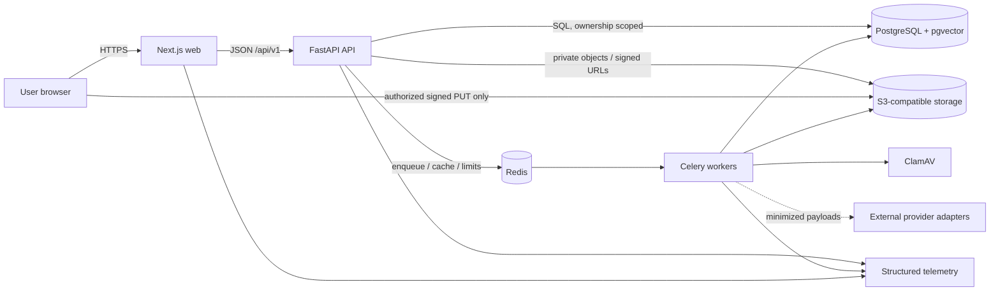
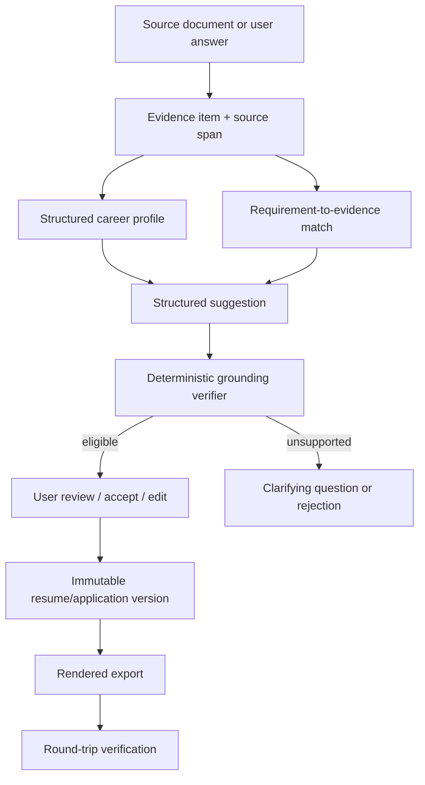

# CareerOS architecture

Status: accepted target architecture; Phases 8 and 9 complete and hosted verified
Last reviewed: 2026-07-25

## Architectural objective

CareerOS maintains a user-owned, structured, evidence-backed career record and
derives reviewable outputs from it. The architecture optimizes for factual
integrity, explainability, tenant isolation, secure document processing,
accessible user control, and replacement of external providers without rewriting
the domain.

The architecture described here is the target. `PLANS.md` is authoritative for
what the current working tree actually implements.

## Implementation alignment status

The repository implements the Phase 0 shared backend/root workspace, the Phase 1
identity boundary, the Phase 2 Resume Health module, the Phase 3 Career Record
bounded context, the Phase 4 Role Explorer bounded context, and the Phase 5 Job
Match bounded context used by thin API and web adapters. It also implements the
Phase 6 Change Studio bounded context for truth-locked suggestions, claim-ledger
grounding, user-controlled review actions, immutable output versions, and
provider-run metadata. Phase 7 adds the Resume Builder bounded context for
structured resumes, immutable versions, deterministic synchronous rendering,
initial round-trip verification, private exports, and short-lived download
intents. Phase 6 and
Phase 7 consume upstream modules only through application boundaries; they do not
read another module's tables directly or let clients choose evidence as
grounding authority. Phase 8 adds the Application Workspace bounded context for
owner-scoped workflow, immutable job/resume/evidence pins, paginated activity,
grounded packs, consistency findings, deletion, and purpose-minimized Phase 9
query views. It also consumes upstream modules only through owner-authorizing
application interfaces. Historical evidence and the completed Phase 8 local and
hosted closeout gates are recorded in `PLANS.md`.
Phase 9 adds four independent bounded contexts: `interview_prep`, `networking`,
`career_growth`, and `career_analytics`. Application Workspace supplies
purpose-minimized immutable interview/application outcome views; Career Record
supplies current eligible achievement/skill/evidence views; and Role Readiness
supplies content-free readiness history. The downstream modules consume those
views through application interfaces and never query predecessor tables
directly. Phase 9's consolidated local and security gates and PR #22 hosted
workflow run `30161489265` pass; exact evidence is recorded in `PLANS.md`.

## System principles

1. **Evidence is upstream.** Career facts and evidence precede generated text.
2. **Deterministic decisions surround probabilistic helpers.** Models may extract,
   classify, retrieve, or suggest; schemas, policy, grounding, scoring, and user
   approval decide what is usable.
3. **One ownership boundary.** Every resource access is scoped by authenticated
   subject and tenant context at the server.
4. **Asynchronous hostile work.** Parsing, scanning, OCR, AI, rendering, and
   verification run as traceable, idempotent, bounded jobs.
5. **Contracts over coupling.** The web consumes versioned API contracts; API,
   worker, and providers share domain services rather than each other's runtime
   internals.
6. **Accessible control is a correctness property.** Keyboard and mobile approval
   paths are not optional presentation enhancements.
7. **Privacy by default.** Minimize provider payloads and telemetry; never make
   raw career documents an analytics event.

## Runtime context



The browser never connects directly to PostgreSQL, Redis, or a queue. Direct
object transfer is allowed only through narrow, expiring signed operations issued
after authorization and finalized by the API.

## Monorepo structure and ownership

| Path                         | Responsibility                                                                        | Must not own                                                           |
| ---------------------------- | ------------------------------------------------------------------------------------- | ---------------------------------------------------------------------- |
| `apps/web`                   | Public and authenticated UI, accessibility, query/form state, server/client rendering | Database queries, object credentials, score formulas, grounding policy |
| `apps/api`                   | Thin HTTP validation, authorization, composition, and OpenAPI delivery                | Domain rules, persistence implementations, worker process behavior     |
| `apps/worker`                | Thin Celery process and task adapters for isolated async execution                    | HTTP composition or duplicated business rules                          |
| `packages/backend`           | Shared Python foundation and phase-owned domain/application/infrastructure modules    | Imports from API/worker deployables or generic unowned helpers         |
| `packages/ui`                | Generic accessible React primitives and reusable presentation components              | Product API calls, domain rules, or route-specific behavior            |
| `packages/design-tokens`     | Shared colors, typography, spacing, radii, and shadows                                | Product state or feature behavior                                      |
| `packages/contracts`         | Normalized OpenAPI artifact, generated TypeScript schema, and typed client wrapper    | Handwritten competing wire models, persistence models, or secrets      |
| `packages/eslint-config`     | Shared frontend lint and dependency-boundary rules                                    | Runtime behavior or credentials                                        |
| `packages/typescript-config` | Shared strict TypeScript compiler defaults                                            | Runtime behavior or credentials                                        |
| `packages/test-fixtures`     | Fictional and hostile test assets/metadata                                            | Real user data                                                         |
| `infra`                      | Container/deployment definitions and policies                                         | Product logic                                                          |

The root uv workspace contains `apps/api`, `apps/worker`, and
`packages/backend` with one committed lockfile. Both applications depend on the
backend. The backend imports neither application, and the worker never imports
the API. Container build contexts must include the root workspace while runtime
images remain independently deployable.

Within `packages/backend/src/careeros`, stable domain-independent primitives live
under `foundation`. Each product capability is added under `modules/<feature>`
only in its owning phase, with `domain`, `application`, `infrastructure`, `api`,
`tasks`, and tests as real behavior requires. Provider SDKs stay under
`integrations`. Domain code is framework-independent; application code depends on
ports; infrastructure implements those ports; HTTP routes and worker tasks remain
thin adapters. Cross-module reads use explicit services, query interfaces, or
events rather than another module's tables.

This superseding foundation decision is recorded in
[ADR 0007](adr/0007-shared-modular-monolith-and-generated-contracts.md).

## Foundation technology

| Concern      | Choice                                                          | Notes                                                                           |
| ------------ | --------------------------------------------------------------- | ------------------------------------------------------------------------------- |
| JS workspace | pnpm 11.13.0, Node.js 24                                        | One root lockfile; Corepack pins package-manager behavior                       |
| Web          | Next.js 16.2.11, React 19.2.7, TypeScript 5.9.3, Tailwind 4.3.2 | App Router; strict types; server components by default where appropriate        |
| Python       | Python 3.13, uv 0.11.21                                         | One root workspace/lock for API, worker, and shared backend                     |
| HTTP         | FastAPI 0.138.2, Pydantic                                       | OpenAPI contract and validation boundary                                        |
| Persistence  | SQLAlchemy 2 async, asyncpg, Alembic                            | PostgreSQL is authoritative; migrations arrive with owning models               |
| Async work   | Celery 5.6.3, Redis locally                                     | Task envelopes require idempotency, ownership, retries/timeouts, traceability   |
| Objects      | MinIO locally, S3-compatible production interface               | Private bucket, randomized keys, encryption and lifecycle policy                |
| Semantics    | pgvector when justified                                         | Retrieval aid only; not a substitute for relational provenance or scoring rules |

## Domain model

The model is organized into bounded areas rather than a single resume table:

- **Identity and access:** users, profiles, sessions, refresh tokens, OAuth
  accounts, organizations/members, consent, audit events.
- **Career record:** career profiles, experience, education, projects, skills,
  credentials, publications, awards, languages, goals, and preferences.
- **Evidence graph:** evidence items/sources/attachments/metrics and links from
  evidence to experiences, skills, requirements, claims, and outputs.
- **Documents and resumes:** source documents, processing jobs, canonical resumes,
  immutable versions/sections/items/templates, exports, and verification reports.
- **Roles and jobs:** role definitions/competencies, saved roles, jobs, source-
  spanned requirements, matches, and analyses.
- **Scores and changes:** analysis versions, feature/component values, findings,
  structured change sets/operations, model and prompt runs.
- **Career workflow:** applications/events/tasks/documents, contacts/interactions,
  interviews/questions/stories, offers, achievements, learning, and reviews.
- **Commercial:** plans, entitlements/subscriptions, usage, and billing events.

Externally visible identifiers are UUIDs. Rows carry `created_at`, `updated_at`,
and explicit ownership. `deleted_at` is added only when recovery, retention, or
async erasure requires it. Mutable aggregates that can be edited concurrently use
a version number or equivalent conditional update.

### Source-of-truth and provenance model



A source document is provenance, not automatic truth. Parser confidence and user
confirmation remain distinct. Derived output stores the exact evidence IDs and
policy/model/prompt versions used so later evidence changes do not rewrite history.

### Career Record consistency and authority (Phase 3 implementation)

`careeros.modules.career_record` is one transactional bounded context for factual
career presentation, typed career entities and skills, evidence, conflicts,
import proposals, Achievement Inbox, reminder preferences, and append-oriented
redacted audit. Account display, locale, timezone, onboarding, and target-search
preferences remain authoritative in the Phase 1 identity profile; Phase 3 does
not duplicate or dual-write them.

Evidence lifecycle (`active`, `archived`, or deleted) is independent from
strength (`Verified`, `Confirmed`, `Supported`, `Inferred`, or `Unsupported`).
Clients never choose the resulting strength. Manual and external-URL provenance
begins Inferred; an exact server-validated Resume Health span can begin Supported;
the owner can explicitly attest to a complete claim as Confirmed. Only a
server-side `VerificationAuthority` decision could assign Verified, and no such
provider is configured in Phase 3, so production APIs cannot create it. Material
edits preserve the prior immutable revision and return the new revision to
Inferred.

Later modules must use the owner-scoped eligibility query rather than inspecting
Career Record tables or trusting client-selected evidence IDs. That boundary
excludes Inferred, Unsupported, archived, deleted, conflicted, unauthorized, and
source-unavailable evidence. Numeric use also requires a Confirmed or Verified
metric with decimal value, unit/currency, period, precision, attribution, and
comparison context where applicable.

Resume Health remains the owner of documents and canonical snapshots. Career
Record reads a minimal immutable source DTO through an explicit application
query, copies bounded provenance into a pending proposal or evidence revision,
and never foreign-keys career truth to a deletable resume. Deleting the source
does not rewrite accepted career data, but source-only Supported evidence becomes
ineligible until independently confirmed or connected to another eligible source.

## Job Match Boundary

`careeros.modules.job_match` owns saved job postings, current extracted
requirements, immutable job-match analyses, requirement match rows, evidence-link
snapshots, opportunity priority analyses, idempotency fingerprints, versions, and
redacted audit events. It consumes eligible evidence through the Career Record
readiness snapshot provider and optional target-role labels through the Role
Readiness application service. It must not inspect Career Record evidence tables
or Role Readiness taxonomy tables directly.

URL imports are treated as hostile input. The default adapter accepts HTTP(S)
only, blocks credentialed URLs and non-public resolved addresses, validates every
redirect, caps bytes/time/redirects, strips scripts/styles/templates from HTML,
and returns plain text only. Application Readiness and Opportunity Priority use
versioned deterministic formulas and must show the canonical scoring disclaimer.

## Change Studio Boundary

`careeros.modules.change_studio` owns change sets, structured operations,
claim-ledger rows, clarifying questions, immutable output versions, provider-run
metadata, idempotency fingerprints, and redacted audit events. It consumes
eligible evidence through Career Record and saved job requirements through Job
Match application providers. The web and API submit an analysis ID and style
constraints; they cannot submit arbitrary evidence IDs, mark claims as grounded,
or waive confirmation.

The provider gateway is environment-selected. Development and tests use a
deterministic provider that only reuses eligible evidence text already linked to
requirements. The HTTP JSON provider is HTTPS-only, API-key configured, bounded
by timeout/retry/response-size limits, and wrapped in a circuit breaker. Provider
payloads are strict JSON candidates, not trusted prose: unknown fields, invalid
IDs/enums/ranges, unsupported facts, unsafe sink content, prompt-injection text,
and ungrounded numbers fail closed before the user can accept them.

## Resume Builder Boundary

`careeros.modules.resume_builder` owns structured resume documents, immutable
resume versions, export records, verification reports, download intents,
idempotency fingerprints, and redacted audit events. It consumes eligible
Career Record evidence through an application provider and can seed from the
current Change Studio output through an application contract. It does not inspect
Career Record, Evidence, Resume Health, or Change Studio tables directly.

Every section and bullet is server-validated before it can become the current
draft or an immutable version. Bullets must remain evidence-backed; unsupported
client edits are rejected rather than rendered. Exports are pinned to a specific
immutable version and format, rendered to private object storage, hashed, parsed
again where applicable, and blocked before download when the implemented
critical text, searchability, or grounding checks fail. Exact occurrence-count,
duplication/omission, and reading-order comparison are not yet release-blocking;
Phase 10 owns that canonical fidelity manifest.

The Phase 7 local renderer and verifier execute immediately inside the service
while persisting job status, attempts, warnings, failures, timeout/retry fields,
and dead-letter-shaped metadata. No worker currently claims those records.
Phase 10 must add a transactional outbox, fenced worker leases/recovery, and
durable object cleanup without introducing a second rendering policy.

## Application Workspace Boundary

`careeros.modules.application_workspace` owns application records, workflow
events, tasks, notes, application packs, generated documents, consistency
findings, idempotency fingerprints, and redacted audit events. It consumes a
saved job through Job Match, an immutable resume version through Resume Builder,
and eligible historical evidence revisions through Career Record application
interfaces. It does not query any upstream table directly.

Creating an application copies a bounded immutable input ledger:

- job ID, positive version, source SHA-256, latest compatible analysis ID, typed
  requirements, source spans, and exact evidence-to-requirement support links;
- resume ID, immutable version ID and number, with each claim and evidence
  reference revalidated against the resume version's normalized claim hashes; and
- evidence ID, revision ID, revision number, statement SHA-256, strength, and
  numeric-claim flag after current eligibility and historical revision checks.

The service rejects incomplete or contradictory provenance. In particular, a
legacy resume/change source without exact evidence revision identifiers,
revision numbers, statement hashes, and a valid claim-hash ledger cannot seed an
application or pack. Changing the selected resume rebuilds the evidence snapshot
and requires an explicit reason preserved with previous/next pins in workflow and
audit history; no source edit rewrites an existing snapshot.

Upgrade compatibility preserves history without inventing provenance. Migration
`20260724_0009` leaves the shipped Phase 6 migration immutable and forward-adds a
nullable all-or-none evidence revision tuple to Change Studio claims. Existing
rows remain readable as explicitly unpinned history, while Resume Builder and
Application Workspace reject them as grounding input. New claims require the
complete tuple.

Application stage/outcome/reopen rules live in the domain. Mutable application
and task operations use positive optimistic-concurrency versions. Application,
task, note, event, and pack creates use bounded idempotency keys plus request
fingerprints, while the web preserves one key for an unchanged user intent and
rotates it after an input change or successful mutation. All nested persistence
and API reads scope by owner plus application parent. Deleting a generated
document replaces its sensitive body and links with an audited tombstone;
deleting an application is ownership/version checked and preserves only a
redacted audit event.

Database constraints use the same stage/outcome vocabulary as the domain. An
omitted event time is excluded from the idempotency fingerprint and assigned only
when the create executes. A resume change, rebuilt evidence snapshot, explicit
reason, workflow event, and audit record share one database transaction.

Reads are purpose-bounded. Application lists and task/note/event/pack child
collections use opaque bounded cursor pagination; the main detail response stays
lightweight. Cursor input is checked for ASCII before strict decoding. The web
loads each activity/pack panel on demand, retains mounted draft state, performs a
conflict-safe authoritative reload, and exposes non-drag board/table/calendar
controls.
Interview preparation receives only grounded claims, evidence pins, requirements,
and basic application context without notes, contacts, or offers. Analytics
receives content-minimized workflow dimensions and milestones without notes,
contacts, generated prose, rejection text, or offer text.

The Phase 8 pack generator is deterministic and synchronous. Generated claims
may cite only the pinned evidence revisions and deterministically supported job
requirements; content and claim ledgers are hashed and checked for numeric,
source, and cross-document consistency. Blocking findings block the affected
document/pack. There is no application submission, email/social-network sending,
contact scraping, or autonomous stage transition boundary.

## Request and job flows

### Synchronous API flow

1. Edge/service middleware assigns or validates a correlation ID and applies
   request-size and rate limits.
2. The API authenticates the session, resolves tenant context, validates the
   payload, and performs an ownership-scoped lookup.
3. The service executes a short transaction, emits an audit event when required,
   and returns a versioned response/error shape.
4. Logs include safe IDs, route template, status, duration, and trace IDs—not raw
   career content.

The HTTP middleware logs the matched route template or `unmatched`, never the
raw path/query. Failure events include only an allowlisted exception class, not
the exception message, body, headers, signed URL, or parser/provider payload. An
unexpected exception is converted to a generic no-store `internal_error` problem
at this boundary rather than being re-raised to the server logger.

### Asynchronous flow

1. The API creates a durable job row and outbox/enqueue intent with user ownership
   and an idempotency key.
2. A worker claims a task with a fresh per-invocation fencing token, checks
   cancellation/ownership/state, and runs with a timeout, bounded retry policy,
   durable lease longer than its hard timeout, and trace context.
3. Progress and sanitized error details update durable job state. Poison jobs move
   to dead-letter handling; unsafe automatic retries are prohibited.
4. The web polls a status resource initially; server-sent events or push
   notification may be introduced after measuring need.

If an overlapping delivery sees a live lease, it performs a delayed busy retry
after that lease must expire. A successor can reclaim an expired lease within the
durable attempt cap, while every stale progress/result write is rejected by its
token. The outbox publisher and object-cleanup maintenance take bounded batches,
apply bounded exponential backoff/attempts, and persist published/completed or
dead-letter state instead of silently dropping broker or storage failures. A
scheduled database-only reconciler locks stale published queued jobs, retryable
failures, and expired running leases. It fences any expired token, creates a new
durable outbox generation, and dead-letters work that has exhausted either its
processing or recovery budget.

All AI work stores provider/model/prompt identifiers, structured-output validity,
usage/cost, and grounding outcome. All rendering work records the input version
and output hash.

### Secure document pipeline (Phase 2 implementation)

```text
read configured upload policy
  -> authorize account or opaque guest capability + reserve randomized staging key
  -> exact-origin, short-lived signed PUT with declared expected-size metadata
  -> finalize: ownership + expiry + size + media-type + signature validation
  -> promote to randomized quarantine key
  -> commit document + job + outbox in one database transaction
  -> fail-closed ClamAV scan
  -> isolated PDF/DOCX expansion/extraction + authoritative PDF page checks
  -> immutable canonical snapshot + source spans + confidence + parser warnings
  -> explicit user correction creates a new snapshot
  -> deterministic fixed-point analysis bound to that snapshot
```

The upload component keeps an issued intent, transfer completion flag, and
finalize idempotency key only in memory, which permits safe same-page retry of an
ambiguous transfer/finalize. A lost intent response or page reload cannot recover
that state and can leave quota reserved for up to the default five-minute intent
TTL; Phase 2 has no resumable or multipart transfer protocol.

The original remains immutable. The worker downloads into a fresh randomized
temporary directory on a bounded `noexec` tmpfs and deletes it on every normal or
exceptional exit. PDF/DOCX bytes are never executed. A wrong signature,
malformed/encrypted/polyglot PDF, macro-enabled DOCX, traversal/expansion bomb,
PDF page limit, universal character/artifact limit, timeout, malware result, or
unavailable required scanner fails safely. Scanner unavailability leaves the
object quarantined for bounded retry and ultimately rejects/dead-letters it
rather than parsing unchecked. DOCX has no authoritative rendered page count in
the local `python-docx` extractor; it is bounded by bytes, archive entries,
expanded size/ratio, extracted characters/blocks, and artifact size until a
rendering provider supplies layout-aware page enforcement.

The local Resume Health and evidence-attachment extractors call blocking
libraries through `asyncio.to_thread`.
Application timeout cancels the await but is not a killable per-parser process
boundary. Celery task limits and the non-root, read-only, CPU/memory/PID-bounded,
no-edge-network worker constrain the residual thread; production parser sandbox
selection remains a later hardening decision.

### Private evidence attachments (Phase 3 implementation)

Evidence attachments use Career Record-owned admission, processing, and deletion
tables rather than the Resume Health document tables. The API authorizes the
owner and evidence item before issuing a randomized private, short-lived signed
`PUT` bound to PDF/DOCX media type, exact byte length, key, and operation. Finalize
rechecks ownership, expiry, object metadata, and byte signature while holding the
parent evidence row against a delete/admission race.

The restricted worker scans fail-closed with ClamAV, applies the bounded PDF/DOCX
extractor, and stores counts/digests rather than attachment text in the public
Career Record representation. Durable jobs, identifier-only queue messages,
transactional outbox, fencing tokens, leases, bounded retry/dead letter, scheduled
lost-delivery reconciliation, and private-object cleanup close the API/broker/
object-store failure gaps. Download requires the same owner and a clean active
attachment and returns only an operation-specific short-lived signed `GET`.
Attachment presence alone never makes a factual claim Supported or eligible.

Parse, analyze, and delete requests are durable jobs. The API transaction writes
the job and an allowlisted outbox message; a scheduler publishes pending rows and
the worker reloads durable ownership/state before acting. Jobs persist progress,
cancellation, attempts, safe error code, trace ID, result ID, and dead-letter
state plus a hashed execution token and lease expiry. Queue payloads contain only
job ID and trace ID. Object-store promotion/claim compensation and orphan cleanup
create durable records with purpose, owner, next attempt, and terminal status;
explicit document deletion remains a fenced durable job and schedules a staging
cleanup backstop.

The canonical source is append-only: the parser creates revision 1, and a user
correction creates a successor with `based_on_snapshot_id` while retaining the
original values and source spans. All-no-op correction is rejected; the domain
caps each document at 50 canonical revisions and 100 analysis jobs, while the API
applies separate owner-scoped correction and analysis rate classes. A score
analysis references exactly one snapshot. Source resumes remain provenance
inputs; they do not replace the career-profile/evidence source of truth
introduced in Phase 3.

## API and contract strategy

- Product routes are versioned below `/api/v1`; health probes remain unversioned.
- OpenAPI generated by the API is authoritative for wire shape. Its normalized,
  committed artifact lives under `packages/contracts/openapi`; pinned generation
  produces the TypeScript schema consumed by a typed `openapi-fetch` wrapper. CI
  rejects export or generation drift. Generated files are reproducible artifacts,
  not parallel handwritten models.
- Errors use a stable problem envelope with machine code, human-safe detail,
  field errors, and correlation ID.
- Collection APIs use cursor pagination where datasets grow; every sort/filter is
  allowlisted and bounded.
- Side-effecting retryable requests accept an `Idempotency-Key`; reuse with a
  different payload is a conflict. Resume Health restricts keys to 8-128
  characters from `[A-Za-z0-9._:-]`; its `If-Match` values are quoted positive
  `int4` versions capped at `2147483647`.
- Breaking changes require a new API version or an explicit migration/deprecation
  window. Internal schema changes do not automatically change the public API.

See `docs/api.md` for the route inventory and examples.

## Provider boundaries

Providers return domain-neutral, validated result types and never decide policy:

- resume parsing, text extraction, layout, malware, and OCR;
- job URL import and role taxonomy;
- AI extraction/suggestion/verification assistance;
- PDF/DOCX rendering;
- email, OAuth, billing, error monitoring, and object storage.

Configuration selects a provider by environment. Tests use deterministic fakes.
Provider failure is explicit; there is no hidden fallback from a security control
to an unsafe no-op. Circuit breaking, timeouts, retry classification, usage cost,
and redacted telemetry wrap remote providers.

## Authentication and tenancy (implemented through Phase 3)

The FastAPI service owns email/password and Google OAuth account linkage.
Passwords use Argon2id. Browser sessions use secure, HTTP-only, appropriately
scoped cookies and CSRF protection. Refresh/session material is random, rotated,
hashed at rest, device/session visible, and invalidatable. Verification/reset
tokens are single-use, hashed, short-lived, and rate-limited.

Authorization uses an authenticated principal plus optional organization context.
Repository methods require ownership scope rather than accepting a bare resource
ID. Background tasks repeat the ownership check against durable records. Admin
identity is separate from tenant authority; sensitive admin reads are
least-privilege, redacted by default, and audited.

Phase 2 represents resource ownership as exactly one account user or guest
session. Guest access uses a server-hashed, opaque, short-lived capability in an
`HttpOnly` cookie plus a separate double-submit CSRF token and exact-origin check
for mutation. It is not derived from a document UUID. Guest quota is one active
intake, scheduled retention queues durable object/content deletion, and explicit
claim requires ready/completed state without an active/retryable job, copies
objects into new account-scoped keys, atomically transfers retained content/job
history, and then revokes the capability. Prior guest audit events remain
append-only under their original scope.

Phase 3 is account-only. Every Career Record row carries a non-null owner user,
and repositories query by owner plus resource identifier. Nested entity/skill/
evidence/attachment links validate both ends in the same scope; unknown and
cross-user identifiers share not-found behavior. The API reuses Phase 1 session,
CSRF, origin, request-size, and problem contracts. Positive versions and strict
quoted `If-Match` preconditions protect mutable aggregates; proposal review,
attachment finalize, and achievement conversion are idempotent.

Local Compose publishes a dedicated minimized `web-edge` image while the Next.js
web container is reachable only on the shared edge network. The final edge and
web images contain the Node runtime but remove npm, Corepack, and package-manager
executables that are needed only while building. `web-edge` strips all
client-selected address headers and overwrites them from its socket peer. The
server-only BFF normalizes that value, signs it with a shared HMAC secret, and
sends the opaque signal to the API; the API verifies it before using it as
pre-authentication and first-guest upload rate-key input. This signal is
intentionally unrelated to authentication or authorization. A cloud load
balancer changes the immediate peer, so production needs an explicit allowlisted
trusted-hop design; arbitrary forwarded headers must never be accepted as client
identity.

## Scoring and AI boundaries

Numeric scores are computed only by a deterministic, versioned engine over stored
features. Models may help extract candidate features but cannot supply the final
score or override hard-gap display. Stored score output includes engine version,
weight configuration, inputs, component contributions, missing-data treatment,
and timestamp.

Resume Health v1 is implemented without a model provider. It uses integer
fixed-point feature/component arithmetic and persists engine/configuration/
feature-schema version, the complete typed feature record, each weighted feature
contribution, and feature-set hash. It returns no number for image-only or sparse
input and emits the canonical internal-score disclaimer. The report's semantic,
keyboard-operable disclosures expose measured values and the raw/display
score-weight-contribution trace without requiring color or chart interpretation.
Exact features and weights are normative in `docs/scoring-methodology.md`.

AI output is untrusted until strict schema validation and deterministic claim-
evidence verification pass. Phase 6 implements this for Change Studio: grounded
operations show original/proposed text, reason, requirement, evidence, claim
validation, risk, and expected score effect while preserving accept/reject/edit,
alternative, lock/unlock, undo/redo, restore, and clarification-answer actions.
A material change becomes usable only through the review lifecycle. See
`docs/scoring-methodology.md` and `docs/ai-grounding-policy.md`.

## Observability

All services emit structured logs and propagate request/trace IDs. Metrics cover
request latency/error, dependency readiness, queue depth/age/retries/dead letters,
processing duration, parser/export failure, AI latency/usage/cost, rate limits,
and authentication failures. Traces carry metadata and stable identifiers only;
raw resume, job, evidence, and generated content are excluded by default.

HTTP logs use route templates rather than raw paths/queries. The application
disables payload-bearing library access loggers and emits allowlisted completion/
failure events; failure logs record only the exception class, not exception text,
headers, request/response bodies, signed URLs, or document/provider payloads.
Unexpected exceptions become generic no-store problems at the middleware
boundary instead of reaching the server traceback logger.

Liveness means the process can respond. Readiness verifies required dependencies
without disclosing credentials or topology details. A degraded optional provider
must be visible without making unrelated core paths unavailable.

## Deployment progression

Phase 0 through Phase 6 use Docker Compose for reproducible local integration.
Production targets remain deliberately unspecified until Phase 10, when the team
must decide and test:

- managed database/cache/queue/object services and regional/data-residency needs;
- separate API and restricted worker network/security policies;
- encrypted backup, point-in-time recovery, and restore exercises;
- secret management, image provenance, dependency/container scanning;
- autoscaling, cost limits, dead-letter operations, and disaster recovery;
- protected environments, migration strategy, rollback/forward repair, and
  manual production approval.

Local Compose is not a production topology.

## Phase realization

Phase 0 implements the runtime seams, Phase 1 implements identity/onboarding, and
Phase 2 adds the real `resume_health` module and secure account/guest document
workflows. Phase 3 adds `career_record`, migration `20260715_0004`, API/worker
adapters, generated contracts, the `career-vault` web feature, private attachment
processing, and focused unit/integration/browser suites. Phase 4 adds
`role_readiness`, migration `20260719_0005`, API/generated contracts, the
`role-explorer` web feature, and focused unit/integration/browser suites. Phase 5
adds `job_match`, migration `20260719_0006`, API/generated contracts, the
`job-match` web feature, and focused unit/integration/browser suites. Phase 6
adds `change_studio`, migration `20260719_0007`, API/generated contracts, the
`change-studio` web feature, deterministic local provider, HTTP provider
boundary, grounding verifier, and focused adversarial/integration/browser suites.
Phase 7 adds `resume_builder`, migration `20260719_0008`, API/generated
contracts, the `resume-builder` web feature, deterministic synchronous
PDF/DOCX/text/JSON rendering, initial round-trip verification, private export
storage, and focused integration/browser suites. Phase 8 adds
`application_workspace`, migration
`20260724_0009`, API/generated contracts, the `applications` web feature,
immutable source adapters, deterministic grounded packs, consistency/deletion
rules, cursor-paginated activity, and desktop/mobile product journeys.
Phase 9 adds four independent backend contexts: `interview_prep`, `networking`,
`career_growth`, and `career_analytics`; additive migration `20260724_0010`;
generated API contracts; the corresponding workspace web modules; a
deterministic Career Health engine; complete-watermark, timezone-aware
non-causal aggregation; and durable analytics/local-reminder worker paths.
Interview and Growth pin exact authorized evidence revisions. New Interview
question-bank and follow-up generation traverses Application Workspace's
application boundary back to live Career Record eligibility before creating
output; exact STAR-story create, generated-artifact, and career-review
finalization replays remain immutable historical results. Other mutable creates
preserve stable resource identity and return its current owner-authorized
representation; they never revive deleted or redacted content. Growth
achievement/skill insights are live derived views and are not separately
persisted as factual authority. Growth insight checks compare stored evidence
links with the live eligible revision ID/number/hash/timestamp tuple before
counting or returning them. Networking owns its append-only contact-consent
ledger, parent tombstone, purpose-specific child-redaction lifecycle, bounded
collections, and safe terminal reminder-history pruning. Analytics accepts only
purpose-minimized owner-authorized source views.

Defense-map composition validates each story's support independently, preventing
one stale story from contaminating other results. Reactivating a completed or
cancelled reminder creates a new occurrence/outbox pair without reusing terminal
work or reviving redacted content. Analytics dead-letter and expired-lease
recovery terminalize the associated job atomically so queue reconciliation cannot
leave an orphaned `queued` job.

Transaction-scoped owner, idempotency, and parent locks serialize Phase 9
collection quotas and concurrent child/generation mutations. Database constraints
and validation functions enforce Growth target ownership, exact evidence
revision number/timestamp/hash provenance on both insert and every update,
immediate review predecessors, and the review's latest version tuple.
Networking reminder occurrences carry the same owner/contact/reminder tuple as
their parent; occurrence, outbox, worker audit, and worker log context propagate
one validated trace ID; and every Networking cursor is bound to owner,
collection, parent, normalized filters, and sort semantics. Analytics
job/snapshot identity includes the selected IANA timezone. Its supplemental
freshness watermark recomputes and hashes the exact bounded, canonical-eligible
achievement and Role Readiness point set for the same guarded window used by
aggregation. Stored payload hashes and pre/post source watermarks fail tampered,
eligibility-drifted, or otherwise stale results closed. Broker messages contain
durable UUIDs rather than contact or career content.

The public Analytics window accepts a maximum 3,650-day delta. Its supplemental
adapter expands UTC selection by one day on each side, so only the internal
Career Record and Role Readiness query contracts accept the resulting 3,652-day
guarded delta. Provider validation becomes `source_limit_exceeded`; provider or
storage unavailability remains inside the Analytics boundary as
`source_unavailable`. API and worker composition share the owned Resume Health
source reader and clean-attachment status bridge, and the worker binds the
durable refresh trace before aggregation and retry logging.

No Phase 9 module imports another module's tables or adds an external send/scrape
capability. OCR providers, browser extension, Terraform, production AI/provider
decisions, external CRM/calendar connections, and production deployment
workflows remain absent until their owning phases.
Phase 10 must also replace Resume Builder's synchronous in-service render/verify
path with durable outbox-backed worker execution and make a real guarded
fictional local database/object-store seed available; persisted job-shaped
fields and the preview-only seed are not substitutes for those capabilities.

## Architecture verification

Every phase retains the repository gates plus architecture-boundary,
OpenAPI-generation drift, migration, and root-workspace checks:

```sh
docker compose config --quiet
make setup
make dev
docker compose ps
make format-check
make lint
make typecheck
make test
make verify
```

Phase 2 additionally uses `scripts/verify-phase2.ps1` (or
`make verify-phase2`) for migration `20260715_0003`, real storage/scanner
contracts, durable worker processing, and registered/guest Playwright journeys.
The complete local gate and hosted CI run `29378312134` pass against the Phase 2
implementation and are recorded in `PLANS.md`.

Phase 3 adds `scripts/verify-phase3.ps1` (or `make verify-phase3`) for migration
`20260715_0004`, Career Record and real attachment-provider integration, durable
attachment processing/reconciliation, and the desktop Career Profile/Evidence/
Achievement primary journey. Shared responsive workspace behavior remains in the
existing mobile suites; the Phase 3 primary journey itself is not run as a mobile
project. The consolidated final-tree local result and hosted Phase 3 run pass as
recorded in `PLANS.md`.

Phase 4 adds `scripts/verify-phase4.ps1` (or `make verify-phase4`) for migration
`20260719_0005`, Role Explorer repository integration, and the authenticated
save/analyze/compare browser workflow. The local consolidated Phase 4 gate passed
on 2026-07-19. Phase 5 adds `scripts/verify-phase5.ps1` (or `make
verify-phase5`) for migration `20260719_0006`, Job Match repository integration,
SSRF policy tests, and the authenticated save/analyze/prioritize browser
workflow. Phase 6 adds `scripts/verify-phase6.ps1` (or `make verify-phase6`) for
migration `20260719_0007`, Change Studio repository integration, grounding and
provider adversarial tests, and the authenticated generate/review/accept/undo/
answer browser workflow. Phase 7 adds `scripts/verify-phase7.ps1` (or `make
verify-phase7`) for migration `20260719_0008`, Resume Builder repository and
renderer round-trip integration, and the authenticated create/version/export/
download-intent browser workflow. Phase 8 adds `scripts/verify-phase8.ps1` (or
`make verify-phase8`) for migration `20260724_0009`, Application Workspace
repository and immutable-source integration, and the complete desktop/mobile
create/track/generate browser workflow. The final local run exited 0 in 273
seconds on 2026-07-24 for implementation revision `964cd9c`: 206 backend, 104
API, and 121 web tests passed; the production build emitted 39 routes; migration
rollback/forward repair, integrations, worker/runtime/container probes, and the
configured browser portfolio passed. Playwright completed 10 of 16 discovered
tests with 6 intentional inherited mobile skips, while Application Workspace
passed its full desktop and mobile journeys. The separate security scan exited 0
in 287.7 seconds. PR #21 workflow runs `30126993025` and `30128304892` passed
every required hosted job.

Phase 9 adds `scripts/verify-phase9.ps1` (or `make verify-phase9`) for migration
`20260724_0010`, rollback to `20260724_0009`, canonical and pre-release-drift
forward repair, all four bounded-context repository/API suites, durable
analytics/local-reminder processing, generated contracts, and the authenticated
desktop/mobile career-workspace journey. The final local tree passed with 365
backend, 134 API, 84 worker, and 150 web tests across 43 files, 48 production
routes, 39 PostgreSQL integrations with 7 inherited warnings, and 12 Playwright
passes with 6 intentional inherited mobile skips. The separate security scan
also passed. PR #22 workflow run `30161489265` passed every required hosted job
at implementation/merge head `1454792`; exact closeout evidence remains in
`PLANS.md`. Phase 10 adds load,
account-wide deletion, backup, and restore gates. The complete strategy is in
`docs/testing-strategy.md`.
