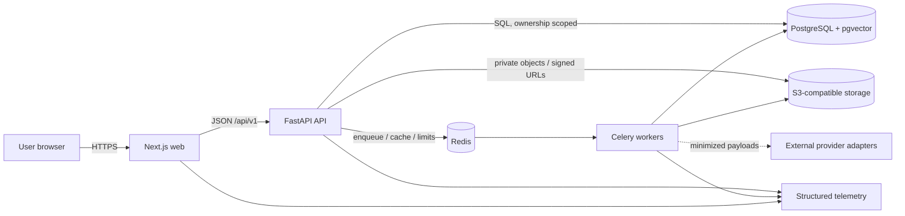
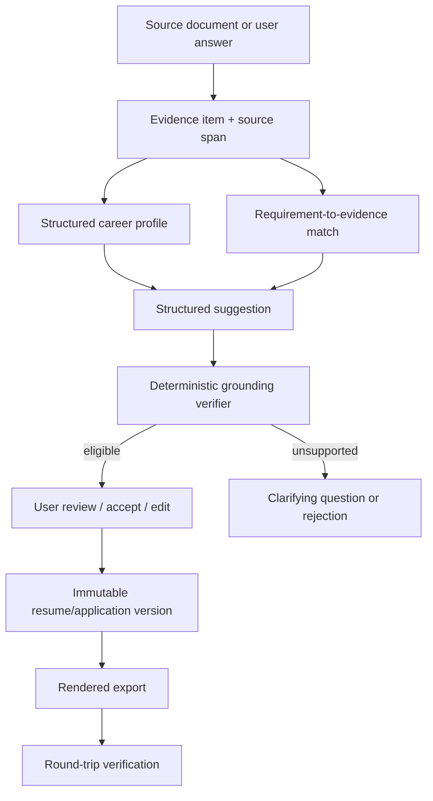

# CareerOS architecture

Status: accepted target architecture; implementation is phased  
Last reviewed: 2026-07-14

## Architectural objective

CareerOS maintains a user-owned, structured, evidence-backed career record and
derives reviewable outputs from it. The architecture optimizes for factual
integrity, explainability, tenant isolation, secure document processing,
accessible user control, and replacement of external providers without rewriting
the domain.

The architecture described here is the target. `PLANS.md` is authoritative for
what the current working tree actually implements.

## Implementation alignment status

The repository now implements the Phase 0 shared backend, root uv workspace,
generated contract pipeline, thin deployable boundaries, and executable
architecture checks described below. Their complete local gate passes in the
aligned working tree. Phase 0 remains open until this tree is committed and that
exact revision passes hosted CI; earlier baseline evidence remains historical.

## System principles

1. **Evidence is upstream.** Career facts and evidence precede generated text.
2. **Deterministic decisions surround probabilistic helpers.** Models may extract,
   classify, retrieve, or suggest; schemas, policy, grounding, scoring, and user
   approval decide what is usable.
3. **One ownership boundary.** Every resource access is scoped by authenticated
   subject and tenant context at the server.
4. **Asynchronous hostile work.** Parsing, scanning, OCR, AI, rendering, and
   verification run as traceable, idempotent, bounded jobs.
5. **Contracts over coupling.** The web consumes versioned API contracts; API,
   worker, and providers share domain services rather than each other's runtime
   internals.
6. **Accessible control is a correctness property.** Keyboard and mobile approval
   paths are not optional presentation enhancements.
7. **Privacy by default.** Minimize provider payloads and telemetry; never make
   raw career documents an analytics event.

## Runtime context



The browser never connects directly to PostgreSQL, Redis, or a queue. Direct
object transfer is allowed only through narrow, expiring signed operations issued
after authorization and finalized by the API.

## Monorepo structure and ownership

| Path                         | Responsibility                                                                        | Must not own                                                           |
| ---------------------------- | ------------------------------------------------------------------------------------- | ---------------------------------------------------------------------- |
| `apps/web`                   | Public and authenticated UI, accessibility, query/form state, server/client rendering | Database queries, object credentials, score formulas, grounding policy |
| `apps/api`                   | Thin HTTP validation, authorization, composition, and OpenAPI delivery                | Domain rules, persistence implementations, worker process behavior     |
| `apps/worker`                | Thin Celery process and task adapters for isolated async execution                    | HTTP composition or duplicated business rules                          |
| `packages/backend`           | Shared Python foundation and phase-owned domain/application/infrastructure modules    | Imports from API/worker deployables or generic unowned helpers         |
| `packages/ui`                | Generic accessible React primitives and reusable presentation components              | Product API calls, domain rules, or route-specific behavior            |
| `packages/design-tokens`     | Shared colors, typography, spacing, radii, and shadows                                | Product state or feature behavior                                      |
| `packages/contracts`         | Normalized OpenAPI artifact, generated TypeScript schema, and typed client wrapper    | Handwritten competing wire models, persistence models, or secrets      |
| `packages/eslint-config`     | Shared frontend lint and dependency-boundary rules                                    | Runtime behavior or credentials                                        |
| `packages/typescript-config` | Shared strict TypeScript compiler defaults                                            | Runtime behavior or credentials                                        |
| `packages/test-fixtures`     | Fictional and hostile test assets/metadata                                            | Real user data                                                         |
| `infra`                      | Container/deployment definitions and policies                                         | Product logic                                                          |

The root uv workspace contains `apps/api`, `apps/worker`, and
`packages/backend` with one committed lockfile. Both applications depend on the
backend. The backend imports neither application, and the worker never imports
the API. Container build contexts must include the root workspace while runtime
images remain independently deployable.

Within `packages/backend/src/careeros`, stable domain-independent primitives live
under `foundation`. Each product capability is added under `modules/<feature>`
only in its owning phase, with `domain`, `application`, `infrastructure`, `api`,
`tasks`, and tests as real behavior requires. Provider SDKs stay under
`integrations`. Domain code is framework-independent; application code depends on
ports; infrastructure implements those ports; HTTP routes and worker tasks remain
thin adapters. Cross-module reads use explicit services, query interfaces, or
events rather than another module's tables.

This superseding foundation decision is recorded in
[ADR 0007](adr/0007-shared-modular-monolith-and-generated-contracts.md).

## Foundation technology

| Concern      | Choice                                                          | Notes                                                                           |
| ------------ | --------------------------------------------------------------- | ------------------------------------------------------------------------------- |
| JS workspace | pnpm 11.13.0, Node.js 24                                        | One root lockfile; Corepack pins package-manager behavior                       |
| Web          | Next.js 16.2.10, React 19.2.7, TypeScript 5.9.3, Tailwind 4.3.2 | App Router; strict types; server components by default where appropriate        |
| Python       | Python 3.13, uv 0.11.21                                         | One root workspace/lock for API, worker, and shared backend                     |
| HTTP         | FastAPI 0.138.2, Pydantic                                       | OpenAPI contract and validation boundary                                        |
| Persistence  | SQLAlchemy 2 async, asyncpg, Alembic                            | PostgreSQL is authoritative; migrations arrive with owning models               |
| Async work   | Celery 5.6.3, Redis locally                                     | Task envelopes require idempotency, ownership, retries/timeouts, traceability   |
| Objects      | MinIO locally, S3-compatible production interface               | Private bucket, randomized keys, encryption and lifecycle policy                |
| Semantics    | pgvector when justified                                         | Retrieval aid only; not a substitute for relational provenance or scoring rules |

## Domain model

The model is organized into bounded areas rather than a single resume table:

- **Identity and access:** users, profiles, sessions, refresh tokens, OAuth
  accounts, organizations/members, consent, audit events.
- **Career record:** career profiles, experience, education, projects, skills,
  credentials, publications, awards, languages, goals, and preferences.
- **Evidence graph:** evidence items/sources/attachments/metrics and links from
  evidence to experiences, skills, requirements, claims, and outputs.
- **Documents and resumes:** source documents, processing jobs, canonical resumes,
  immutable versions/sections/items/templates, exports, and verification reports.
- **Roles and jobs:** role definitions/competencies, saved roles, jobs, source-
  spanned requirements, matches, and analyses.
- **Scores and changes:** analysis versions, feature/component values, findings,
  structured change sets/operations, model and prompt runs.
- **Career workflow:** applications/events/tasks/documents, contacts/interactions,
  interviews/questions/stories, offers, achievements, learning, and reviews.
- **Commercial:** plans, entitlements/subscriptions, usage, and billing events.

Externally visible identifiers are UUIDs. Rows carry `created_at`, `updated_at`,
and explicit ownership. `deleted_at` is added only when recovery, retention, or
async erasure requires it. Mutable aggregates that can be edited concurrently use
a version number or equivalent conditional update.

### Source-of-truth and provenance model



A source document is provenance, not automatic truth. Parser confidence and user
confirmation remain distinct. Derived output stores the exact evidence IDs and
policy/model/prompt versions used so later evidence changes do not rewrite history.

## Request and job flows

### Synchronous API flow

1. Edge/service middleware assigns or validates a correlation ID and applies
   request-size and rate limits.
2. The API authenticates the session, resolves tenant context, validates the
   payload, and performs an ownership-scoped lookup.
3. The service executes a short transaction, emits an audit event when required,
   and returns a versioned response/error shape.
4. Logs include safe IDs, route template, status, duration, and trace IDs—not raw
   career content.

### Asynchronous flow

1. The API creates a durable job row and outbox/enqueue intent with user ownership
   and an idempotency key.
2. A worker claims a task, checks cancellation/ownership/state, and runs with a
   timeout, bounded retry policy, and trace context.
3. Progress and sanitized error details update durable job state. Poison jobs move
   to dead-letter handling; unsafe automatic retries are prohibited.
4. The web polls a status resource initially; server-sent events or push
   notification may be introduced after measuring need.

All AI work stores provider/model/prompt identifiers, structured-output validity,
usage/cost, and grounding outcome. All rendering work records the input version
and output hash.

### Secure document pipeline (Phase 2 target)

```text
request upload intent
  -> authorize + reserve randomized private object key
  -> bounded signed upload
  -> finalize: signature/MIME/size validation
  -> quarantine + malware/decompression checks
  -> isolated extraction (no execution, no unnecessary network)
  -> OCR only when needed and enabled
  -> canonical parse + source spans + confidence
  -> deterministic analysis
  -> user correction/review
```

The original remains immutable. Temporary content is cleaned on success, failure,
and timeout. A wrong extension, malformed file, macro-enabled document, archive
bomb, or unavailable required scanner fails safely. See the threat model.

## API and contract strategy

- Product routes are versioned below `/api/v1`; health probes remain unversioned.
- OpenAPI generated by the API is authoritative for wire shape. Its normalized,
  committed artifact lives under `packages/contracts/openapi`; pinned generation
  produces the TypeScript schema consumed by a typed `openapi-fetch` wrapper. CI
  rejects export or generation drift. Generated files are reproducible artifacts,
  not parallel handwritten models.
- Errors use a stable problem envelope with machine code, human-safe detail,
  field errors, and correlation ID.
- Collection APIs use cursor pagination where datasets grow; every sort/filter is
  allowlisted and bounded.
- Side-effecting retryable requests accept an `Idempotency-Key`; reuse with a
  different payload is a conflict.
- Breaking changes require a new API version or an explicit migration/deprecation
  window. Internal schema changes do not automatically change the public API.

See `docs/api.md` for the route inventory and examples.

## Provider boundaries

Providers return domain-neutral, validated result types and never decide policy:

- resume parsing, text extraction, layout, malware, and OCR;
- job URL import and role taxonomy;
- AI extraction/suggestion/verification assistance;
- PDF/DOCX rendering;
- email, OAuth, billing, error monitoring, and object storage.

Configuration selects a provider by environment. Tests use deterministic fakes.
Provider failure is explicit; there is no hidden fallback from a security control
to an unsafe no-op. Circuit breaking, timeouts, retry classification, usage cost,
and redacted telemetry wrap remote providers.

## Authentication and tenancy (Phase 1 target)

The FastAPI service owns email/password and Google OAuth account linkage.
Passwords use Argon2id. Browser sessions use secure, HTTP-only, appropriately
scoped cookies and CSRF protection. Refresh/session material is random, rotated,
hashed at rest, device/session visible, and invalidatable. Verification/reset
tokens are single-use, hashed, short-lived, and rate-limited.

Authorization uses an authenticated principal plus optional organization context.
Repository methods require ownership scope rather than accepting a bare resource
ID. Background tasks repeat the ownership check against durable records. Admin
identity is separate from tenant authority; sensitive admin reads are
least-privilege, redacted by default, and audited.

## Scoring and AI boundaries

Numeric scores are computed only by a deterministic, versioned engine over stored
features. Models may help extract candidate features but cannot supply the final
score or override hard-gap display. Stored score output includes engine version,
weight configuration, inputs, component contributions, missing-data treatment,
and timestamp.

AI output is untrusted until strict schema validation and deterministic claim-
evidence verification pass. A material change becomes usable only through the
review lifecycle. See `docs/scoring-methodology.md` and
`docs/ai-grounding-policy.md`.

## Observability

All services emit structured logs and propagate request/trace IDs. Metrics cover
request latency/error, dependency readiness, queue depth/age/retries/dead letters,
processing duration, parser/export failure, AI latency/usage/cost, rate limits,
and authentication failures. Traces carry metadata and stable identifiers only;
raw resume, job, evidence, and generated content are excluded by default.

Liveness means the process can respond. Readiness verifies required dependencies
without disclosing credentials or topology details. A degraded optional provider
must be visible without making unrelated core paths unavailable.

## Deployment progression

Phase 0 uses Docker Compose for reproducible local integration. Production targets
remain deliberately unspecified until Phase 10, when the team must decide and
test:

- managed database/cache/queue/object services and regional/data-residency needs;
- separate API and restricted worker network/security policies;
- encrypted backup, point-in-time recovery, and restore exercises;
- secret management, image provenance, dependency/container scanning;
- autoscaling, cost limits, dead-letter operations, and disaster recovery;
- protected environments, migration strategy, rollback/forward repair, and
  manual production approval.

Local Compose is not a production topology.

## Phase realization

Phase 0 implements only the runtime seams: the root workspaces, shared backend
foundation, generated contracts, generic UI, health/meta endpoints, dependency
connectivity, a fictional web preview, worker health, local services, test
runners, and documentation. Each subsequent phase adds a maintainable vertical
slice as mapped in `PLANS.md`; an interface, directory, or empty route is never
used as evidence that its feature exists. The browser extension, product modules,
provider integrations, Terraform, operations, and production workflows are
created only in their owning phases.

## Architecture verification

Phase 0 requires the following repository gates plus architecture-boundary,
OpenAPI-generation drift, migration, and root-workspace checks:

```sh
docker compose config --quiet
make setup
make dev
docker compose ps
make format-check
make lint
make typecheck
make test
make verify
```

The aligned working tree passes these local gates together. Exact evidence is
recorded in `PLANS.md`; Phase 0 remains open until the tree is committed and the
same revision passes hosted CI.
Later phases add ownership, hostile-document, grounding, score-golden, round-trip
export, accessibility, load, deletion, and restore gates. The complete strategy
is in `docs/testing-strategy.md`.
