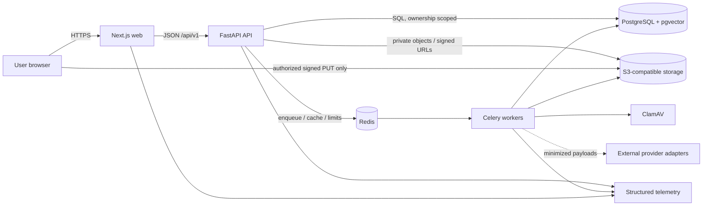
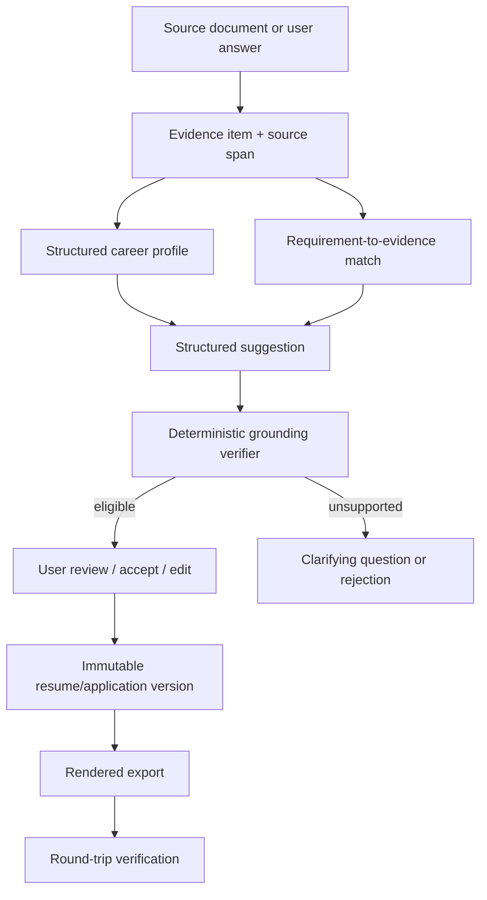

# CareerOS architecture

Status: accepted target architecture; Phase 2 implemented and verified
Last reviewed: 2026-07-15

## Architectural objective

CareerOS maintains a user-owned, structured, evidence-backed career record and
derives reviewable outputs from it. The architecture optimizes for factual
integrity, explainability, tenant isolation, secure document processing,
accessible user control, and replacement of external providers without rewriting
the domain.

The architecture described here is the target. `PLANS.md` is authoritative for
what the current working tree actually implements.

## Implementation alignment status

The repository implements the Phase 0 shared backend/root workspace, the Phase 1
identity boundary, and a Phase 2 Resume Health module used by thin API and worker
adapters. Phase 2 adds generated HTTP contracts, one ownership-scoped persistence
model, private object storage, a transactional job outbox, isolated document
processing, and deterministic scoring without changing the dependency direction.
Historical evidence and passing Phase 2 local/hosted gates are recorded in
`PLANS.md`.

## System principles

1. **Evidence is upstream.** Career facts and evidence precede generated text.
2. **Deterministic decisions surround probabilistic helpers.** Models may extract,
   classify, retrieve, or suggest; schemas, policy, grounding, scoring, and user
   approval decide what is usable.
3. **One ownership boundary.** Every resource access is scoped by authenticated
   subject and tenant context at the server.
4. **Asynchronous hostile work.** Parsing, scanning, OCR, AI, rendering, and
   verification run as traceable, idempotent, bounded jobs.
5. **Contracts over coupling.** The web consumes versioned API contracts; API,
   worker, and providers share domain services rather than each other's runtime
   internals.
6. **Accessible control is a correctness property.** Keyboard and mobile approval
   paths are not optional presentation enhancements.
7. **Privacy by default.** Minimize provider payloads and telemetry; never make
   raw career documents an analytics event.

## Runtime context



The browser never connects directly to PostgreSQL, Redis, or a queue. Direct
object transfer is allowed only through narrow, expiring signed operations issued
after authorization and finalized by the API.

## Monorepo structure and ownership

| Path                         | Responsibility                                                                        | Must not own                                                           |
| ---------------------------- | ------------------------------------------------------------------------------------- | ---------------------------------------------------------------------- |
| `apps/web`                   | Public and authenticated UI, accessibility, query/form state, server/client rendering | Database queries, object credentials, score formulas, grounding policy |
| `apps/api`                   | Thin HTTP validation, authorization, composition, and OpenAPI delivery                | Domain rules, persistence implementations, worker process behavior     |
| `apps/worker`                | Thin Celery process and task adapters for isolated async execution                    | HTTP composition or duplicated business rules                          |
| `packages/backend`           | Shared Python foundation and phase-owned domain/application/infrastructure modules    | Imports from API/worker deployables or generic unowned helpers         |
| `packages/ui`                | Generic accessible React primitives and reusable presentation components              | Product API calls, domain rules, or route-specific behavior            |
| `packages/design-tokens`     | Shared colors, typography, spacing, radii, and shadows                                | Product state or feature behavior                                      |
| `packages/contracts`         | Normalized OpenAPI artifact, generated TypeScript schema, and typed client wrapper    | Handwritten competing wire models, persistence models, or secrets      |
| `packages/eslint-config`     | Shared frontend lint and dependency-boundary rules                                    | Runtime behavior or credentials                                        |
| `packages/typescript-config` | Shared strict TypeScript compiler defaults                                            | Runtime behavior or credentials                                        |
| `packages/test-fixtures`     | Fictional and hostile test assets/metadata                                            | Real user data                                                         |
| `infra`                      | Container/deployment definitions and policies                                         | Product logic                                                          |

The root uv workspace contains `apps/api`, `apps/worker`, and
`packages/backend` with one committed lockfile. Both applications depend on the
backend. The backend imports neither application, and the worker never imports
the API. Container build contexts must include the root workspace while runtime
images remain independently deployable.

Within `packages/backend/src/careeros`, stable domain-independent primitives live
under `foundation`. Each product capability is added under `modules/<feature>`
only in its owning phase, with `domain`, `application`, `infrastructure`, `api`,
`tasks`, and tests as real behavior requires. Provider SDKs stay under
`integrations`. Domain code is framework-independent; application code depends on
ports; infrastructure implements those ports; HTTP routes and worker tasks remain
thin adapters. Cross-module reads use explicit services, query interfaces, or
events rather than another module's tables.

This superseding foundation decision is recorded in
[ADR 0007](adr/0007-shared-modular-monolith-and-generated-contracts.md).

## Foundation technology

| Concern      | Choice                                                          | Notes                                                                           |
| ------------ | --------------------------------------------------------------- | ------------------------------------------------------------------------------- |
| JS workspace | pnpm 11.13.0, Node.js 24                                        | One root lockfile; Corepack pins package-manager behavior                       |
| Web          | Next.js 16.2.10, React 19.2.7, TypeScript 5.9.3, Tailwind 4.3.2 | App Router; strict types; server components by default where appropriate        |
| Python       | Python 3.13, uv 0.11.21                                         | One root workspace/lock for API, worker, and shared backend                     |
| HTTP         | FastAPI 0.138.2, Pydantic                                       | OpenAPI contract and validation boundary                                        |
| Persistence  | SQLAlchemy 2 async, asyncpg, Alembic                            | PostgreSQL is authoritative; migrations arrive with owning models               |
| Async work   | Celery 5.6.3, Redis locally                                     | Task envelopes require idempotency, ownership, retries/timeouts, traceability   |
| Objects      | MinIO locally, S3-compatible production interface               | Private bucket, randomized keys, encryption and lifecycle policy                |
| Semantics    | pgvector when justified                                         | Retrieval aid only; not a substitute for relational provenance or scoring rules |

## Domain model

The model is organized into bounded areas rather than a single resume table:

- **Identity and access:** users, profiles, sessions, refresh tokens, OAuth
  accounts, organizations/members, consent, audit events.
- **Career record:** career profiles, experience, education, projects, skills,
  credentials, publications, awards, languages, goals, and preferences.
- **Evidence graph:** evidence items/sources/attachments/metrics and links from
  evidence to experiences, skills, requirements, claims, and outputs.
- **Documents and resumes:** source documents, processing jobs, canonical resumes,
  immutable versions/sections/items/templates, exports, and verification reports.
- **Roles and jobs:** role definitions/competencies, saved roles, jobs, source-
  spanned requirements, matches, and analyses.
- **Scores and changes:** analysis versions, feature/component values, findings,
  structured change sets/operations, model and prompt runs.
- **Career workflow:** applications/events/tasks/documents, contacts/interactions,
  interviews/questions/stories, offers, achievements, learning, and reviews.
- **Commercial:** plans, entitlements/subscriptions, usage, and billing events.

Externally visible identifiers are UUIDs. Rows carry `created_at`, `updated_at`,
and explicit ownership. `deleted_at` is added only when recovery, retention, or
async erasure requires it. Mutable aggregates that can be edited concurrently use
a version number or equivalent conditional update.

### Source-of-truth and provenance model



A source document is provenance, not automatic truth. Parser confidence and user
confirmation remain distinct. Derived output stores the exact evidence IDs and
policy/model/prompt versions used so later evidence changes do not rewrite history.

## Request and job flows

### Synchronous API flow

1. Edge/service middleware assigns or validates a correlation ID and applies
   request-size and rate limits.
2. The API authenticates the session, resolves tenant context, validates the
   payload, and performs an ownership-scoped lookup.
3. The service executes a short transaction, emits an audit event when required,
   and returns a versioned response/error shape.
4. Logs include safe IDs, route template, status, duration, and trace IDs—not raw
   career content.

The HTTP middleware logs the matched route template or `unmatched`, never the
raw path/query. Failure events include only an allowlisted exception class, not
the exception message, body, headers, signed URL, or parser/provider payload. An
unexpected exception is converted to a generic no-store `internal_error` problem
at this boundary rather than being re-raised to the server logger.

### Asynchronous flow

1. The API creates a durable job row and outbox/enqueue intent with user ownership
   and an idempotency key.
2. A worker claims a task with a fresh per-invocation fencing token, checks
   cancellation/ownership/state, and runs with a timeout, bounded retry policy,
   durable lease longer than its hard timeout, and trace context.
3. Progress and sanitized error details update durable job state. Poison jobs move
   to dead-letter handling; unsafe automatic retries are prohibited.
4. The web polls a status resource initially; server-sent events or push
   notification may be introduced after measuring need.

If an overlapping delivery sees a live lease, it performs a delayed busy retry
after that lease must expire. A successor can reclaim an expired lease within the
durable attempt cap, while every stale progress/result write is rejected by its
token. The outbox publisher and object-cleanup maintenance take bounded batches,
apply bounded exponential backoff/attempts, and persist published/completed or
dead-letter state instead of silently dropping broker or storage failures. A
scheduled database-only reconciler locks stale published queued jobs, retryable
failures, and expired running leases. It fences any expired token, creates a new
durable outbox generation, and dead-letters work that has exhausted either its
processing or recovery budget.

All AI work stores provider/model/prompt identifiers, structured-output validity,
usage/cost, and grounding outcome. All rendering work records the input version
and output hash.

### Secure document pipeline (Phase 2 implementation)

```text
read configured upload policy
  -> authorize account or opaque guest capability + reserve randomized staging key
  -> exact-origin, short-lived signed PUT with declared expected-size metadata
  -> finalize: ownership + expiry + size + media-type + signature validation
  -> promote to randomized quarantine key
  -> commit document + job + outbox in one database transaction
  -> fail-closed ClamAV scan
  -> isolated PDF/DOCX expansion/extraction + authoritative PDF page checks
  -> immutable canonical snapshot + source spans + confidence + parser warnings
  -> explicit user correction creates a new snapshot
  -> deterministic fixed-point analysis bound to that snapshot
```

The upload component keeps an issued intent, transfer completion flag, and
finalize idempotency key only in memory, which permits safe same-page retry of an
ambiguous transfer/finalize. A lost intent response or page reload cannot recover
that state and can leave quota reserved for up to the default five-minute intent
TTL; Phase 2 has no resumable or multipart transfer protocol.

The original remains immutable. The worker downloads into a fresh randomized
temporary directory on a bounded `noexec` tmpfs and deletes it on every normal or
exceptional exit. PDF/DOCX bytes are never executed. A wrong signature,
malformed/encrypted/polyglot PDF, macro-enabled DOCX, traversal/expansion bomb,
PDF page limit, universal character/artifact limit, timeout, malware result, or
unavailable required scanner fails safely. Scanner unavailability leaves the
object quarantined for bounded retry and ultimately rejects/dead-letters it
rather than parsing unchecked. DOCX has no authoritative rendered page count in
the local `python-docx` extractor; it is bounded by bytes, archive entries,
expanded size/ratio, extracted characters/blocks, and artifact size until a
rendering provider supplies layout-aware page enforcement.

The local extractor calls blocking libraries through `asyncio.to_thread`.
Application timeout cancels the await but is not a killable per-parser process
boundary. Celery task limits and the non-root, read-only, CPU/memory/PID-bounded,
no-edge-network worker constrain the residual thread; production parser sandbox
selection remains a later hardening decision.

Parse, analyze, and delete requests are durable jobs. The API transaction writes
the job and an allowlisted outbox message; a scheduler publishes pending rows and
the worker reloads durable ownership/state before acting. Jobs persist progress,
cancellation, attempts, safe error code, trace ID, result ID, and dead-letter
state plus a hashed execution token and lease expiry. Queue payloads contain only
job ID and trace ID. Object-store promotion/claim compensation and orphan cleanup
create durable records with purpose, owner, next attempt, and terminal status;
explicit document deletion remains a fenced durable job and schedules a staging
cleanup backstop.

The canonical source is append-only: the parser creates revision 1, and a user
correction creates a successor with `based_on_snapshot_id` while retaining the
original values and source spans. All-no-op correction is rejected; the domain
caps each document at 50 canonical revisions and 100 analysis jobs, while the API
applies separate owner-scoped correction and analysis rate classes. A score
analysis references exactly one snapshot. Source resumes remain provenance
inputs; they do not replace the career-profile/evidence source of truth
introduced in Phase 3.

## API and contract strategy

- Product routes are versioned below `/api/v1`; health probes remain unversioned.
- OpenAPI generated by the API is authoritative for wire shape. Its normalized,
  committed artifact lives under `packages/contracts/openapi`; pinned generation
  produces the TypeScript schema consumed by a typed `openapi-fetch` wrapper. CI
  rejects export or generation drift. Generated files are reproducible artifacts,
  not parallel handwritten models.
- Errors use a stable problem envelope with machine code, human-safe detail,
  field errors, and correlation ID.
- Collection APIs use cursor pagination where datasets grow; every sort/filter is
  allowlisted and bounded.
- Side-effecting retryable requests accept an `Idempotency-Key`; reuse with a
  different payload is a conflict. Resume Health restricts keys to 8-128
  characters from `[A-Za-z0-9._:-]`; its `If-Match` values are quoted positive
  `int4` versions capped at `2147483647`.
- Breaking changes require a new API version or an explicit migration/deprecation
  window. Internal schema changes do not automatically change the public API.

See `docs/api.md` for the route inventory and examples.

## Provider boundaries

Providers return domain-neutral, validated result types and never decide policy:

- resume parsing, text extraction, layout, malware, and OCR;
- job URL import and role taxonomy;
- AI extraction/suggestion/verification assistance;
- PDF/DOCX rendering;
- email, OAuth, billing, error monitoring, and object storage.

Configuration selects a provider by environment. Tests use deterministic fakes.
Provider failure is explicit; there is no hidden fallback from a security control
to an unsafe no-op. Circuit breaking, timeouts, retry classification, usage cost,
and redacted telemetry wrap remote providers.

## Authentication and tenancy (implemented through Phase 2)

The FastAPI service owns email/password and Google OAuth account linkage.
Passwords use Argon2id. Browser sessions use secure, HTTP-only, appropriately
scoped cookies and CSRF protection. Refresh/session material is random, rotated,
hashed at rest, device/session visible, and invalidatable. Verification/reset
tokens are single-use, hashed, short-lived, and rate-limited.

Authorization uses an authenticated principal plus optional organization context.
Repository methods require ownership scope rather than accepting a bare resource
ID. Background tasks repeat the ownership check against durable records. Admin
identity is separate from tenant authority; sensitive admin reads are
least-privilege, redacted by default, and audited.

Phase 2 represents resource ownership as exactly one account user or guest
session. Guest access uses a server-hashed, opaque, short-lived capability in an
`HttpOnly` cookie plus a separate double-submit CSRF token and exact-origin check
for mutation. It is not derived from a document UUID. Guest quota is one active
intake, scheduled retention queues durable object/content deletion, and explicit
claim requires ready/completed state without an active/retryable job, copies
objects into new account-scoped keys, atomically transfers retained content/job
history, and then revokes the capability. Prior guest audit events remain
append-only under their original scope.

Local Compose publishes `web-edge` while the Next.js web container is reachable
only on the shared edge network. `web-edge` strips all client-selected address
headers and overwrites them from its socket peer. The server-only BFF normalizes
that value, signs it with a shared HMAC secret, and sends the opaque signal to the
API; the API verifies it before using it as pre-authentication and first-guest
upload rate-key input. This signal is intentionally unrelated to authentication
or authorization. A cloud load balancer changes the immediate peer, so production
needs an explicit allowlisted trusted-hop design; arbitrary forwarded headers
must never be accepted as client identity.

## Scoring and AI boundaries

Numeric scores are computed only by a deterministic, versioned engine over stored
features. Models may help extract candidate features but cannot supply the final
score or override hard-gap display. Stored score output includes engine version,
weight configuration, inputs, component contributions, missing-data treatment,
and timestamp.

Resume Health v1 is implemented without a model provider. It uses integer
fixed-point feature/component arithmetic and persists engine/configuration/
feature-schema version, the complete typed feature record, each weighted feature
contribution, and feature-set hash. It returns no number for image-only or sparse
input and emits the canonical internal-score disclaimer. The report's semantic,
keyboard-operable disclosures expose measured values and the raw/display
score-weight-contribution trace without requiring color or chart interpretation.
Exact features and weights are normative in `docs/scoring-methodology.md`.

AI output is untrusted until strict schema validation and deterministic claim-
evidence verification pass. A material change becomes usable only through the
review lifecycle. See `docs/scoring-methodology.md` and
`docs/ai-grounding-policy.md`.

## Observability

All services emit structured logs and propagate request/trace IDs. Metrics cover
request latency/error, dependency readiness, queue depth/age/retries/dead letters,
processing duration, parser/export failure, AI latency/usage/cost, rate limits,
and authentication failures. Traces carry metadata and stable identifiers only;
raw resume, job, evidence, and generated content are excluded by default.

HTTP logs use route templates rather than raw paths/queries. The application
disables payload-bearing library access loggers and emits allowlisted completion/
failure events; failure logs record only the exception class, not exception text,
headers, request/response bodies, signed URLs, or document/provider payloads.
Unexpected exceptions become generic no-store problems at the middleware
boundary instead of reaching the server traceback logger.

Liveness means the process can respond. Readiness verifies required dependencies
without disclosing credentials or topology details. A degraded optional provider
must be visible without making unrelated core paths unavailable.

## Deployment progression

Phase 0 uses Docker Compose for reproducible local integration. Production targets
remain deliberately unspecified until Phase 10, when the team must decide and
test:

- managed database/cache/queue/object services and regional/data-residency needs;
- separate API and restricted worker network/security policies;
- encrypted backup, point-in-time recovery, and restore exercises;
- secret management, image provenance, dependency/container scanning;
- autoscaling, cost limits, dead-letter operations, and disaster recovery;
- protected environments, migration strategy, rollback/forward repair, and
  manual production approval.

Local Compose is not a production topology.

## Phase realization

Phase 0 implements the runtime seams, and Phase 1 implements identity/onboarding.
Phase 2 adds the real `resume_health` backend module, migration, API/worker
adapters, generated contracts, account and guest web workflows, accessible UI
primitives, local S3/ClamAV policy, fictional deterministic document fixtures,
and focused unit/integration/browser suites. Later product modules, external AI/
OCR providers, browser extension, Terraform, operations, and production
workflows remain absent until their owning phases.

## Architecture verification

Every phase retains the repository gates plus architecture-boundary,
OpenAPI-generation drift, migration, and root-workspace checks:

```sh
docker compose config --quiet
make setup
make dev
docker compose ps
make format-check
make lint
make typecheck
make test
make verify
```

Phase 2 additionally uses `scripts/verify-phase2.ps1` (or
`make verify-phase2`) for migration `20260715_0003`, real storage/scanner
contracts, durable worker processing, and registered/guest Playwright journeys.
The complete local gate and hosted CI run `29378312134` pass against the Phase 2
implementation and are recorded in `PLANS.md`.

The Phase 0/1 baselines and Phase 2 passed their aligned local and hosted gates.
Later phases add grounding, role/job score golden, round-trip export,
load, account-wide deletion, backup, and restore gates. The complete strategy is
in `docs/testing-strategy.md`.
