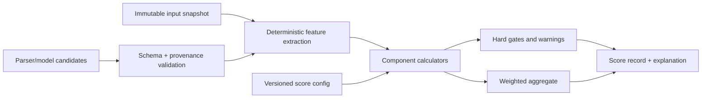

# Rezumi scoring methodology

Status: Resume Health v2, Role Readiness v1, Job Match v1, Phase 6 Change Studio controls, and Career Health v1 implemented
Last reviewed: 2026-07-25

## Required interpretation

> Rezumi scores are internal readiness measurements. They are not scores
> provided by an employer or applicant tracking system and do not guarantee
> interviews or employment outcomes.

Rezumi does not know an employer's private ATS configuration, recruiter
preferences, candidate pool, or hiring decision. A score summarizes observable,
documented features under a published Rezumi formula. It is not a hiring
probability, ranking against other candidates, or causal prediction.

The disclaimer appears next to the first score in a report, in methodology/help
content, and in exported score reports. Compact views may use a clearly linked
short label (“Internal Rezumi measure”) only when the full disclaimer is one
accessible action away.

## Terminology

- **Resume Health Score:** job-independent document quality/readiness.
- **Machine Readability / ATS Readiness:** ability of supported parsers to extract
  a predictable reading order and critical fields; never an employer ATS result.
- **Role Readiness:** evidence-backed alignment with a general role definition.
- **Requirement Coverage:** evidence-backed coverage of an exact job's normalized
  requirements.
- **Evidence Strength:** quality, confirmation, specificity, and relevance of
  evidence supporting an alignment or claim.
- **Application Readiness:** internal composite for a specific job and a specific
  career/resume snapshot.
- **Content Impact:** specificity, action/outcome clarity, and appropriate evidence
  in resume content; not real-world hiring impact.
- **Truth Confidence:** internal confidence that displayed claims preserve known
  facts and connect to eligible evidence. It is not third-party background
  verification.
- **Career Health Score:** a longitudinal evidence, goal, development, review,
  and skill-evidence maintenance measure; it is not job-market value.

## Scoring invariants

1. The final number is produced only by deterministic code over versioned,
   persisted structured features. An LLM cannot supply or override it.
2. The same engine version, configuration, inputs, and rounding mode produce the
   same raw and displayed result.
3. Every component has a bounded 0–100 value, traceable feature contributions,
   human-readable explanation, and actionable findings.
4. Missing, unknown, not-applicable, and zero are different states. A client
   cannot mark a hard requirement not applicable without an explicit reason.
5. Parser/model confidence never turns an unsupported fact into evidence.
6. Hard requirements and their gaps are displayed separately and never disappear
   inside a high average.
7. Scores are tied to immutable input snapshots and formula versions. Reanalysis
   creates a new result; historical values are not recomputed in place.
8. Display rounding never changes eligibility, thresholds, or stored precision.
9. Threshold color/labels include text and are configurable, versioned, and
   validated for accessibility.
10. Outcome data may inform calibration and product research, but reported user
    analytics remain correlation/pattern descriptions, not causal proof.

## Scoring pipeline



Models may propose section classifications or normalized requirements. Those
candidates are stored with source spans and confidence, validated, and converted
to deterministic features. The scoring engine never parses free-form LLM prose.

## Score record

Each persisted analysis contains at least:

```json
{
  "scoreType": "resume_health",
  "engineVersion": "resume-health/2.0.0",
  "configurationVersion": "resume-health-default/2",
  "featureSchemaVersion": "resume-health-features/2",
  "inputSnapshotId": "uuid",
  "rawScoreBasisPoints": 7812,
  "displayScore": 78,
  "featureValues": {},
  "components": [
    {
      "key": "machine_readability",
      "rawScoreBasisPoints": 8536,
      "featureContributions": []
    }
  ],
  "warnings": [],
  "featureSetHash": "sha256:...",
  "computedAt": "2026-07-14T00:00:00Z"
}
```

The implemented contract uses generated OpenAPI schemas. Basis-point integer
arithmetic avoids platform-dependent floating-point drift. The analysis row
persists the feature-schema version and complete typed feature record; normalized
contribution rows persist each component/feature score, weight, and contribution
in basis points. The API returns both raw and rounded display units. Hashing
detects unexplained input drift; it is not a privacy or authorization control.

## General Resume Health

The initial top-level formula from the product specification is:

| Component                           | Weight | Measures                                                                             |
| ----------------------------------- | -----: | ------------------------------------------------------------------------------------ |
| ATS Readiness / Machine Readability |    25% | Extractable text, parser confidence, reading-order warnings, and section recognition |
| Recruiter Clarity                   |    20% | Recognized sections, concise blocks, section breadth, and chronology signals         |
| Content Impact                      |    20% | Observable action/outcome phrasing, repetition, and concise blocks                   |
| Achievement Strength                |    15% | Observable action/outcome phrasing and repetition without verifying the claim        |
| Structure                           |    10% | Recognized-section breadth/ratio, page fit, and concise blocks                       |
| Consistency and Truth               |    10% | Parser confidence, parser warnings, repetition, and chronology signals               |

For component values `c_i` in `[0, 100]` and integer weights totaling 100:

```text
resume_health_raw = sum(weight_i * c_i) / 100
```

“Truth and Confidence” is also shown as an explanatory report section. In the
initial top-level formula it is part of Consistency and Truth; the UI must not
double-count it. The configuration may later split components only under a new
version whose weights still total 100.

### Historical Resume Health v1 deterministic features

Historical analyses may reference engine `resume-health/1.0.0` with immutable configuration
`resume-health-default/1` and feature schema `resume-health-features/1`. Features
and all intermediate values use integer basis points in `[0, 10000]`.

The canonical snapshot produces these inputs:

| Feature                | v1 definition                                                                   |
| ---------------------- | ------------------------------------------------------------------------------- |
| Extractable characters | Sum of canonical block text lengths                                             |
| Page count             | Validated PDF page count; nominal `1` for local DOCX because no renderer exists |
| Image-only             | Canonical warning contains `image_only_pdf`                                     |
| Sections               | Total canonical sections and count whose kind is not `other`                    |
| Blocks                 | Total blocks; a block is concise when its text is at most 240 characters        |
| Bullets                | Total bullets and bullets containing an allowlisted action or outcome signal    |
| Duplicate blocks       | Case-folded, whitespace-normalized block count minus unique block count         |
| Chronology signals     | Blocks containing a four-digit year from 1900 through 2099                      |
| Warnings               | Canonical warning count and warnings containing `reading_order`                 |
| Parser confidence      | `sum(block_confidence) // block_count`; zero when there are no blocks           |

The action signal list is `built`, `created`, `delivered`, `designed`,
`developed`, `drove`, `improved`, `implemented`, `led`, `launched`, `managed`,
`optimized`, `reduced`, `increased`, `owned`, and `supported`. The outcome signal
list is `result`, `resulted`, `outcome`, `increased`, `reduced`, `improved`,
`saved`, `grew`, `accelerated`, `revenue`, `cost`, `time`, `quality`, and
`adoption`. These lists detect observable phrasing only. They do not establish
that a claim is true or reward adding an unsupported claim.

The reusable v1 sub-features are:

| Code                  | Integer-basis-point calculation                                                         |
| --------------------- | --------------------------------------------------------------------------------------- |
| `recognized_ratio`    | recognized sections / all sections, rounded half up; zero for an empty denominator      |
| `concise_ratio`       | concise blocks / all blocks, rounded half up; zero for an empty denominator             |
| `action_ratio`        | action-led bullets / bullets, rounded half up                                           |
| `outcome_ratio`       | outcome-bearing bullets / bullets, rounded half up                                      |
| `searchable`          | `min(10000, extractable_characters * 10)`                                               |
| `section_breadth`     | `min(10000, recognized_sections * 2500)`                                                |
| `chronology`          | `min(10000, chronology_signals * 2000)`                                                 |
| `duplicate_score`     | `max(0, 10000 - duplicate_blocks * 2000)`                                               |
| `warning_score`       | `max(0, 10000 - warnings * 1500)`                                                       |
| `reading_order_score` | `max(0, 10000 - reading_order_warnings * 2500)`                                         |
| `page_fit`            | 10000 for one to three pages; otherwise `max(2000, 10000 - 2000 * abs(page_count - 2))` |

When a document has no bullets, v1 assigns both bullet ratios the neutral value 5000. A paragraph-led format is therefore not treated as a division error or a
perfect achievement signal.

Each component is the rounded-half-up weighted sum below. Sub-feature weights in
each row total 10000 basis points.

| Component             | Exact v1 sub-feature weights                                                         |
| --------------------- | ------------------------------------------------------------------------------------ |
| Machine Readability   | searchable 30%; parser confidence 30%; reading-order score 20%; recognized ratio 20% |
| Recruiter Clarity     | recognized ratio 30%; concise ratio 30%; section breadth 20%; chronology 20%         |
| Content Impact        | action ratio 35%; outcome ratio 30%; duplicate score 20%; concise ratio 15%          |
| Achievement Strength  | outcome ratio 45%; action ratio 35%; duplicate score 20%                             |
| Structure             | section breadth 35%; recognized ratio 25%; page fit 20%; concise ratio 20%           |
| Consistency and Truth | parser confidence 35%; warning score 30%; duplicate score 20%; chronology 15%        |

The engine multiplies each component basis-point value by its top-level weight,
rounds that contribution half up to one basis point, and sums the six
contributions. The display score is the aggregate basis-point value rounded half
up to a whole number. No binary floating-point arithmetic is used.

`python-docx` has no authoritative rendered layout or page count. Phase 2 records
a nominal DOCX page value of one, so its `page_fit` sub-feature cannot diagnose
the actual rendered length and must not be described as doing so. DOCX safety is
bounded through bytes, archive entries/expansion, characters, blocks, artifact
size, and runtime resources. A later rendering provider and score-configuration
version are required before layout-aware DOCX page fit can be claimed.

An image-only document, fewer than 200 extractable characters, or fewer than
three canonical blocks returns `insufficient_data`: no numeric aggregate and no
component values are emitted. The report instead supplies a warning and a review
path. The API label bands for this configuration are `needsAttention` below 60,
`developing` from 60 through 79, and `strong` from 80; those labels remain
internal interpretations, not predictions.

The feature-set hash is SHA-256 over the sorted, compact JSON representation of
the complete feature record. It is returned as `sha256:<hex>` and detects drift;
it is not authorization or proof of document authenticity.

Reports expose the persisted feature schema and measured values, then group the
stored weighted feature contributions under their component. Semantic definition
lists and keyboard-operable disclosure controls show raw/display score, weight,
and contribution without relying on chart geometry or color. This trace is an
explanation of deterministic document measurements, not evidence that a career
claim is true.

Findings are deterministic as well: v1 reports reading-order warnings, section
recognition below 60%, action-led bullets below 50%, outcome-bearing bullets below
40%, and any parser warning. Suggested outcome context explicitly says to add it
only when it can be supported and confirmed.

The committed nontrivial golden case has 612 characters, one page, four of four
recognized sections, 14 concise blocks, three action-led bullets, one
outcome-bearing bullet, five chronology signals, no duplicates or warnings, and
9000 parser confidence. Its component values are 8536, 10000, 8000, 7000, 10000,
and 9650; contributions are 2134, 2000, 1600, 1050, 1000, and 965. The exact raw
score is 8749 basis points and the display score is 87.

### Resume Health v2 semantic review features

Current Phase 2 analyses use engine `resume-health/2.0.0`, configuration
`resume-health-default/2`, and feature schema `resume-health-features/2`. v2
retains every v1 measured input and adds:

| Feature                  | v2 definition                                                          |
| ------------------------ | ---------------------------------------------------------------------- |
| Semantic records/fields  | Active typed entities and fields, excluding explicitly removed values  |
| Parser-derived fields    | Active typed fields whose state is not `user_added`                    |
| Source-anchored fields   | Parser-derived fields carrying at least one exact source anchor        |
| Reviewed fields          | Active fields in confirmed, corrected, or user-added state             |
| Date fields              | Active fields with date precision metadata                             |
| Precise date fields      | Date fields whose precision is day, month, or year rather than unknown |
| Source-anchor coverage   | anchored parser fields / parser-derived fields                         |
| Semantic review coverage | reviewed active fields / active semantic fields                        |
| Date-precision coverage  | precise date fields / date fields                                      |
| Semantic breadth         | `min(10000, active_entities * 2000 + active_fields * 300)`             |

An empty denominator gives the three semantic coverage ratios the neutral value
7000; absence of semantic fields gives semantic breadth 7000. Missing semantic
data therefore is neither perfect evidence nor an automatic zero. User-added
facts do not lower source-anchor coverage because they explicitly make no parser
or source claim.

v2 keeps the same six top-level weights. Exact sub-feature weights are:

| Component             | Exact v2 sub-feature weights                                                                                                                                |
| --------------------- | ----------------------------------------------------------------------------------------------------------------------------------------------------------- |
| Machine Readability   | searchable 25%; parser confidence 25%; reading order 15%; recognized sections 15%; source anchors 20%                                                       |
| Recruiter Clarity     | recognized sections 25%; concise blocks 25%; section breadth 15%; chronology 15%; semantic breadth 20%                                                      |
| Content Impact        | action ratio 35%; outcome ratio 30%; duplicate integrity 20%; concise ratio 15%                                                                             |
| Achievement Strength  | outcome ratio 45%; action ratio 35%; duplicate integrity 20%                                                                                                |
| Structure             | section breadth 25%; recognized sections 20%; page fit 15%; concise ratio 15%; semantic breadth 25%                                                         |
| Consistency and Truth | parser confidence 20%; warning integrity 20%; duplicate integrity 15%; chronology 10%; source anchors 15%; review coverage 10%; date-precision coverage 10% |

The v2 golden case retains a perfect score of 100. The nontrivial v1-compatible
case with complete semantic coverage has component values 8780, 10000, 8000,
7000, 10000, and 9800; contributions are 2195, 2000, 1600, 1050, 1000, and 980. Its exact raw score is 8825 basis points and display score is 88.

v2 findings additionally flag incomplete semantic review, missing anchors on
parser-derived fields, and unknown date precision. These remain document-quality
measurements, not verification of a career claim.

No feature rewards invented keywords or penalizes a career gap, name, age,
protected characteristic, nontraditional history, or absence of an optional
section as though it were a hiring judgment. Phase 2 Resume Health measures the
document only. Evidence-backed claim scoring remains downstream of the Phase 3
evidence graph.

## Role Readiness

Role readiness compares an owner-scoped career snapshot with a versioned general
role definition, not an exact vacancy. Phase 4 implements engine
`role-readiness/1.0.0`, configuration `role-readiness-default/1`, and feature
schema `role-readiness-features/1` with fixed-point basis-point arithmetic:

| Dimension                            | Weight |
| ------------------------------------ | -----: |
| Core competency coverage             |    20% |
| Responsibility alignment             |    15% |
| Seniority alignment                  |    10% |
| Leadership evidence                  |    10% |
| Domain knowledge                     |    10% |
| Technical skills                     |    10% |
| Business impact                      |    10% |
| Education/certification expectations |     5% |
| Evidence strength                    |    10% |

Skill-state credits are deterministic:

| State                       | Credit |
| --------------------------- | -----: |
| Demonstrated                |   1.00 |
| Transferable                |   0.65 |
| Adjacent                    |   0.35 |
| Listed but not demonstrated |   0.25 |
| Missing / Unknown           |   0.00 |

Required competencies carry importance weight `3`; helpful competencies carry
importance weight `1`. Evidence strength uses eligible direct evidence and the
state ceilings below. If a career snapshot has no role-readiness signal, the
analysis returns `insufficient_data` with no numeric aggregate.

Required and helpful competencies carry explicit versioned importance; education
or certification is never assumed required unless the role definition says so.
The report separately lists strengths, gaps, unknowns, transferable/adjacent
skills, and evidence to add. The numeric score alone must not order career choices.

## Career Health

Phase 9 implements deterministic engine `career-health/1.0.0`, immutable
configuration `career-health-default/1`, and feature schema
`career-health-features/1`. It measures maintenance of the user's own structured
career record. It does not measure job-market value, predict an outcome, compare
people, or infer an employer or ATS assessment.

The configured components are:

| Component                  | Weight | v1 measurement                                                                                                                              |
| -------------------------- | -----: | ------------------------------------------------------------------------------------------------------------------------------------------- |
| Evidence currency          |    25% | Mean age-band credit across currently eligible exact evidence revisions                                                                     |
| Goal progress              |    30% | Equal-weight non-cancelled goal and milestone completion                                                                                    |
| Development follow-through |    20% | Status credit for non-cancelled learning, certification, promotion, review, and mobility items, with no credit for overdue incomplete items |
| Review cadence             |    15% | Recency of immutable finalized quarterly and annual review versions                                                                         |
| Readiness maintenance      |    10% | Share of documented skills linked to currently eligible evidence revisions                                                                  |

All values use integer basis points. Only applicable components enter the
denominator:

```text
career_health_raw =
  round_half_up(
    sum(component_score_basis_points * configured_weight_basis_points),
    sum(applicable_configured_weight_basis_points)
  )
```

The engine returns `insufficient_data`, without component scores or a numeric
aggregate, unless at least three components totaling at least 6000 configured
basis points are applicable. Missing data is therefore not silently converted to
zero or averaged into false precision. A complete result is labeled
`well_maintained` at 8000 basis points or higher, `developing` from 6000 through
7999, and `needs_attention` below 6000. Those labels describe record maintenance,
not career quality.

Evidence currency grants 10000 basis points through 90 days, 7500 through 180
days, 5000 through 365 days, 2500 through 730 days, and zero thereafter.
Milestones grant 0/5000/10000 for pending/in-progress/completed. Development
items grant 0/5000/2500/10000 for planned/in-progress/paused/completed, while an
overdue incomplete item receives zero. A finalized quarterly review is current
through 100 days and partial through 190; an annual review is current through
400 days and partial through 550. Current/partial/stale cadence credit is
10000/5000/0.

Each analysis persists its exact owner-authorized input snapshot, configuration,
formula, SHA-256 snapshot hash, integer component trace, findings, formula
versions, and computation time. Published analyses are immutable; changed source
records create a new analysis. Evidence-derived inputs pin evidence ID, revision
ID, revision number, and statement SHA-256 without copying raw evidence text.
The stored snapshot hash is recomputed before an analysis is returned; a
tampered snapshot fails closed. Every API and UI representation includes the
canonical score disclaimer from this document.

## Promotion Readiness interpretation

Promotion Readiness is not a numerical score. It is a current six-check
preparation report derived from eligible achievement evidence, skill-evidence
coverage, evidenced completed milestones, an evidenced completed promotion plan,
an evidence-backed finalized review, and an evidenced annual resume refresh. Its states
(`insufficient_evidence`, `building`, and `review_ready`) describe whether those
Rezumi preparation records are present; they do not rank people or infer a
decision by an employer. A persisted completed-milestone, completed-promotion,
finalized-review, or annual-refresh link contributes only while its evidence ID,
revision ID/number, statement hash, and revision timestamp still match the
current eligible Career Record snapshot; revoked or superseded pins do not
continue to support the report.

Every Promotion Readiness representation uses this separate required language:

> Promotion Readiness summarizes Rezumi preparation signals from current
> eligible evidence and owner-maintained records. It is not an employer decision,
> hiring probability, promotion guarantee, or assessment of job-market value.

## Job-specific Application Readiness

The initial configurable formula is:

| Component                | Weight |
| ------------------------ | -----: |
| Requirement Coverage     |    25% |
| Responsibility Alignment |    15% |
| Seniority Alignment      |    10% |
| Domain Alignment         |    10% |
| Evidence Strength        |    15% |
| ATS Readiness            |    10% |
| Content Impact           |    10% |
| Truth Confidence         |     5% |

```text
application_readiness_raw = sum(weight_i * component_i) / 100
```

Human Readability is a required displayed dimension. In the initial formula its
measurable content/readability features are reported within Content Impact; it is
not silently added as a ninth weighted component. A future split requires a new
configuration version.

Application Readiness is bound to the exact job requirement set, career profile/
evidence snapshot, and resume version. A changed job text or accepted resume
change creates a new analysis.

### Requirement Coverage

Every normalized requirement carries a source span, type, mandatory/preferred
classification, confidence, and versioned importance weight. A transparent
baseline is:

```text
coverage = sum(importance_r * match_credit_r)
           / sum(importance_r for applicable requirements)
           * 100
```

The initial proposed match credits are configuration, not UI constants:

| Match state    | Proposed credit | Meaning                                                       |
| -------------- | --------------: | ------------------------------------------------------------- |
| Strong match   |            1.00 | Direct, relevant eligible evidence                            |
| Transferable   |            0.65 | Evidence supports a clearly explained transferable capability |
| Partial match  |            0.50 | Some but not all scope/level/elements supported               |
| Unknown        |            0.00 | Insufficient information; prompts a question                  |
| Missing        |            0.00 | No supporting record after review                             |
| Not applicable |        Excluded | Only with recorded reason and policy/user confirmation        |

An initial importance scale may use mandatory `3`, preferred `2`, and helpful
`1`, plus an explicit source-specific override within documented bounds. The
exact values are released as configuration and tested with golden examples.
Mandatory requirements are listed as met/partial/unknown/missing regardless of
their contribution to the average.

### Skill-state treatment

For job-specific competency sub-calculations, the proposed evidence credits are:

| State                       | Proposed credit |
| --------------------------- | --------------: |
| Demonstrated                |            1.00 |
| Transferable                |            0.65 |
| Adjacent                    |            0.35 |
| Listed but not demonstrated |            0.25 |
| Missing / Unknown           |            0.00 |

“Required” and “Helpful” are importance labels, not match credits. “Unknown” is
not treated as “Missing” in explanatory text even when neither receives score
credit; unknown produces a data request, while missing produces a gap action.

## Evidence Strength and Truth Confidence

Evidence state is one input, not the whole result. Relevance, source span,
specificity, recency only where legitimately role-relevant, corroboration,
confirmation, conflict, and claim coverage may contribute.

Proposed state ceilings for Phase 3+ configuration are:

| Evidence state | Maximum evidence credit | Generation eligibility                                                           |
| -------------- | ----------------------: | -------------------------------------------------------------------------------- |
| Verified       |                    1.00 | Yes                                                                              |
| Confirmed      |                    0.90 | Yes; required minimum for user-supplied numbers unless independently verified    |
| Supported      |                    0.70 | Yes for facts explicitly supported by the source; no unconfirmed inferred number |
| Inferred       |                    0.25 | No factual generation; may drive a clarifying question                           |
| Unsupported    |                    0.00 | No                                                                               |

These are ceilings: irrelevant or contradictory verified evidence does not score
high. “Verified” means verified under a documented Rezumi evidence process; it
does not imply an employer, regulator, or background-check company certified it.

Truth Confidence considers eligible evidence coverage, directness of source
spans, unresolved conflicts, parser confidence, user confirmation, and grounding
results. It never converts probability into a factual claim. Low confidence is
shown with the reason and correction/question path.

## Missing, uncertain, and not-applicable data

- Missing optional data does not automatically penalize an unrelated dimension.
- Missing required evidence receives no coverage credit and remains a visible
  gap; the user is never encouraged to fabricate it.
- Unknown parsed data receives no factual credit and a confidence warning. User
  correction produces a new input snapshot.
- Not applicable is excluded from a denominator only through an allowlisted rule
  or an explicit user decision with audit history.
- If too little data exists for a meaningful score, return “insufficient data”
  with component availability—not a deceptively precise zero or average.
- A component denominator and minimum-evidence threshold are stored in the score
  configuration and explanation.

## Thresholds, rounding, and presentation

Raw fixed-decimal values are retained; the standard display rounds half up to the
nearest integer only after the aggregate. Do not round individual components
before aggregation. Comparisons and eligibility use raw values.

Labels such as “Strong,” “Moderate,” or “Needs attention” require a versioned
threshold table and user-tested language. They are not predictions. Every ring or
bar includes the numeric value, component name, text interpretation, explanation,
and accessible tabular summary. Red is reserved for critical/hard gaps and is
never the sole signal.

Avoid false precision in small deltas. A reported change should state formula
version and input difference; UI may suppress or qualify changes below a
configured materiality threshold.

## Expected score effect in Change Studio

An `expectedScoreDelta` is never model authority and never a hiring-outcome
prediction. In Phase 6, Change Studio exposes only a bounded deterministic local
estimate for grounded operations against an existing Job Match analysis; remote
provider-supplied deltas are ignored by the service. Later resume/export phases
may replace that estimate by applying a structured operation to a copy of the
canonical resume and re-running deterministic features under the same formula.
It must:

- identify affected component(s), engine/config version, and assumptions;
- remain unavailable if the operation has an unsupported claim;
- be recomputed after manual edit or evidence change;
- be labeled estimated until the user accepts and a complete analysis runs;
- never be used to auto-accept a material change.

## Opportunity Priority

Pursuit Priority combines job readiness with user-supplied career direction,
interest, compensation/location/work-model preferences, deadline, tailoring
effort, and contacts. User preferences are not career-quality scores. Mandatory
blockers remain separate. Output explains reasons, uncertainty, effort, and next
action and never states that the user will or will not be hired.

Phase 5 presents a bounded numeric priority value with an ordinal label,
component reasons, uncertainty, effort, and next action. The persisted
configuration, component weights, and threshold labels are versioned alongside
the analysis. The number is never a career-quality, employer, ATS, or hiring
probability score.

## Versioning and change control

A score configuration is immutable once persisted analyses reference it. It
includes:

- stable score/config semantic version and effective date;
- component and feature definitions, weights, thresholds, caps, gates, and
  missing-data rules;
- supported parser/canonical schema versions;
- fixed-decimal/rounding rules and explanation templates;
- approval record, test fixture version, and calibration notes.

Bug fixes that can change a number require a new version. The UI can offer
reanalysis under the new version but does not rewrite old results. Trend charts
identify version breaks and avoid drawing a continuous comparison when formulas
are not comparable.

## Validation and testing

Before release, each score engine has:

- unit tests for every feature, boundary, cap, missing-data state, and rounding;
- golden fixtures with independently calculated component and total results;
- property tests for bounds, determinism, weight totals, ordering where expected,
  and no `NaN`/division-by-zero behavior;
- parser/provider perturbation tests proving model prose cannot become a number;
- provenance tests proving each evidence-derived feature links an authorized
  source span;
- hard-gap tests proving a high average cannot hide a mandatory missing item;
- fairness/abuse review for proxies, keyword stuffing, duplicated content, career
  gaps, nontraditional history, locale, disability/accessibility, and sparse data;
- accessible UI tests for disclaimer, text summaries, non-color status, and
  keyboard access;
- regression tests across supported PDF/DOCX fixtures and formula versions.

Calibration uses fictional/synthetic or properly consented, minimized data. It
must not optimize toward protected characteristics or claim causal hiring
effects. Product changes based on outcomes are experiments with limitations and
privacy review, not proof of success probability.

## Implemented phase boundary

Phase 2 implements and persists job-independent Resume Health v2 while retaining
strict read compatibility for historical v1 analyses. Phase 4
implements and persists general Role Readiness v1. Phase 5 implements and
persists exact-job Application Readiness v1 and Opportunity Priority v1. Phase 6
implements Change Studio's grounded-change review controls and bounded local
expected-score-effect display; it does not create a new scoring engine. Phase 9
implements and persists longitudinal Career Health v1 with strict
insufficient-data handling. The fictional dashboard at `/demo/dashboard` remains
isolated from product data. Resume Health v2, Role Readiness v1, Application
Readiness v1, Opportunity Priority v1, and Career Health v1 must not be reused as
employer, ATS, hiring-probability, or guarantee scores.

The implementation, focused golden tests, and repository-wide local format, lint,
type, unit, integration, container, migration, browser, accessibility, and
security gates are recorded in `PLANS.md`.
