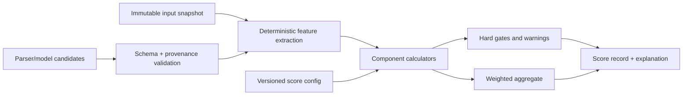

# CareerOS scoring methodology

Status: policy and initial formula contract; scoring engines are implemented in
their owning phases  
Last reviewed: 2026-07-14

## Required interpretation

> CareerOS scores are internal readiness measurements. They are not scores
> provided by an employer or applicant tracking system and do not guarantee
> interviews or employment outcomes.

CareerOS does not know an employer's private ATS configuration, recruiter
preferences, candidate pool, or hiring decision. A score summarizes observable,
documented features under a published CareerOS formula. It is not a hiring
probability, ranking against other candidates, or causal prediction.

The disclaimer appears next to the first score in a report, in methodology/help
content, and in exported score reports. Compact views may use a clearly linked
short label (“Internal CareerOS measure”) only when the full disclaimer is one
accessible action away.

## Terminology

- **Resume Health Score:** job-independent document quality/readiness.
- **Machine Readability / ATS Readiness:** ability of supported parsers to extract
  a predictable reading order and critical fields; never an employer ATS result.
- **Role Readiness:** evidence-backed alignment with a general role definition.
- **Requirement Coverage:** evidence-backed coverage of an exact job's normalized
  requirements.
- **Evidence Strength:** quality, confirmation, specificity, and relevance of
  evidence supporting an alignment or claim.
- **Application Readiness:** internal composite for a specific job and a specific
  career/resume snapshot.
- **Content Impact:** specificity, action/outcome clarity, and appropriate evidence
  in resume content; not real-world hiring impact.
- **Truth Confidence:** internal confidence that displayed claims preserve known
  facts and connect to eligible evidence. It is not third-party background
  verification.
- **Career Health Score:** later, longitudinal evidence/goal maintenance measure;
  it must not be conflated with job-market value.

## Scoring invariants

1. The final number is produced only by deterministic code over versioned,
   persisted structured features. An LLM cannot supply or override it.
2. The same engine version, configuration, inputs, and rounding mode produce the
   same raw and displayed result.
3. Every component has a bounded 0–100 value, traceable feature contributions,
   human-readable explanation, and actionable findings.
4. Missing, unknown, not-applicable, and zero are different states. A client
   cannot mark a hard requirement not applicable without an explicit reason.
5. Parser/model confidence never turns an unsupported fact into evidence.
6. Hard requirements and their gaps are displayed separately and never disappear
   inside a high average.
7. Scores are tied to immutable input snapshots and formula versions. Reanalysis
   creates a new result; historical values are not recomputed in place.
8. Display rounding never changes eligibility, thresholds, or stored precision.
9. Threshold color/labels include text and are configurable, versioned, and
   validated for accessibility.
10. Outcome data may inform calibration and product research, but reported user
    analytics remain correlation/pattern descriptions, not causal proof.

## Scoring pipeline



Models may propose section classifications or normalized requirements. Those
candidates are stored with source spans and confidence, validated, and converted
to deterministic features. The scoring engine never parses free-form LLM prose.

## Score record

Each persisted analysis contains at least:

```json
{
  "scoreType": "resume_health",
  "engineVersion": "resume-health/1.0.0",
  "configurationVersion": "resume-health-default/1",
  "inputSnapshotId": "uuid",
  "rawScoreBasisPoints": 7812,
  "displayScore": 78,
  "components": [],
  "hardGaps": [],
  "warnings": [],
  "featureSetHash": "sha256:...",
  "computedAt": "2026-07-14T00:00:00Z"
}
```

The actual contract will use generated OpenAPI schemas. Basis points or fixed
decimal arithmetic avoids platform-dependent floating-point drift. Store feature
values and contributions at greater precision than displayed. Hashing detects
unexplained input drift; it is not a privacy or authorization control.

## General Resume Health

The initial top-level formula from the product specification is:

| Component                           | Weight | Measures                                                                               |
| ----------------------------------- | -----: | -------------------------------------------------------------------------------------- |
| ATS Readiness / Machine Readability |    25% | Text extractability, reading order, section/field parsing, supported layout behavior   |
| Recruiter Clarity                   |    20% | Scannable structure, clear chronology/titles, concise and understandable content       |
| Content Impact                      |    20% | Action, specificity, scope, outcome, and relevance signals that are actually present   |
| Achievement Strength                |    15% | Evidence-backed outcomes and personal contribution without invented quantification     |
| Structure                           |    10% | Recognizable sections, ordering, hierarchy, length/layout constraints                  |
| Consistency and Truth               |    10% | Date/title/format consistency, parsing confidence, evidence and contradiction warnings |

For component values `c_i` in `[0, 100]` and integer weights totaling 100:

```text
resume_health_raw = sum(weight_i * c_i) / 100
```

“Truth and Confidence” is also shown as an explanatory report section. In the
initial top-level formula it is part of Consistency and Truth; the UI must not
double-count it. The configuration may later split components only under a new
version whose weights still total 100.

### Candidate deterministic features

The Phase 2 implementation must publish the exact sub-feature table. Candidate
inputs include:

- extractor agreement, searchable-text ratio, critical-field recall against
  user-corrected canonical data, reading-order violations, and image-only state;
- recognized section presence/order, chronology parse, duplicate/misaligned
  content, heading semantics, bullet length distribution, and page count;
- explicit action/scope/outcome language, supported numbers, repeated generic
  phrasing, and evidence-backed achievement ratio;
- date/title/entity conflicts, unsupported claim count, uncertain source spans,
  and user-confirmation coverage.

No feature may reward invented keywords or penalize a career gap, name, age,
protected characteristic, nontraditional history, or absence of an optional
section as though it were a hiring judgment. Gap detection is informational.

## Role Readiness

Role readiness compares a career snapshot with a versioned role definition, not
an exact vacancy. The initial **proposed** Phase 4 configuration is shown so the
implementation has a reviewable starting point; it is not an active score in
Phase 0 and must be validated before release:

| Dimension                            | Proposed weight |
| ------------------------------------ | --------------: |
| Core competency coverage             |             20% |
| Responsibility alignment             |             15% |
| Seniority alignment                  |             10% |
| Leadership evidence                  |             10% |
| Domain knowledge                     |             10% |
| Technical skills                     |             10% |
| Business impact                      |             10% |
| Education/certification expectations |              5% |
| Evidence strength                    |             10% |

Required and helpful competencies carry explicit versioned importance; education
or certification is never assumed required unless the role definition says so.
The report separately lists strengths, gaps, unknowns, transferable/adjacent
skills, and evidence to add. The numeric score alone must not order career choices.

## Job-specific Application Readiness

The initial configurable formula is:

| Component                | Weight |
| ------------------------ | -----: |
| Requirement Coverage     |    25% |
| Responsibility Alignment |    15% |
| Seniority Alignment      |    10% |
| Domain Alignment         |    10% |
| Evidence Strength        |    15% |
| ATS Readiness            |    10% |
| Content Impact           |    10% |
| Truth Confidence         |     5% |

```text
application_readiness_raw = sum(weight_i * component_i) / 100
```

Human Readability is a required displayed dimension. In the initial formula its
measurable content/readability features are reported within Content Impact; it is
not silently added as a ninth weighted component. A future split requires a new
configuration version.

Application Readiness is bound to the exact job requirement set, career profile/
evidence snapshot, and resume version. A changed job text or accepted resume
change creates a new analysis.

### Requirement Coverage

Every normalized requirement carries a source span, type, mandatory/preferred
classification, confidence, and versioned importance weight. A transparent
baseline is:

```text
coverage = sum(importance_r * match_credit_r)
           / sum(importance_r for applicable requirements)
           * 100
```

The initial proposed match credits are configuration, not UI constants:

| Match state    | Proposed credit | Meaning                                                       |
| -------------- | --------------: | ------------------------------------------------------------- |
| Strong match   |            1.00 | Direct, relevant eligible evidence                            |
| Transferable   |            0.65 | Evidence supports a clearly explained transferable capability |
| Partial match  |            0.50 | Some but not all scope/level/elements supported               |
| Unknown        |            0.00 | Insufficient information; prompts a question                  |
| Missing        |            0.00 | No supporting record after review                             |
| Not applicable |        Excluded | Only with recorded reason and policy/user confirmation        |

An initial importance scale may use mandatory `3`, preferred `2`, and helpful
`1`, plus an explicit source-specific override within documented bounds. The
exact values are released as configuration and tested with golden examples.
Mandatory requirements are listed as met/partial/unknown/missing regardless of
their contribution to the average.

### Skill-state treatment

For role/job competency sub-calculations, the proposed evidence credits are:

| State                       | Proposed credit |
| --------------------------- | --------------: |
| Demonstrated                |            1.00 |
| Transferable                |            0.65 |
| Adjacent                    |            0.35 |
| Listed but not demonstrated |            0.25 |
| Missing / Unknown           |            0.00 |

“Required” and “Helpful” are importance labels, not match credits. “Unknown” is
not treated as “Missing” in explanatory text even when neither receives score
credit; unknown produces a data request, while missing produces a gap action.

## Evidence Strength and Truth Confidence

Evidence state is one input, not the whole result. Relevance, source span,
specificity, recency only where legitimately role-relevant, corroboration,
confirmation, conflict, and claim coverage may contribute.

Proposed state ceilings for Phase 3+ configuration are:

| Evidence state | Maximum evidence credit | Generation eligibility                                                           |
| -------------- | ----------------------: | -------------------------------------------------------------------------------- |
| Verified       |                    1.00 | Yes                                                                              |
| Confirmed      |                    0.90 | Yes; required minimum for user-supplied numbers unless independently verified    |
| Supported      |                    0.70 | Yes for facts explicitly supported by the source; no unconfirmed inferred number |
| Inferred       |                    0.25 | No factual generation; may drive a clarifying question                           |
| Unsupported    |                    0.00 | No                                                                               |

These are ceilings: irrelevant or contradictory verified evidence does not score
high. “Verified” means verified under a documented CareerOS evidence process; it
does not imply an employer, regulator, or background-check company certified it.

Truth Confidence considers eligible evidence coverage, directness of source
spans, unresolved conflicts, parser confidence, user confirmation, and grounding
results. It never converts probability into a factual claim. Low confidence is
shown with the reason and correction/question path.

## Missing, uncertain, and not-applicable data

- Missing optional data does not automatically penalize an unrelated dimension.
- Missing required evidence receives no coverage credit and remains a visible
  gap; the user is never encouraged to fabricate it.
- Unknown parsed data receives no factual credit and a confidence warning. User
  correction produces a new input snapshot.
- Not applicable is excluded from a denominator only through an allowlisted rule
  or an explicit user decision with audit history.
- If too little data exists for a meaningful score, return “insufficient data”
  with component availability—not a deceptively precise zero or average.
- A component denominator and minimum-evidence threshold are stored in the score
  configuration and explanation.

## Thresholds, rounding, and presentation

Raw fixed-decimal values are retained; the standard display rounds half up to the
nearest integer only after the aggregate. Do not round individual components
before aggregation. Comparisons and eligibility use raw values.

Labels such as “Strong,” “Moderate,” or “Needs attention” require a versioned
threshold table and user-tested language. They are not predictions. Every ring or
bar includes the numeric value, component name, text interpretation, explanation,
and accessible tabular summary. Red is reserved for critical/hard gaps and is
never the sole signal.

Avoid false precision in small deltas. A reported change should state formula
version and input difference; UI may suppress or qualify changes below a
configured materiality threshold.

## Expected score effect in Change Studio

An `expectedScoreDelta` is computed by applying a structured operation to a copy
of the canonical resume and re-running deterministic features under the same
formula. It is not model opinion and not a hiring-outcome prediction. It must:

- identify affected component(s), engine/config version, and assumptions;
- remain unavailable if the operation has an unsupported claim;
- be recomputed after manual edit or evidence change;
- be labeled estimated until the user accepts and a complete analysis runs;
- never be used to auto-accept a material change.

## Opportunity Priority

Pursuit Priority combines job readiness with user-supplied career direction,
interest, compensation/location/work-model preferences, deadline, tailoring
effort, and contacts. User preferences are not career-quality scores. Mandatory
blockers remain separate. Output explains reasons, uncertainty, effort, and next
action and never states that the user will or will not be hired.

The Phase 5 team must choose whether to present a number or an ordinal category
after user research. If numeric, its configuration follows the same versioning
and explainability requirements.

## Versioning and change control

A score configuration is immutable once persisted analyses reference it. It
includes:

- stable score/config semantic version and effective date;
- component and feature definitions, weights, thresholds, caps, gates, and
  missing-data rules;
- supported parser/canonical schema versions;
- fixed-decimal/rounding rules and explanation templates;
- approval record, test fixture version, and calibration notes.

Bug fixes that can change a number require a new version. The UI can offer
reanalysis under the new version but does not rewrite old results. Trend charts
identify version breaks and avoid drawing a continuous comparison when formulas
are not comparable.

## Validation and testing

Before release, each score engine has:

- unit tests for every feature, boundary, cap, missing-data state, and rounding;
- golden fixtures with independently calculated component and total results;
- property tests for bounds, determinism, weight totals, ordering where expected,
  and no `NaN`/division-by-zero behavior;
- parser/provider perturbation tests proving model prose cannot become a number;
- provenance tests proving each evidence-derived feature links an authorized
  source span;
- hard-gap tests proving a high average cannot hide a mandatory missing item;
- fairness/abuse review for proxies, keyword stuffing, duplicated content, career
  gaps, nontraditional history, locale, disability/accessibility, and sparse data;
- accessible UI tests for disclaimer, text summaries, non-color status, and
  keyboard access;
- regression tests across supported PDF/DOCX fixtures and formula versions.

Calibration uses fictional/synthetic or properly consented, minimized data. It
must not optimize toward protected characteristics or claim causal hiring
effects. Product changes based on outcomes are experiments with limitations and
privacy review, not proof of success probability.

## Phase 0 boundary

No scoring engine, real analysis, or persisted score is implemented in Phase 0.
Any score shown in the dashboard preview is isolated fictional data, visibly
labeled, and not returned by the product API. Phase 0 verifies only that score UI
primitives can expose labels and accessible text without misleading ATS language.

Phase 2 must finalize and implement Resume Health sub-feature configuration;
Phase 4 Role Readiness; Phase 5 Application Readiness and Opportunity Priority.
None may be marked complete until its deterministic/golden/explanation gates pass.
