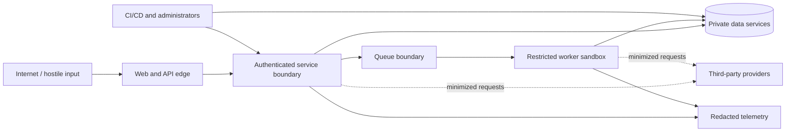

# CareerOS security threat model

Status: Phase 8 and Phase 9 controls complete and hosted verified
Method: asset/trust-boundary analysis with STRIDE-style threat enumeration  
Last reviewed: 2026-07-25

## Scope and current posture

This model covers the browser, Next.js application, FastAPI API, Celery workers,
PostgreSQL/pgvector, Redis, S3-compatible object storage, external providers,
administration, CI/CD, and operational telemetry.

Phase 1 accepts authentication, limited account/profile data, session metadata,
consent events, and onboarding progress. Phase 2 also accepts PDF/DOCX resumes,
stores private originals and derived text/reading-order artifacts, and persists
canonical snapshots, processing jobs, Resume Health analyses, findings, and safe
audit events. Phase 3 adds owned career facts, resume-import proposals, evidence
and provenance, private PDF/DOCX evidence attachments, conflicts, achievement
drafts, reminder preferences, immutable evidence history, and redacted Career
Record audit. Phase 4 adds role taxonomy, saved roles, owner-scoped readiness
analyses, evidence-linked competency results, idempotency records, and redacted
Role Explorer audit. Phase 5 adds owned job postings, constrained job-URL
imports, source-spanned requirement extraction, evidence-linked match analyses,
opportunity priorities, idempotency records, and redacted Job Match audit. Phase
6 adds Change Studio change sets, claim-ledger rows, clarifying questions,
immutable output versions, provider-run metadata, idempotency records, and
redacted Change Studio audit. Phase 7 adds structured resumes, immutable resume
versions, private exported objects, round-trip verification reports, short-lived
download intents, idempotency records, and redacted Resume Builder audit. Phase
8 adds owner-scoped applications, contacts, workflow activity, tasks,
notes, outcomes, rejection/offer text, immutable source pins, grounded packs,
consistency findings, idempotency records, and redacted audit. Phase 9 adds exact
application-claim/evidence-pinned STAR stories, interview sessions/questions,
private notes/reflections and unsent follow-up drafts; contact PII, third-party
consent attestations, referrals, templates, local reminders and occurrences;
goals, development items, immutable reviews, Growth evidence links and Career
Health snapshots; and analytics jobs, source watermarks, definitions and
immutable aggregates. Its implemented controls are called out below. The product
still does not fetch evidence URLs, submit applications, send messages, scrape
contacts, bill, or perform administrator actions; controls described for those
later paths remain target requirements, not implementation claims. The
deterministic local AI provider is implemented for development/tests, while
production remote-provider enablement remains a deployment and security review
decision. The fictional dashboard preview remains isolated at
`/demo/dashboard` and does not use authenticated account state.

## Security objectives

1. A person can access only data and operations authorized for their user and
   current tenant.
2. Career documents, evidence, contacts, and account data remain confidential and
   purpose-limited across storage, telemetry, providers, support, and backups.
3. Provenance, evidence state, score inputs, resume versions, consent, and audit
   records retain integrity and explainability.
4. Hostile documents, URLs, and text cannot execute, pivot into internal services,
   exhaust unbounded resources, or change system/model policy.
5. The product remains available under abusive authentication, upload, analysis,
   AI-cost, and queue patterns with controlled degradation.
6. Users retain meaningful review, export, deletion, and session control.

## Assets and classification

| Class                        | Examples                                                                                                                  | Handling baseline                                                                                    |
| ---------------------------- | ------------------------------------------------------------------------------------------------------------------------- | ---------------------------------------------------------------------------------------------------- |
| Restricted authentication    | Password hashes, session/refresh/reset/verification tokens, OAuth secrets, signed URL credentials                         | Never log; hash tokens at rest; managed secrets; narrow access; rotate/revoke                        |
| Restricted career content    | Raw resumes, evidence documents, performance excerpts, application answers, contact details, job notes, interview stories | Private encryption; ownership scope; no analytics payload; provider minimization; retention/deletion |
| Confidential structured data | Parsed profile, evidence graph, scores/features, applications, contacts, model inputs/outputs                             | Ownership and purpose checks; encrypted transport/storage; audited sensitive access                  |
| Security/audit data          | Consent, audit events, access history, hashes, redacted errors                                                            | Integrity/retention controls; no raw document content; limited admin access                          |
| Internal operational data    | Queue/job state, traces, cost/usage, feature flags                                                                        | Redacted IDs; least privilege; bounded retention                                                     |
| Public                       | Marketing content, published policies, public role taxonomy                                                               | Integrity and release review; no user-specific values                                                |
| Fictional demo               | Seeded preview profile and metrics                                                                                        | Explicitly labeled; isolated from production accounts and analytics                                  |

Embeddings inherit the classification of their source. They are not anonymous and
must be deleted, exported, and access-controlled with the source record.

## Actors

- Legitimate guest, individual user, organization member, coach, and administrator.
- Curious or malicious authenticated user attempting cross-user access.
- Unauthenticated attacker, credential stuffer, bot, and cost/availability abuser.
- Malicious file/job author embedding exploits or prompt instructions.
- Compromised or over-privileged provider, administrator, dependency, CI runner,
  support operator, or deployment credential.
- Accidental insider making an unsafe query, log, export, or configuration change.

## Trust boundaries

Each arrow is authenticated, encrypted outside a local-only network, least-
privilege, bounded, and observable. Local Compose connectivity is not evidence of
a safe production network policy.

## Security invariants

- A resource ID, object key, queue message, signed URL, role claim, or hidden UI
  control is never sufficient authorization.
- Every user-owned operation applies authenticated subject plus tenant/owner
  scope at the database/service boundary.
- Raw untrusted content is data, never executable instructions.
- Unsupported or ungrounded model output cannot become an accepted claim.
- Objects are private and randomized; original and exported documents are
  immutable, hashed, and linked to exact versions.
- Secrets, raw documents, and tokens never enter logs or analytics by default.
- Required security provider failure is explicit and fails closed or quarantines;
  it never silently becomes a no-op.
- Administrative access does not imply blanket access to raw career content.

## Threat and control register

| ID   | Threat / abuse case                                                          | Primary controls                                                                                                                                                                                                                                                | Verification                                                                                                                                 | Residual risk / owner                                                                                        |
| ---- | ---------------------------------------------------------------------------- | --------------------------------------------------------------------------------------------------------------------------------------------------------------------------------------------------------------------------------------------------------------- | -------------------------------------------------------------------------------------------------------------------------------------------- | ------------------------------------------------------------------------------------------------------------ |
| T01  | Broken access control / IDOR by changing UUID                                | Ownership-scoped repository methods; tenant context; deny-by-default policies; task/object recheck; cross-user audit                                                                                                                                            | API integration and signed-object tests change IDs/tenant headers                                                                            | Policy/query omissions remain possible; every data phase                                                     |
| T02  | Tenant-isolation failure through joins, search, analytics, or pgvector       | Ownership columns/indexes; scoped joins/vector filters; aggregation thresholds; no client-selected unrestricted tenant                                                                                                                                          | Static query review, adversarial multi-tenant fixtures, property tests                                                                       | Future org delegation complexity; Phases 1–10                                                                |
| T03  | Public/signed object leakage or key guessing                                 | Private buckets; randomized tenant-scoped keys; short-lived operation-specific URLs; content disposition; authorization before issue/finalize                                                                                                                   | Signed-PUT binding, owner-scoped finalize/resource denial, destination-origin rejection, and anonymous bucket HTTP 403                       | URL forwarding within short TTL; Phase 2                                                                     |
| T04  | File polyglot, wrong extension, malformed parser exploit                     | Signature and MIME allowlist; parser isolation; patched libraries; safe failure; original quarantine                                                                                                                                                            | Malformed/polyglot/wrong-extension corpus                                                                                                    | Unknown parser zero-days; sandbox and rapid patching; Phase 2                                                |
| T05  | Malware or macro-enabled document                                            | Malware scan before parsing; reject/quarantine macro formats; never invoke office macros/content                                                                                                                                                                | EICAR and macro fixtures in isolated test environment                                                                                        | Scanner evasion; layered isolation; Phase 2                                                                  |
| T06  | Zip/decompression bomb or huge document                                      | Compressed/uncompressed byte, entry, ratio, page, CPU, memory, and wall-clock limits; streaming; kill worker                                                                                                                                                    | Signature, malformed/encrypted/polyglot, macro/traversal, expansion entry/ratio, PDF-page, character, timeout, and image-only cases          | Resource exhaustion below thresholds; tune/load test                                                         |
| T07  | Path traversal / unsafe temporary filenames                                  | Server-generated keys/names; ignore archive paths; canonical temp root; no user path joins; cleanup finally/timeout                                                                                                                                             | Traversal and symlink fixture tests                                                                                                          | Library-level extraction behavior; Phase 2                                                                   |
| T08  | Uploaded content executes or reaches network                                 | No execution; restricted UID/filesystem/capabilities; no unnecessary egress; CPU/memory/time caps; disposable workdir                                                                                                                                           | Compose policy inspection and restricted worker runtime checks                                                                               | Local Compose is less isolated; production gate Phase 10                                                     |
| T09  | SSRF through job URL, redirects, DNS rebinding, alternate IP forms           | HTTP(S) only; normalized URL; resolve and validate every connection/redirect; block loopback/private/link-local/metadata/reserved IPv4/IPv6; target pinned connection or proxy with egress allow policy; time/byte/redirect limits                              | IPv4/IPv6/decimal DNS-rebind/redirect/metadata test server                                                                                   | Phase 5 validates before each request/redirect but does not yet socket-pin the connection; sanitize/minimize |
| T10  | Remote script/content injection from job import                              | Fetch raw response without browser execution; content-type allowlist; sanitize; store text/source safely; CSP and output encoding                                                                                                                               | Script/event-handler/SVG/HTML fixtures                                                                                                       | Sanitizer bypass; plain-text default                                                                         |
| T11  | SQL injection or unsafe dynamic filters                                      | SQLAlchemy parameters; allowlisted sort/filter fields; no model output in SQL; least-privilege DB role                                                                                                                                                          | Injection API tests and code scanning                                                                                                        | Unsafe future raw SQL; review gate                                                                           |
| T12  | Stored/reflected/DOM XSS or model-output injection                           | React escaping; HTML sanitizer only where rich text required; CSP; safe links; no dangerous HTML; validate model output                                                                                                                                         | XSS corpus, component/e2e CSP tests                                                                                                          | Rich editor/preview surface; Phases 6–7                                                                      |
| T13  | CSRF on cookie-authenticated mutation                                        | SameSite cookies, CSRF token/origin checks, safe method semantics, CORS allowlist                                                                                                                                                                               | Cross-origin mutation tests                                                                                                                  | Browser behavior/config drift; Phase 1                                                                       |
| T14  | Credential stuffing, enumeration, brute force                                | Generic responses; IP/account/device-aware limits; progressive delay; breached-password policy where lawful; email verification; monitoring                                                                                                                     | Abuse/load tests; response equivalence                                                                                                       | Distributed botnets and user reuse; Phase 1                                                                  |
| T15  | Session theft/replay/fixation                                                | Secure HTTP-only scoped cookies; rotate hashed refresh/session secrets; invalidate on logout/reset/delete; short lifetimes; session UI; OAuth state/PKCE                                                                                                        | Replay, rotation, fixation, logout-all tests                                                                                                 | Compromised endpoint/browser; optional MFA later                                                             |
| T16  | Password/reset/token compromise                                              | Argon2id calibrated parameters; strong random one-time hashed tokens; expiry/rate limits; no token logging; email-link origin allowlist                                                                                                                         | Hash configuration and reuse/expiry tests                                                                                                    | Email-account compromise; Phase 1                                                                            |
| T17  | Rate-limit bypass or costly endpoint abuse                                   | Limits at edge and application keyed by IP/account/tenant/device; normalized identity; quotas, concurrency and body caps; backpressure                                                                                                                          | Header/IP variants, distributed/concurrency/load tests                                                                                       | Proxy attribution errors; tune with telemetry                                                                |
| T18  | Prompt injection in resume, evidence, or job                                 | Treat content as quoted untrusted data; separate system policy; strip/flag unsafe control chars; least-data prompts; no tools by default                                                                                                                        | Adversarial golden fixtures and policy regression                                                                                            | Novel semantic injections; deterministic verifier is final gate                                              |
| T19  | AI fabricates/changes factual claim                                          | Strict schema; evidence IDs and claim ledger; deterministic entity/number/technology/credential checks; reject/question; explicit user review                                                                                                                   | Unsupported claim, changed ownership/date, metric grounding tests                                                                            | Paraphrase meaning detection; high-risk confirmation                                                         |
| T20  | Malformed or malicious model output reaches shell/SQL/HTML/path              | Parse/validate strict JSON; bounded strings/enums; output encoding; never execute or directly interpolate                                                                                                                                                       | Schema fuzz and sink-specific tests                                                                                                          | Downstream library bug; keep privilege minimal                                                               |
| T21  | Sensitive data leaks to AI provider                                          | Field/purpose minimization, configurable redaction, consent, no provider training by default, approved regions/retention, DPA, provider disable switch                                                                                                          | Payload snapshot/privacy tests                                                                                                               | Provider/legal changes; Phase 6 review                                                                       |
| T22  | Sensitive data leaks through logs, traces, errors, analytics                 | Central redaction, allowlisted fields, route templates not raw URLs, safe IDs, payload-free events, production error masking                                                                                                                                    | Secret/PII canary tests and log review                                                                                                       | Free-form exceptions; structured logging only                                                                |
| T23  | Excessive AI or render cost                                                  | Per-user/tenant/plan quota, idempotency, max tokens/pages, concurrency, timeouts, circuit breaker, cost accounting and alerts                                                                                                                                   | Retry/idempotency/budget tests                                                                                                               | Provider price/usage spikes; configurable kill switch                                                        |
| T23a | Export file looks correct but drops, duplicates, or reorders facts           | Implemented: immutable version pinning, deterministic searchable output, PDF/DOCX reparse, critical-text blocking, hash storage, and no download intent for blocked exports. Phase 10 gap: canonical occurrence/read-order checks and distinct verified layouts | Current renderer round-trip, blocked-export download denial, cross-user download, and Playwright workflow; Phase 10 fidelity-manifest corpus | Shared template structure and nonblocking occurrence/read-order comparison until the Phase 10 gate closes    |
| T23b | Application source drift, legacy provenance, or contradictory packs          | Exact job version/source hash, resume-version claim-hash validation, evidence revision/statement hashes, legacy-source refusal, deterministic claim/number/requirement consistency, blocked findings                                                            | Historical-revision/hash mismatch, legacy-ledger refusal, numeric support, cross-document consistency, resume-change audit tests             | Semantic paraphrase drift; deterministic synchronous generator remains intentionally constrained             |
| T24  | Queue replay, forged job, duplicate side effect                              | Authenticated private broker; durable job record; ownership/state/idempotency check; payload references not raw secrets; bounded retry/dead letter                                                                                                              | Duplicate/reordered/forged payload tests                                                                                                     | Redis local durability differs from production; deployment ADR                                               |
| T25  | Dependency or build compromise                                               | Lockfiles/hashes, least-privilege CI, pinned actions/images, review of updates, SCA/container/secret scanning, provenance and SBOM objective                                                                                                                    | CI security jobs and reproducible build                                                                                                      | Registry/upstream compromise; ongoing                                                                        |
| T26  | Secret committed or exposed in image/client                                  | `.env.example` placeholders; secret scanning; server-only vars; build/image inspection; managed secret injection                                                                                                                                                | Git/image/bundle secret scans                                                                                                                | Human error or CI artifact leakage                                                                           |
| T27  | Admin abuse or support overreach                                             | Separate role/permissions, just-in-time purpose-bound access, no raw default, re-auth/MFA target, immutable audit, alerts, dual control for destructive actions                                                                                                 | Permission matrix and audit tests                                                                                                            | Authorized insider misuse; governance and monitoring                                                         |
| T28  | Audit tampering or missing evidence                                          | Append-oriented audit store, server-generated actor/request/time, restricted mutation, retention/export controls, coverage tests                                                                                                                                | Critical-action audit assertions                                                                                                             | DB superuser compromise; external/WORM export later                                                          |
| T29  | Data remains after deletion or appears in backup/vector/cache                | Data inventory and erasure orchestration; tombstones; object/vector/cache/provider deletion; backup expiry policy; status to user                                                                                                                               | End-to-end deletion and restore-window tests                                                                                                 | Immutable backup retention; disclose and minimize                                                            |
| T29a | Fictional seed writes known credentials or synthetic data to a shared target | No delivery route; tools-only profile; exact confirmation; development, local database identity/host, local MinIO/bucket, and reviewed migration-head checks before I/O; immutable drift refusal                                                                | Pure guard tests and two-pass PostgreSQL/MinIO replay with zero-row second pass                                                              | A malicious local DNS/hosts override can redirect an allowlisted name; tooling remains developer-only        |
| T30  | Billing webhook replay/forgery                                               | Signature/timestamp verification, raw-body validation, event idempotency, state-machine constraints, amount/plan lookup server-side                                                                                                                             | Replay/order/signature tests                                                                                                                 | Provider account compromise; Phase 10                                                                        |
| T31  | Denial of service against API, DB, queue, object store                       | Body/query bounds, timeouts, pools, backpressure, per-tenant concurrency, queue isolation, autoscaling and graceful degradation                                                                                                                                 | Load/soak/failure tests                                                                                                                      | Large distributed attack; upstream protection                                                                |
| T32  | Sensitive health/readiness metadata disclosure                               | Minimal status/version; no credentials, stack traces, hostnames, bucket names, or raw dependency errors; admin detail separately protected                                                                                                                      | Response snapshot tests                                                                                                                      | Version fingerprinting; patch promptly                                                                       |
| T33  | Cache key collision or cross-tenant result reuse                             | Namespace by environment/version/tenant/user/resource; cache only authorized representations; short TTL/invalidation                                                                                                                                            | Cross-tenant cache tests                                                                                                                     | Future caching complexity; introduce only with tests                                                         |
| T34  | OAuth account-link takeover                                                  | State, nonce, PKCE, exact redirect allowlist, verified provider identity, explicit authenticated link/unlink, conflict handling                                                                                                                                 | Login/link CSRF and provider-account collision tests                                                                                         | Compromised provider identity; Phase 1                                                                       |
| T35  | Insecure deletion/reset/retry operation                                      | Re-auth for sensitive actions, confirmation, ownership, idempotency, audit, safe allowlisted retry states                                                                                                                                                       | Cross-user/replay/unsafe retry tests                                                                                                         | Social engineering; clear UX and notices                                                                     |

## File-processing security design

### Admission

The API issues a single-purpose, short-lived upload intent only after rate,
quota, and account-or-guest ownership checks. It records expected media/size and
a randomized private staging key. The browser accepts only the configured object
origin and receives a method/headers-constrained signed `PUT`, never permanent
credentials. Finalization treats browser/object metadata as assertions, not
proof: it checks owner, intent expiry, exact stored byte count, stored media type,
and a bounded byte signature before promoting the object into quarantine.

The browser keeps intent/transfer/finalize retry state only in memory and can
reuse it after an ambiguous response while the page stays mounted. It never puts
signed URLs or capability material in durable browser storage. The tradeoff is
that a lost upload-intent response or page reload may reserve intake quota until
the default five-minute TTL expires; scheduled cleanup later removes orphaned
staging bytes. Phase 2 uses one signed `PUT`; there is no resumable or multipart
transfer.

Initial accepted types are PDF and DOCX. Macro-enabled Office formats, archives,
executables, encrypted documents that cannot be inspected, and unsupported types
are rejected with a safe user-facing reason. Limits are configuration with secure
upper bounds, not user-controlled values.

### Quarantine and processing

New objects remain quarantined. A restricted worker downloads the bounded object
into a fresh randomized child of a private `noexec` tmpfs, runs required ClamAV,
then applies PDF/DOCX signature, expansion, entry, compression-ratio, character,
artifact, and wall-clock limits plus an authoritative PDF page cap before
extraction. It runs as a non-root user
with a read-only base filesystem, dropped capabilities, `no-new-privileges`,
bounded CPU/memory/PIDs, and no edge network. It never executes embedded scripts,
macros, links, or attachments.

The temporary directory context removes bytes on success or exception. An
infected document is rejected. Scanner connection/protocol failure is retryable
only within the bounded job policy; the object remains quarantined and an
exhausted job is rejected/dead-lettered rather than parsed unchecked. Malformed,
encrypted, polyglot, macro-bearing, traversal, expansion-bomb, PDF-page-limit, and
timeout inputs produce allowlisted safe error codes. Raw parser/scanner output is
not returned or logged.

The local `python-docx` path cannot reliably derive rendered DOCX page count. It
therefore bounds DOCX by upload bytes, archive entries, expanded bytes/ratio,
extracted characters/blocks, artifact size, CPU/memory, and wall clock. A future
layout-aware rendering provider is required before claiming DOCX page-count
enforcement.

Each worker delivery receives a fresh fencing token stored only as its SHA-256
digest and a durable lease longer than the Celery hard timeout. A concurrent
delivery performs a delayed busy retry rather than sharing the lease. An expired
lease can be reclaimed within the durable attempt cap, and every progress/result
write verifies the current token so a stale worker cannot commit after recovery.
A scheduled database-only reconciler recovers stale published, retryable-failed,
and expired-running jobs through a fresh outbox generation; it first clears an
expired lease/token and refuses to exceed either processing or recovery budgets.

### Storage and lifecycle

Original quarantine objects are immutable by application policy; the local
bucket denies anonymous access. Plain-text and reading-order derivatives use
separate randomized keys and ownership checks. Content hashes support integrity,
but there is no cross-user deduplication or existence signal. Local bucket
versioning is not presented as the production retention control.

Guest access uses a high-entropy opaque capability stored only as a keyed hash on
the server and delivered in a path-restricted `HttpOnly`, `SameSite=Lax` cookie.
A separate double-submit token and exact-origin check protect guest mutation. One
guest capability permits one active intake; both capability and document default
to 24-hour retention. Expiry first queues the same durable deletion job used by
explicit delete, then revokes the capability. Account conversion requires a
valid account session, account CSRF, valid guest capability, explicit consent,
and account quota; it also requires a ready document, completed analysis, and no
active/retryable job. It copies objects to new randomized account keys and
transfers retained content/job history before deleting guest-key copies. Existing
guest audit records remain append-only under the original guest scope.

Deletion removes the original and derivative objects, purges canonical snapshots,
analyses, feature values/contributions, findings, and components, and leaves only
a redacted document/job/audit record. Object promotion/claim compensation and
rejected/expired staging or orphan quarantine cleanup use owner-scoped durable
cleanup rows with bounded backoff/attempts and terminal dead-letter state.
Explicit deletion is a fenced durable job with bounded retry/dead-letter and a
staging cleanup backstop. The transactional job outbox uses the same bounded
operational principle for broker publication. Backup expiry, account-wide export/deletion,
embeddings, OCR artifacts, and provider erasure remain later-phase production
policy because those stores are not part of Phase 2.

### Resume export storage and verification

Phase 7 exported resume files use separate randomized private object keys scoped
by owner and immutable version. API responses expose the export ID, status,
format, size, hash, and verification report, never the internal object key.
Download URLs are produced only through short-lived owner-checked download
intents and are unavailable for failed, deleted, or verification-blocked exports.

Rendering input is an immutable structured resume version whose bullets carry
eligible evidence IDs. Server validation rejects unsupported edits before render.
Generated PDF/DOCX bytes are parsed again by the document extractor; critical
missing text, unreadable output, or implemented grounding mismatches block the
export. Exact bullet occurrence counts, duplicate/omission detection, and reading
order are not yet release-blocking. Text and JSON exports still receive a
structured verification report and hash, but do not require binary reparse.

Export deletion rechecks ownership and leaves redacted audit/status metadata.
The current path tombstones database state before a non-durable object-store
delete, so interruption can orphan a private object. Durable fenced object
cleanup and reconciliation are Phase 10 release requirements. Verification
failures and render errors store safe codes/messages only; logs must not include
resume text, download URLs, object keys, or rendered bytes.

Rendering and verification currently execute synchronously in the application
service. Persisted attempt/retry/dead-letter-shaped fields are not a durable
queue. Phase 10 must move this hostile/resource-intensive work behind an
outbox-backed, leased worker with bounded recovery.

### Application Workspace provenance and sensitive data

Phase 8 applications duplicate only the bounded source material required to
preserve history: exact job version/source hash and requirement spans, immutable
resume version and claim ledger, and eligible evidence revision numbers/
statement hashes. Each source is loaded through an owner-authorizing application
service. Cross-user IDs, a changed or unavailable historical revision, a hash
mismatch, inconsistent claim references, and legacy versions without exact
revision/hash provenance fail closed before application creation or a resume-pin
change.

Upgrade compatibility does not manufacture provenance. The shipped Phase 6
migration remains immutable; Phase 8 forward-adds a nullable all-or-none evidence
revision tuple to Change Studio claims. Existing rows remain readable as
explicitly unpinned history, but Resume Builder and Application Workspace refuse
to use them as grounded generation input. Only claims created with the complete
revision ID/number/statement-hash tuple can cross those boundaries.

Application, task, note, event, pack, and document rows carry explicit owner and
application scope; nested reads constrain both rather than authorizing from an ID
alone. Application/task mutations use optimistic concurrency. Retried creates use
bounded idempotency keys and fingerprints, and the web retains one key for the
same unchanged user intent. A reused key with different input conflicts instead
of duplicating or mutating the earlier side effect. Omitted event time is not
replaced with a moving clock value before fingerprinting, so a retry remains the
same request.

Contacts, notes, rejection reasons, offer summaries, and generated pack bodies
are restricted career content and never belong in general logs, analytics
snapshots, or operational errors. List/child APIs use bounded opaque pagination,
strict cursor validation rejects non-ASCII input before decoding, calendar ranges
are bounded, and the main detail response avoids unbounded eager activity. The
web loads sensitive child panels only when used, reloads authoritative state
safely after a concurrency conflict, and does not treat hidden controls as
authorization.

Pack generation is deterministic and synchronous in this phase. Every factual
claim retains exact evidence-revision and supported-requirement links; numeric
claims are checked against pinned evidence, document content is hashed, and
cross-document disagreement produces blocking findings. Deleting a generated
document replaces its content and provenance links with an audited tombstone.
Application deletion is owner/version checked and leaves only redacted audit
metadata. No API can submit an application, send a generated message, scrape a
contact, or autonomously advance a stage.

## URL-import security design

The server, never the user's browser session, performs a constrained fetch. URL
normalization rejects credentials, fragments where irrelevant, unsupported
schemes, ambiguous hosts, and malformed encodings. Resolution validates all
addresses before each request and redirect. IPv4-mapped IPv6 and alternate
address representations are normalized before network-range decisions.

The fetcher caps DNS/connect/read/total time, redirects, decompressed bytes, and
content type. It does not send user cookies or internal credentials and does not
execute JavaScript. Phase 5's local importer relies on the HTTP client's normal
TLS hostname verification but does not yet pin the TCP socket to the prevalidated
address, so DNS rebinding between validation and connection remains a documented
production hardening item. A production egress proxy/firewall blocks metadata and
private networks even if application validation fails.

## AI and grounding security design

Documents are surrounded by fixed untrusted-data delimiters and cannot supply
system or tool instructions. Providers receive the minimum required fields and
opaque evidence IDs. Tool use is disabled unless a future reviewed capability
needs a narrow allowlisted tool.

Model output first passes size/JSON/schema validation, then the deterministic
grounding verifier described in `docs/ai-grounding-policy.md`. Unknown evidence
IDs, unsupported facts, unconfirmed numbers, entity/date changes, or changed
contribution semantics are rejected. Rejected output may produce a safe
clarifying question but never an exportable claim.

Prompt/model/provider versions, input evidence IDs, validation outcome, usage,
and cost are recorded without raw prompt logging. The display layer escapes
output and enforces the same content policy after a user's manual edit.

## Authentication and authorization design

Phase 1 uses FastAPI-owned sessions. Passwords use Argon2id with calibrated cost.
Session/refresh secrets are high-entropy, hashed in storage, bound to a session
record, rotated on use, and revoked on logout, password reset, account deletion,
or suspicious reuse. Cookies are Secure and HTTP-only in production with an
appropriate SameSite policy; state-changing requests use CSRF defenses.

OAuth uses exact redirect URIs, state, nonce, and PKCE. Account linking requires
an authenticated session or a verified conflict-resolution flow; provider email
alone is not always sufficient proof.

Each service method receives an authorization context and queries by both owner/
tenant and UUID. Background jobs store owner/tenant and reauthorize durable
resources. Organization roles grant explicit capabilities, not blanket tenant
reads. Admin capabilities are separate and audited.

### Abuse-source attribution boundary

The pre-authentication and Phase 2 guest-intake rate key is deliberately separate
from identity. Local
Compose publishes only `web-edge`; the Next.js container has no host port. The
edge is built as a dedicated minimized image. Both shipped Node runtimes remove
npm, Corepack, and package-manager executables after the build stage, so their
transitive packages are not deployed. The edge discards `Forwarded`,
`X-Forwarded-For`, `X-Real-IP`, and vendor address headers supplied by the client,
then writes the direct socket peer. The server-only BFF normalizes that value and
HMAC-signs it; the API verifies the signature in constant time and uses only the
opaque signature as the pre-auth/first-guest upload rate subject. Invalid or
unavailable signals fail closed in staging and production. This mechanism grants
no session, capability, owner, or tenant authority.

The local policy is intentionally single-hop. Behind a cloud load balancer, the
edge sees the balancer socket address, so attribution collapses until a
deployment-specific allowlist defines exactly which proxy hop may supply which
address header. Accepting arbitrary forwarded headers would reintroduce spoofing;
distributed actors can still evade any per-source key and require upstream edge
controls plus account/domain quotas.

### Phase 1 implemented controls and evidence

- Passwords are Argon2id hashes. Session, refresh, verification, recovery, OAuth
  state, and PKCE material are high-entropy opaque values; persisted secrets use
  keyed hashes rather than recoverable plaintext.
- Access and refresh cookies are HTTP-only, production-secure, and scoped to the
  required paths. A session-bound readable CSRF cookie plus matching header and
  origin/CORS allowlist protect state changes. The web proxy is same-origin,
  header-allowlisted, redirect-controlled, time-bounded, and cannot select an
  arbitrary upstream.
- Refresh use rotates the token and detects replay; a replay revokes the family.
  Verification and recovery tokens are short-lived and single-use. Successful
  password recovery invalidates sessions.
- Registration, resend, and recovery responses resist account enumeration. Redis
  applies bounded abuse controls. Request bodies are capped at 1 MiB for both
  declared and chunked bodies before application parsing.
- Google OAuth state is browser-bound and one-use. The adapter requires state,
  nonce, PKCE, exact configured redirects, RS256 signatures, audience/client and
  authorized-party checks, plus `at_hash` when supplied. Account collisions fail
  safely and tests use deterministic providers without live credentials.
- Owner-scoped repositories and route dependencies reject anonymous and cross-user
  access. Session, authentication, consent, and security-sensitive changes emit
  redacted audit events; recent-auth hooks exist without claiming MFA support.

Unit/API tests cover these invariants, two integration workflows exercise real
PostgreSQL and Redis, and the isolated browser journey proves registration through
Mailpit verification, login, onboarding, exact-session revocation, logout, and
protected-route denial on desktop and mobile. Exact counts and commands are in
`PLANS.md`.

### Phase 2 implemented controls and verification evidence

- Migration `20260715_0003` gives every upload, document, artifact, canonical
  snapshot, analysis, job, and object cleanup exactly one account or guest owner,
  with foreign keys, state/value checks, scoped indexes, and owner-scoped
  repository methods. Analyses persist feature-schema version, typed feature
  values, and normalized weighted contributions rather than an unauditable total.
- Presigned upload intents use randomized keys and exact expected media/size.
  Finalize repeats ownership and byte admission before staging-to-quarantine
  promotion. MinIO uses a non-root application identity limited to the private
  document bucket and one exact browser CORS origin.
- Required ClamAV scanning, guarded local PDF/DOCX extraction, randomized
  temporary paths, a restricted worker container, bounded job retry/dead letter,
  per-invocation token/lease fencing, delayed busy delivery, and allowlisted queue
  task names reduce hostile-file and queue-forgery blast radius.
- Account access uses the existing session/CSRF principal. Guest access uses a
  separately hashed capability plus guest CSRF/origin policy. Resource UUID alone
  cannot retrieve, correct, analyze, claim, cancel, or delete content.
- Canonical corrections are immutable successors with optimistic concurrency.
  Resume headers are narrowly validated, all-no-op correction is rejected,
  correction/analysis have separate owner-scoped rates, and domain history caps
  bound revision/job growth. Analysis and deletion are idempotent durable jobs;
  scheduled retention uses the same object/content deletion path. Durable object
  cleanup and transactional outbox publication have bounded attempts/backoff and
  dead-letter state. Audit metadata contains safe IDs/state, not filename,
  document text, signed URL, capability, or parser output.
- Focused tests cover cross-owner denial; capability scope/expiry/claim; quota and
  retention; infected and unavailable scanner behavior; wrong-signature,
  malformed, encrypted, polyglot, macro, traversal, expansion, image-only, and
  timeout documents; private S3 and real ClamAV contracts; outbox, cancellation,
  retry/dead letter, fencing/lease recovery, BFF signal/header overwrite,
  route-template payload-free logging; and registered/guest browser workflows.

These controls and the same-revision local container, integration, E2E, and scan
gates pass as recorded in `PLANS.md`; the 2026-07-26 typed semantic closure also
passes its exact implementation-tree Phase 2 verifier and separate security
scan. Hosted run `29378312134` remains evidence for the original generic-block
v1 slice; hosted evidence for the typed closure is pending authorization to
publish.

Identity closure keeps onboarding observations outside the mutation payload and
fetches them through an owner-scoped Resume Health application query. Password
change requires recent authentication and current-password verification when a
password exists, invalidates reset material, and revokes all sessions. Google
disconnection fails closed if it would remove the last login method. Security
activity exposes only bounded owner-scoped event type, outcome, time, and
current-session state; audit metadata, request IDs, tokens, and PII are not
returned. Settings capabilities default disabled and cannot make an absent
export, deletion, billing, or delivery workflow appear enabled.

### Phase 3 implemented controls and verification status

- Migration `20260715_0004` gives Career Record rows a non-null owner and uses
  owner-aware uniqueness, foreign keys, checks, and indexes for profile entities,
  nested links, evidence revisions/sources/metrics/conflicts/usage, proposals,
  attachment workflow state, achievements, reminders, and audit events.
  Repositories fetch by owner plus ID; nested links validate both resources in the
  same scope, and cross-user/unknown IDs have indistinguishable not-found behavior.
- Phase 3 is account-only and reuses authenticated server-side sessions, CSRF,
  exact-origin, body limits, safe problem responses, and request/trace context.
  Positive versions and strict quoted `If-Match` values reject stale writes.
  Proposal review, attachment finalize, and achievement conversion prevent replay
  from silently duplicating or overwriting career truth.
- Evidence strength and lifecycle are separate server decisions. Clients cannot
  submit a resulting strength; owner confirmation produces Confirmed only after
  validation. The production service composes no `VerificationAuthority`, so
  neither a client, model, nor owner can manufacture Verified evidence. Material
  edits create immutable Inferred revisions, and open conflicts, unavailable
  provenance, archive/delete lifecycle, Inferred, and Unsupported evidence are
  excluded by the owner-scoped downstream eligibility query.
- Resume provenance crosses the module boundary only through an explicit
  ownership-checking application query. Career Record copies bounded source IDs,
  revision/schema information, source span/digest, and a review excerpt into a
  pending proposal or immutable evidence revision. It does not foreign-key career
  truth to a deletable resume or treat parser confidence as confirmation.
- Additive migration `20260726_0011` gives every new confirmation, personal-fact,
  typed-proposal, relationship, and per-field-provenance row explicit owner
  scope. Composite foreign keys reject cross-owner links, a partial unique index
  permits only one primary contact fact of a kind, and historical entities remain
  unconfirmed. Typed proposal input is loaded server-side from the owned reviewed
  semantic snapshot; unreviewed/removed fields are excluded, and exact
  parser/user-added origins are distinguished from accept-time owner edits.
- Material canonical edits revoke fact/entity/skill confirmation. Downstream
  snapshots load only current confirmed facts and records, validate provenance
  against the exact source snapshot field and canonical digest, and return an
  explicit gap for unsupported data rather than silently promoting it.
- Evidence attachments accept bounded PDF/DOCX only. Admission and download use
  randomized private object keys and short-lived operation/key/media/size-bound
  signed URLs. Finalize repeats ownership, expiry, object metadata, exact size,
  and byte-signature checks while locking the parent evidence against deletion.
  Required ClamAV and the bounded extractor run in the restricted worker and fail
  closed; attachment presence alone cannot raise evidence strength.
- Attachment jobs persist owner, idempotency, trace, status, attempts, safe error,
  lease, hashed fencing token, and terminal state. Identifier-only outbox payloads,
  bounded publish/process/cleanup retries, dead letters, stale-job reconciliation,
  and durable object cleanup cover broker loss, worker death, and object-store
  failure without logging raw evidence, answers, filenames, signed URLs, or bytes.
- Focused domain, repository, API, worker, provider, component, and browser tests
  cover the controls above. The desktop primary journey creates career data,
  confirms evidence, and explicitly converts an achievement; it does not exercise
  a mobile end-to-end career journey or independent verification. The final
  local `scripts/verify-phase3.ps1` result and hosted Phase 3 CI pass as recorded
  in `PLANS.md`.

### Phase 4 implemented controls and verification status

- Public role taxonomy rows carry source, license, version, and published time.
  User-owned saved roles, readiness analyses, components, competency results,
  evidence links, idempotency rows, and audit events carry non-null owner scope
  and supporting indexes/constraints.
- All routes require authenticated account sessions. Mutations require CSRF and
  exact-origin protection; saved-role updates/deletes require strict `If-Match`;
  analysis requires bounded idempotency keys. Cross-user saved-role and analysis
  reads return not-found rather than exposing resource existence.
- Readiness consumes only the Career Record application snapshot. It does not
  query evidence tables, accept client evidence IDs as proof, copy raw evidence
  text into analysis/audit rows, or treat a listed skill as demonstrated without
  eligible matching evidence.
- Scoring is deterministic fixed-point code with persisted engine/configuration/
  feature-schema versions, feature hash, input snapshot, components, and
  competency results. Responses include the internal-score disclaimer and never
  label readiness as an ATS score, hiring probability, or guarantee.
- Unit, migration-shape, API, repository integration, web component, and
  Playwright workflow coverage exercise owner scope, idempotency, stale versions,
  no-signal behavior, evidence relevance, comparison, and disclaimer display.
- The consolidated local `scripts/verify-phase4.ps1` gate passed on 2026-07-19,
  including real dependency integrations, migration rollback/forward repair,
  worker hardening probes, and the isolated Role Explorer browser journey.

### Phase 5 implemented controls and verification status

- Migration `20260719_0006` adds owner-scoped job postings, current extracted
  requirements, immutable match analyses, requirement match rows, evidence-link
  snapshots, opportunity priorities, idempotency records, and redacted audit
  events with constraints, foreign keys, and scoped indexes.
- All routes require authenticated account sessions. Mutations require CSRF;
  create/import/analyze/priority operations require bounded idempotency keys; and
  job update/delete require strict `If-Match`. Cross-user job, analysis, and
  priority reads return safe not-found responses.
- Job Match consumes eligible evidence only through the Career Record application
  snapshot and role context only through the Role Readiness application service.
  It does not accept client evidence IDs as proof and does not query Phase 3 or
  Phase 4 tables directly.
- URL import accepts HTTP(S) only, rejects credentials and non-public resolved
  addresses, repeats validation for redirects, caps redirects/time/bytes, avoids
  cookies/scripts/browser execution, and sanitizes HTML to plain text. The
  remaining socket-pinning hardening item is documented above and in ADR 0011.
- Application Readiness and Opportunity Priority are deterministic, versioned,
  evidence-linked internal measurements. Responses include the canonical
  disclaimer and never describe the result as an employer score, ATS score,
  hiring probability, or guarantee.
- Unit, provider, migration-shape, API, repository integration, web component,
  and Playwright workflow coverage exercise owner scope, idempotency, stale
  versions, source spans, sanitizer/SSRF rejection, injected job text, hard gaps,
  matrix display, and disclaimer visibility. Final consolidated local Phase 5
  verification is recorded in `PLANS.md`.

### Phase 6 implemented controls and verification status

- Migration `20260719_0007` adds owner-scoped change sets, operations,
  claim-ledger rows, clarifying questions, immutable versions, provider runs,
  idempotency records, and redacted audit events with scoped indexes and
  constraints.
- Change Studio consumes Career Record evidence and Job Match requirements only
  through application services. It reauthorizes by owner and never trusts a
  client-provided evidence or requirement ID as proof.
- All reads require authenticated account sessions. Mutations require CSRF,
  bounded idempotency keys, and current `If-Match` versions where an existing
  change set is modified. Cross-user change sets and clarifications return safe
  not-found responses.
- Provider output is treated as hostile JSON. Strict parsing rejects unknown
  fields and invalid IDs/enums/ranges; deterministic grounding blocks unsafe sink
  content, prompt-injection text, unsupported facts, unauthorized evidence,
  ungrounded numbers, ownership/leadership inflation, and causation claims not
  supported by evidence.
- The deterministic local provider only reuses eligible evidence text already
  linked to saved job requirements. The HTTP JSON provider is HTTPS-only,
  credential-required, timeout/retry/response-size bounded, and protected by a
  circuit breaker; production rejects deterministic provider configuration.
- Accept/edit/alternative/lock/reject/undo/redo/restore/answer actions are
  explicit user decisions, append audit records, and preserve immutable output
  versions. Clarification answers do not become eligible evidence by themselves.
- Unit, adversarial grounding/provider, migration-shape, API, repository
  integration, web component, and Playwright workflow coverage exercise owner
  scope, idempotency, stale versions, malformed provider output, unsupported
  claims, numeric eligibility, provenance display, and the primary review flow.
  Final consolidated local Phase 6 verification is recorded in `PLANS.md`.

### Phase 7 implemented controls and verification status

- Migration `20260719_0008` adds owner-scoped resumes, immutable versions,
  exports, verification reports, short-lived download intents, idempotency, and
  redacted audit. Additive migrations `20260726_0012`/`20260726_0013` add
  immutable fact/layout pins, operation-typed outbox state, fenced leases,
  cleanup state, and matching constraints/indexes.
- Resume Builder consumes owner-authorized Career Record and Change Studio
  application views. Every current bullet and immutable-version claim must carry
  exact evidence revision provenance; unsupported and incomplete legacy source
  ledgers are refused rather than treated as grounded.
- Exports pin one immutable version plus canonical manifest/content hashes, use
  private randomized object keys, reparse PDF/DOCX output in the resource-limited
  worker, and block exact omission/duplicate/order/searchability/page/grounding
  failures before any short-lived owner-checked download intent.
- API transactions enqueue identifier-only render/delete operations. Fenced
  leases, bounded retry/dead-letter, reconciliation, and redacted stage audits
  contain replay and outage risk. Failed verification removes its object;
  explicit deletion records `deleted_at` only after S3 confirms deletion, so an
  orphan cannot be silently reported as gone.
- Every render claim persists a distinct attempt-object cleanup backstop before
  the S3 write. Successful verification cancels only the winning backstop in
  the same transaction that publishes its object key; worker termination,
  uncertain storage responses, and lease loss leave a bounded, audited cleanup
  record rather than an undiscoverable object.
- Presigned downloads force `private, no-store` and attachment disposition.
  The API never returns internal object keys; anonymous bucket access remains
  denied.
- The final consolidated Phase 7 renderer, repository, API, web, migration, and
  browser evidence is recorded in `PLANS.md`.

### Phase 8 implemented controls and verification status

- Migration `20260724_0009` adds explicitly owner-scoped applications and child
  records with composite scope, database constraints/indexes, positive
  concurrency versions, idempotency fingerprints, and redacted audit. It also
  forward-adds nullable all-or-none evidence revision pins to Change Studio
  claims without rewriting the shipped `20260719_0007` migration or backfilling
  historical rows.
- Owner-authorizing source adapters require an exact job version/source hash,
  immutable resume version whose claim hashes are revalidated, and exact eligible
  evidence revision numbers/statement hashes. Historical mismatch, cross-owner
  input, and incomplete provenance fail closed. Legacy Change Studio claims remain
  readable as explicitly unpinned history but cannot seed Resume Builder or
  Application Workspace; new claims require the complete pin tuple.
- Authenticated reads and nested-parent checks prevent ID-only authorization;
  mutations require CSRF, and application/task changes require strict
  `If-Match`. Application, task, note, event, and pack creates reuse stable
  per-intent idempotency keys and reject a conflicting fingerprint. Event retries
  remain stable when time is omitted, and malformed non-ASCII cursors fail closed.
- Database stage/outcome constraints match the domain enums. A resume change,
  refreshed evidence snapshot, explicit reason, workflow event, and audit record
  commit or roll back together in one transaction.
- The deterministic synchronous generator preserves exact
  evidence-revision/requirement links, blocks unsupported numeric/factual
  material, hashes documents, and reports source and cross-document consistency.
  Sensitive document deletion leaves an audited tombstone; application deletion
  leaves a redacted audit event.
- Cursor pagination, bounded filters/calendar ranges, lightweight detail
  responses, and lazy web panels bound response/query growth. Accessible
  board/table/calendar and non-drag actions avoid treating drag or hidden UI as
  authority.
- Final local closeout passed on 2026-07-24 for implementation revision
  `964cd9c`. `scripts/verify-phase8.ps1` exited 0 in 273 seconds with `206 passed`
  backend, `104 passed` API, `121/121 passed` across 35 web files, a 39-route
  production build, migration rollback/forward repair, integration/worker/
  container probes, and the configured browser portfolio. Playwright discovered
  16 tests and completed with 10 passed and 6 intentional inherited mobile skips;
  Application Workspace itself passed complete desktop and mobile journeys.
- `scripts/security-scan.ps1` exited 0 in 287.7 seconds. Gitleaks was clean; pnpm
  and pip audits found no known vulnerabilities, with unpublished local workspace
  packages skipped; API and worker had no fixable-high findings; and web plus
  `web-edge` had no vulnerabilities. Three medium Python-runtime findings remain
  with fixes only in Python 3.15 prereleases and are nonblocking under policy.
  PR #21 workflow runs `30126993025` and `30128304892` passed every required
  hosted job.
- No submission, send, scrape, or autonomous stage-changing capability exists.
  The production provider, durable generation worker, load/soak, backup/restore,
  and protected deployment review remain later gates.

### Phase 9 implemented controls and verification status

- Career Record now binds every v1 exact-source `Supported` statement to the
  immutable original block digest before persistence, accepts boundary whitespace
  differences only, derives the title server-side, and rejects additional
  metadata or relationship scope. Live eligibility re-resolves the owned source,
  checks its persisted provenance tuple/digest, and rejects legacy spoofed scope
  with `supported_scope_mismatch` without rewriting history. Corrected blocks
  fail closed. Accepted legacy import context is not described as exact field
  provenance and disappears from current entity responses after a factual edit.
- Migration `20260724_0010` adds explicit ownership, composite owner/parent
  foreign keys, bounded enum/check constraints, optimistic versions,
  idempotency fingerprints, audit records, analytics jobs/outbox/snapshots, and
  local reminder occurrence/outbox state. It also conditionally repairs missing
  Phase 8 provenance tuple/check objects and stale resume-change event/audit enum
  checks in pre-release development databases without mutating migration
  `20260724_0009`; downgrade leaves canonical Phase 8 objects intact.
- Interview stories accept only exact claim/evidence pins loaded through the
  owner-authorizing Application Workspace interface. Source hashes are
  revalidated; missing, historical, cross-user, or unsupported facts fail closed.
  Before a story is newly persisted as ready, every selected exact pin is
  rechecked against live canonical eligibility. Defense maps repeat that check
  and degrade rejected ready stories to partial/needs-review without rewriting
  them. Notes/reflections remain private, and generated questions/follow-ups are
  grounded review-only drafts with no send capability. Before any new question
  bank or follow-up is created, its relevant immutable session pins are rechecked
  through Application Workspace against live canonical Career Record eligibility
  and exact revision ID/number/hash, strength, and numeric state. Stable
  idempotent replays return their prior immutable artifacts; they do not silently
  rewrite history after an eligibility change.
  Defense-map assembly validates every story independently, so an ineligible pin
  on one story cannot mark unrelated supported stories stale.
- Networking uses a separate, append-only, purpose-specific consent ledger.
  Account consent and Application Workspace contacts are never treated as contact
  consent. The ledger records the account owner's explicit attestation; it is not
  independent proof supplied by the contact. Every contact child lookup scopes
  by owner and parent. Opaque cursors bind owner, collection, parent, normalized
  filters, and sort semantics; strict decoding rejects malformed, non-ASCII, or
  cross-purpose values. Organization deletion atomically detaches active contacts
  rather than creating cross-owner or dangling references.
- Consent policy versions are server-owned allowlisted identifiers. The wire
  schema rejects arbitrary values, the application boundary repeats that check,
  and a database constraint permits only the current attestation or internal
  deletion-policy identifiers. A client therefore cannot smuggle names, email
  addresses, or other free text into the ledger retained after redaction.
- Collection or storage withdrawal also withdraws every active consent purpose,
  irreversibly tombstones all contact-parent PII, cancels pending referrals and
  reminders, and redacts note bodies, every interaction summary, referral
  context, and reminder titles. Outreach-only withdrawal retains the contact,
  notes, and inbound/mutual history but cancels pending work and redacts
  outbound, template-linked, or referral interaction summaries plus referral
  context and reminder titles. Contact deletion follows the destructive
  tombstone path. Terminal referral/reminder transitions after either withdrawal
  cannot restore redacted content. Contact/owner row locking prevents concurrent
  mutations from escaping those terminal privacy states.
- Reminder workers carry only durable identifiers, use bounded claim/lease/retry/
  dead-letter state, and materialize local occurrences without a delivery
  provider, URL fetch, email, or social-network adapter. The execution API exposes
  only allowlisted machine status and safe error codes; lease tokens, destination,
  contact content, and message content are excluded. Composite database
  constraints require an occurrence's owner/contact/reminder tuple to match its
  reminder. Occurrence and outbox rows carry the same validated trace ID through
  worker audits and log context. Owner/contact quotas bound every stored CRM
  collection. Before a new recurring occurrence is created, only acknowledged or
  cancelled occurrences paired with processed or cancelled outbox rows may be
  pruned to the configured retained-terminal bound; scheduled, retryable, leased,
  and dead-letter evidence is retained, and recurrence stops at the hard cap.
  Explicitly reactivating a completed or cancelled reminder creates a new
  occurrence/outbox pair. It cannot reuse terminal queue work or restore content
  previously redacted by a consent withdrawal.
- Career Growth pins eligible evidence revision IDs/numbers/hashes, stores
  immutable finalized review versions, and audits mutations/deletion. Database
  validation requires the link's owner, evidence ID, revision ID/number,
  revision timestamp and statement SHA-256 to match Career Record; polymorphic
  targets must exist for the same owner. Review predecessors must be the
  immediately previous version in the same review, and the review's latest
  ID/number/status tuple is constrained to one version row. Finalization is
  idempotent, requires at least one current eligible evidence link, and
  revalidates the exact revision before publishing. Career Health is
  deterministic integer arithmetic over a hashed input/config/formula snapshot,
  verifies the stored hash before display, returns no numeric score below its
  minimum applicable-data threshold, and always carries the canonical
  non-predictive disclaimer.
- Growth insights expose only current eligible `achievement` evidence in
  achievement history while the skill dashboard may use any current eligible
  linked evidence. Promotion checks for completed milestones, promotion plans,
  finalized reviews, and completed annual refreshes, and the annual-refresh links
  exposed by insights, accept a stored pin only while its revision
  ID/number/hash and revision timestamp still match live eligible evidence. A
  promotion plan must be completed before it can support that check. The
  database trigger revalidates evidence-link target and provenance on every
  insert or update, so mutating a non-key provenance field cannot bypass the
  check. Promotion
  Readiness has its own non-predictive disclaimer, and a completed certification
  or annual-resume-refresh item requires eligible evidence.
- Analytics reads complete owner-scoped keyset pages behind purpose-minimized
  application interfaces, verifies source watermarks before and after
  aggregation, fails stale reports closed, suppresses rate values below a
  five-record denominator, and rejects causal/guarantee language. Raw resumes,
  evidence/contact/note prose, offer/rejection detail, and generated documents are
  not analytics inputs. Interview and offer event buckets are restricted to the
  same application cohort selected for the report rather than any application
  whose later event happens to fall in the window.
- Analytics validates IANA timezones and keys jobs/snapshots by timezone so local
  calendar cohorts cannot collide. It exposes versioned metric/cohort/timestamp/
  suppression definitions, verifies the stored payload hash before display, and
  persists a safe stale audit plus bounded retry when a source watermark changes.
  Career Record re-evaluates current canonical eligibility for exact
  `achievement` candidates. Supplemental reads fail safely above 500 Role
  Readiness or 2,000 achievement points, and their window-aware watermark hashes
  that exact bounded point set for the same guarded source window as the
  snapshot. An eligibility-only or point-set change therefore changes freshness
  even when a coarse row version did not. Owner-serialized active/history quotas
  bound repeated refresh creation. The public 3,650-day window expands only to a
  3,652-day internal UTC guard; wider source reads fail with a typed limit error.
  Supplemental provider failures are translated at the Analytics boundary, and
  API/worker paths use the same owned resume-source and clean-attachment
  eligibility queries.
- Analytics jobs use UUID-only broker messages, transactional outbox state,
  bounded attempts, leases longer than worker hard limits, retry/dead-letter and
  expired-lease reconciliation, per-invocation database disposal, and safe
  count/code-only logs. The persisted job trace is rebound before worker
  processing and retry logs. Duplicate or reordered delivery is idempotent.
  Dead-letter and expired-lease reconciliation terminalize the paired Analytics
  job atomically, preventing terminal outbox state from leaving an orphaned
  `queued` job.
- API mutations require authenticated ownership and CSRF, plus stable
  idempotency and quoted `If-Match` where the resource is versioned. Responses
  are private `no-store` and map failures to safe problems without sensitive
  bodies or exception messages. Interview Prep, Networking, Career Growth, and
  Career Analytics collection limits use typed safe `429` problems, while their
  declared route responses include the shared streamed-body `413` boundary.
- Phase 9's final local closeout and separate security scan pass. The consolidated
  gate reported 365 backend, 134 API, 84 worker, and 150 web tests across 43
  files; 48 production routes; 39 PostgreSQL integration passes with 7 inherited
  SQLAlchemy cycle warnings; and 12 Playwright passes with 6 intentional
  inherited mobile skips. Both Phase 9 desktop/mobile journeys passed. PR #22
  workflow run `30161489265` passed every required hosted job at
  implementation/merge head `1454792`; `PLANS.md` is the authoritative evidence
  record.

## Privacy, retention, and consent

- Default: user content is not used to train models.
- Record consent purpose, policy version, timestamp, and revocation.
- Minimize data sent to providers and negotiate retention/data-use terms before
  enabling a production provider.
- Define lifecycle by class: unfinalized upload, guest document, active account,
  archived evidence, audit/security log, deleted account, backup, and billing
  record. Phase 2 defaults upload intents to five minutes and guest capability/
  document retention to 24 hours; Phase 3 evidence-attachment admission defaults
  to ten minutes and download signatures to two minutes. Production account,
  audit, backup, and legal
  durations remain a Phase 10 policy decision; indefinite raw-document retention
  is not an acceptable default.
- Data export includes understandable structured records and files with integrity
  metadata; it excludes other tenants and internal security secrets.
- Erasure is a tracked, idempotent job with per-store status and retry/dead-letter
  handling. Legal retention exceptions are narrow and disclosed.

## Logging and monitoring requirements

Allowlisted structured fields include timestamp, level, service, environment,
route template, status, duration, request/trace ID, opaque actor/tenant/resource
ID, job type/status/retry, provider identifier, token/cost counts, and redacted
error code. Do not record request/response bodies, raw query content, document
text, generated prose, prompt text, object signed URLs, secrets, or tokens.

The implemented HTTP middleware emits only the matched route template (or
`unmatched`), method, status/duration, request/trace context, and exception class.
It never logs the raw path/query, body, headers, exception message, or traceback
at this PII-bearing boundary. Payload-bearing library access/client loggers are
disabled in favor of allowlisted structured application events. Unexpected
exceptions are converted to generic no-store `internal_error` problems at this
boundary instead of being re-raised into the ASGI server traceback logger.

Alert on repeated auth failures/session reuse, authorization denials and ID
enumeration patterns, upload/scanner/parser anomalies, SSRF policy blocks, rate-
limit spikes, queue age/retries/dead letters, AI budget/grounding failures,
administrator sensitive actions, and deletion/retention failures.

## Required security tests by phase

| Phase | Blocking security evidence                                                                                                                                                                                                                                                              |
| ----- | --------------------------------------------------------------------------------------------------------------------------------------------------------------------------------------------------------------------------------------------------------------------------------------- |
| 0     | Secret/dependency/container scan foundation; minimal health responses; no real PII in fixtures/logs; Compose services not unintentionally public beyond local needs                                                                                                                     |
| 1     | Registration/session/reset/OAuth abuse tests; CSRF; rotation/replay; anonymous and cross-user/tenant authorization; audit coverage                                                                                                                                                      |
| 2     | Hostile upload corpus; signature/limit/malware/expansion/path/timeout; worker egress/resource policy; object-key and deletion isolation                                                                                                                                                 |
| 3     | Evidence transition/provenance/ownership; attachment access; unsupported evidence exclusion; conflict audit                                                                                                                                                                             |
| 4     | Taxonomy input validation and cross-user saved-role/readiness history isolation                                                                                                                                                                                                         |
| 5     | SSRF matrix, sanitizer, source-span integrity, URL limits, hard-gap integrity, prompt-injected job text                                                                                                                                                                                 |
| 6     | Strict-output fuzzing, unsupported claim/number rejection, prompt injection, cost/idempotency, XSS-safe diff/render, manual-edit revalidation                                                                                                                                           |
| 7     | Template injection, renderer sandbox, round-trip grounding/integrity/hash, private export, immutable version/restore                                                                                                                                                                    |
| 8     | Exact job/resume/evidence revision/hash pins; legacy-source refusal; nested authorization; stable idempotency/concurrency; pack consistency/tombstone audit; no submit/send                                                                                                             |
| 9     | Exact interview claim/evidence/numeric grounding and concurrency; contact consent/redaction, purpose-bound cursors and local-only reminders; Growth provenance/review-chain/snapshot integrity; timezone-isolated, hash/watermark-checked, small-cohort-suppressed non-causal analytics |
| 10    | Billing webhook, admin matrix/audit, end-to-end export/deletion, backup restore, load/DoS, penetration test, dependency/container/IaC scan                                                                                                                                              |

## Phase 0 security checklist

- [x] `.env.example` contains no real secret and actual `.env` files are ignored.
- [x] Web/API/worker images run without development servers or embedded secrets.
- [x] Health endpoints return minimal safe data; readiness fails on required
      dependency loss without returning credentials or raw stack traces.
- [x] PostgreSQL, Redis, and MinIO use explicit local-only credentials and are not
      presented as production configuration.
- [x] Container services use health checks, bounded restart behavior, and named
      volumes; unnecessary host ports are avoided or documented.
- [x] CI installs from committed lockfiles and runs format/lint/type/test/build plus
      available secret/dependency/container scans.
- [x] Fictional UI fixtures are labeled and contain no real private data.
- [x] `make verify` and Compose health are green in the integrated working tree.

These checks are regression gates; a later failure reopens the affected phase in
`PLANS.md`.

## Phase 10 commercial boundary

- [x] Plan rows cannot contain inferred pricing, entitlements, or quotas while
      configuration is owner-decision-required; active pricing is complete or
      rejected by domain and database constraints.
- [x] Checkout and portal are owner scoped, CSRF protected, idempotent, and
      restricted to allowlisted return origins. Provider session URLs must be
      HTTPS, uncredentialed, unfragmented, and unexpired.
- [x] Billing webhooks consume bounded raw bytes, require provider authentication,
      persist an event ID plus SHA-256, reject identifier/content collisions,
      replay exact events, and ignore older provider sequence values without
      reverting subscription state.
- [x] Provider customer references are mapped through durable owner state and are
      never treated as bearer authority. Cross-user reads return not found.
- [x] Commercial audit excludes raw payloads, provider customer/subscription
      references, email, career content, credentials, and return URLs.
- [x] Production composition is disabled until provider, merchant, tax, pricing,
      entitlement, quota, regional, and legal decisions are reviewed. The
      deterministic HMAC provider is test-only.

Residual risk: a selected payment provider requires a provider-specific signature
and event-semantics assessment, credential/key-rotation runbook, outage and
reconciliation alerts, regional/privacy review, and contract tests before
production enablement. ADR 0019 does not approve live billing.

## Phase 10 organization tenancy boundary

- [x] Organization authority is derived from active durable membership; a route
      identifier, header, invitation identifier, grant identifier, or billing
      reference is never bearer authority.
- [x] Owner/admin/coach/member capabilities are server mapped and rechecked.
      Coaches and members see only their own roster entry, suspended memberships
      have no capabilities, and owner suspension is rejected.
- [x] Invitation creation is CSRF protected and idempotent. API responses exclude
      email and token material; the database stores the normalized delivery
      address, keyed email digest, and only a keyed token digest after delivery.
- [x] Acceptance requires the exact active account email, token digest, invitation
      status, expiry, and organization. Rejection responses do not reveal whether
      the mailbox, account, invitation, or membership exists.
- [x] Delegated grants permit only named summary/collaboration scopes, expire,
      revoke with optimistic concurrency, and recheck subject/grantee active
      membership and coach/admin role for every authorization decision.
- [x] Partial unique indexes close concurrent duplicate open-invitation and active
      grant races. Audit contains identifiers and allowlisted role/scope labels,
      never mailbox, raw token, resume/evidence content, or object references.

- [x] Invitation delivery uses bounded `SKIP LOCKED` claims, unexpired UUID
      fencing, deterministic context-separated credentials, bounded SMTP timeouts
      and batches, exponential retry, terminal cancellation/dead-letter, and
      redacted operational-only telemetry. Production rejects the local secret,
      local/non-TLS SMTP, local sender, and local/non-HTTPS public origin.

Residual risk: invitation email remains personal data required for delivery and
must follow the retention/deletion inventory in Phase 10E. SMTP is at-least-once:
an ambiguous acknowledgement can resend the same credential, but cannot mint a
second credential or bypass exact-email/status/expiry/digest acceptance. A live
provider and its credential-rotation/runbook review remain deployment decisions.

## Phase 10 account privacy boundary

- [x] Export/deletion requests are authenticated, CSRF protected, idempotent,
      and traceable. Deletion requires recent authentication, disables the
      account, increments auth authority, revokes sessions/refresh tokens, and
      expires browser cookies before asynchronous erasure.
- [x] Operation status and download use a context-separated high-entropy
      capability whose digest is stored. UUID knowledge is not authority; raw
      capabilities and signed URLs are excluded from logs and persistence.
- [x] Export fails closed on any unclassified direct user-linked table, excludes
      auth secrets/internal queue and object-key metadata/other tenants, and
      packages bounded structured records and files with SHA-256 manifest data.
- [x] Erasure inventories known PostgreSQL/S3 references, deletes objects before
      the user row, redacts prior export download metadata, retries idempotently,
      and retains only capability-scoped terminal operational state.
- [x] Sole active organization owners and accounts with billing-customer records
      block rather than bypass ownership or retention obligations. Blocked
      accounts are restored and receive a stable safe reason.
- [x] Export artifacts default to 24-hour retention and cleanup deletes the
      object before redacting metadata. Production fails closed on disabled
      privacy providers, local capability secrets, or insecure storage.

Residual risk: primary-store deletion does not imply immediate removal from
backups, provider systems, mail delivery infrastructure, or legally retained
billing records. Phase 10H must set and verify backup expiry/restore behavior,
provider erasure runbooks, alert ownership, and accurate user-facing deletion
windows. Billing deletion remains blocked until a live provider/legal policy is
approved.

## Incident and recovery expectations

Phase 10 must document owners and playbooks for credential/session compromise,
tenant data exposure, malicious upload/parser exploit, provider data incident,
prompt/grounding bypass, queue/cost runaway, admin abuse, object exposure, and
deletion/backup failure. Immediate capabilities include provider/feature kill
switches, token/session revocation, object quarantine, queue pause, key rotation,
audit preservation, affected-user assessment, and legally appropriate notice.

Backup is not complete until a restore into an isolated environment verifies
integrity, ownership, migrations, object references, and documented RPO/RTO.

## Open decisions and residual risks

- Production region, data residency, account/backup retention durations, RPO/RTO,
  identity email, AI/OCR/parser/scanner/billing providers, queue service, and
  support-access process are not selected. ClamAV and the local PDF/DOCX parser
  are Phase 2/3 local/initial adapters, not a production provider decision.
- No application sandbox fully eliminates parser zero-day risk; isolation,
  patching, corpus testing, and kill switches remain necessary.
- Resume Health parsing now uses a killable, reaped child process with bounded
  request/result contracts, temporary-workspace cleanup, and POSIX resource
  limits. Evidence-attachment and trusted CareerOS-created export extraction
  still use the local `asyncio.to_thread` adapter; cancelling those awaits does
  not forcibly terminate the underlying Python thread. Celery task limits and
  the non-root, read-only, CPU/memory/PID-bounded, no-edge-network worker
  constrain impact, but those remaining paths require a reviewed isolation
  decision before production exposure to untrusted files.
- Semantic grounding cannot perfectly detect meaning drift. High-risk claims,
  numbers, leadership, and ownership require stricter deterministic checks and
  user confirmation.
- Distributed abuse can defeat simple rate keys. Edge controls and telemetry must
  complement application quotas.
- The local signed-source chain trusts only the `web-edge` socket peer. A cloud
  load balancer collapses clients to that peer until a deployment-specific
  allowlisted trusted-hop policy is implemented; trusting arbitrary forwarded
  headers is prohibited.
- Upload retry state is in-memory only. A lost intent response or page reload may
  reserve Resume Health quota for up to its default five-minute intent TTL or an
  evidence attachment slot for up to its default ten-minute admission TTL.
  Neither flow has resumable transfer. This is an availability/UX limitation, not
  a reason to persist signed URLs or weaken admission.
- DOCX rendered page count is not authoritative in `python-docx`; byte/archive/
  expansion/character/block/artifact/resource limits apply until a reviewed
  layout-aware rendering provider is introduced.
- MFA is not implemented; recent-auth and session hooks only preserve a future
  integration point. Live Google credentials and production SMTP delivery were
  not part of the local gate, so provider enablement requires a separate
  configuration and contract review.
- Account export and primary PostgreSQL/S3 erasure are now durable and verified.
  Backup expiry, provider erasure, legally retained billing records, and exact
  user-facing deletion windows remain production policy and operations work.
- OCR is an explicit optional port but no Phase 2/3 OCR adapter is enabled.
  Image-only resumes therefore return parser warning/insufficient data, and image
  content in evidence attachments is not promoted into claim text.
- No independent evidence verifier is selected. Verified remains intentionally
  unreachable in production until a reviewed provider and operating process can
  supply method, verifier, scope, source, and time without trusting the claimant.
- External HTTP(S) evidence URLs are stored as untrusted provenance metadata only;
  Career Record does not fetch them. Any future evidence fetch must use or harden
  the Phase 5 redirect/DNS/private-address/size/time SSRF policy rather than
  reusing a generic HTTP client.
- Phase 4 uses a small CareerOS-authored seed role taxonomy. External taxonomy
  provider ingestion, admin curation workflow, localization, and market-specific
  role calibration remain later work.
- Backups and third-party retention delay physical erasure; policy and user
  messaging must describe the bounded window accurately.
- Local Compose is not hardened for hostile multi-user or internet-facing
  use.
- The high-severity image gate has two exact-version exceptions in `.grype.yaml`:
  CPython 3.13.14 `CVE-2026-15308` has no supported 3.13 fix and the current API
  does not parse untrusted HTML; Next.js 16.2.11 vendors undici 6.26.0 affected by
  WebSocket-only `GHSA-vxpw-j846-p89q`, while the product has no WebSocket client
  path.
  A Python base-image or Next.js update must remove the corresponding exception.
- The 2026-07-25 final-tree scan passed. Gitleaks, `pnpm audit`, and `pip-audit`
  found no actionable source/application-dependency issue; web and `web-edge`
  images had no vulnerability. The newly disclosed `brace-expansion` issue is
  fixed by a workspace-wide `5.0.8` override plus compatibility patches for
  pinned minimatch 3.1.5 and 5.1.9 consumers. API and worker use digest-pinned
  Python 3.13.14 on Alpine 3.24 with OpenSSL 3.5.7, which removes the fixable
  OpenSSL findings disclosed against the older slim image. They retain only
  `CVE-2025-15366`, `CVE-2025-15367`, and `CVE-2026-12003`, three nonblocking
  medium CPython 3.13.14 findings whose listed fixes are Python 3.15 prereleases.
  The separately documented exact-version `undici` policy exception above
  remains removal-bound rather than an unignored scan result. Dependency/base-
  image upgrades must remove the residual findings when compatible stable
  releases are available.

Any new external data flow, public endpoint, file type, AI tool, administrator
capability, authentication method, or tenant-sharing feature requires this model
to be reviewed before release.
