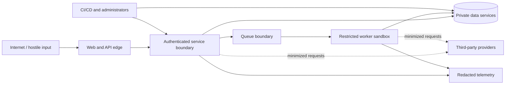

# CareerOS security threat model

Status: baseline; update with every data-owning or trust-boundary change  
Method: asset/trust-boundary analysis with STRIDE-style threat enumeration  
Last reviewed: 2026-07-14

## Scope and current posture

This model covers the browser, Next.js application, FastAPI API, Celery workers,
PostgreSQL/pgvector, Redis, S3-compatible object storage, external providers,
administration, CI/CD, and operational telemetry.

Phase 0 contains local platform skeletons and fictional demo content only. It does
not yet accept authentication, uploads, private career data, job URLs, model
requests, exports, billing, or administrator actions. Controls described for
those paths are required target controls, not claims of implementation. Phase 0
must still protect secrets, dependency integrity, health endpoints, container
boundaries, and logs.

## Security objectives

1. A person can access only data and operations authorized for their user and
   current tenant.
2. Career documents, evidence, contacts, and account data remain confidential and
   purpose-limited across storage, telemetry, providers, support, and backups.
3. Provenance, evidence state, score inputs, resume versions, consent, and audit
   records retain integrity and explainability.
4. Hostile documents, URLs, and text cannot execute, pivot into internal services,
   exhaust unbounded resources, or change system/model policy.
5. The product remains available under abusive authentication, upload, analysis,
   AI-cost, and queue patterns with controlled degradation.
6. Users retain meaningful review, export, deletion, and session control.

## Assets and classification

| Class                        | Examples                                                                                                                  | Handling baseline                                                                                    |
| ---------------------------- | ------------------------------------------------------------------------------------------------------------------------- | ---------------------------------------------------------------------------------------------------- |
| Restricted authentication    | Password hashes, session/refresh/reset/verification tokens, OAuth secrets, signed URL credentials                         | Never log; hash tokens at rest; managed secrets; narrow access; rotate/revoke                        |
| Restricted career content    | Raw resumes, evidence documents, performance excerpts, application answers, contact details, job notes, interview stories | Private encryption; ownership scope; no analytics payload; provider minimization; retention/deletion |
| Confidential structured data | Parsed profile, evidence graph, scores/features, applications, contacts, model inputs/outputs                             | Ownership and purpose checks; encrypted transport/storage; audited sensitive access                  |
| Security/audit data          | Consent, audit events, access history, hashes, redacted errors                                                            | Integrity/retention controls; no raw document content; limited admin access                          |
| Internal operational data    | Queue/job state, traces, cost/usage, feature flags                                                                        | Redacted IDs; least privilege; bounded retention                                                     |
| Public                       | Marketing content, published policies, public role taxonomy                                                               | Integrity and release review; no user-specific values                                                |
| Fictional demo               | Seeded preview profile and metrics                                                                                        | Explicitly labeled; isolated from production accounts and analytics                                  |

Embeddings inherit the classification of their source. They are not anonymous and
must be deleted, exported, and access-controlled with the source record.

## Actors

- Legitimate guest, individual user, organization member, coach, and administrator.
- Curious or malicious authenticated user attempting cross-user access.
- Unauthenticated attacker, credential stuffer, bot, and cost/availability abuser.
- Malicious file/job author embedding exploits or prompt instructions.
- Compromised or over-privileged provider, administrator, dependency, CI runner,
  support operator, or deployment credential.
- Accidental insider making an unsafe query, log, export, or configuration change.

## Trust boundaries

Each arrow is authenticated, encrypted outside a local-only network, least-
privilege, bounded, and observable. Local Compose connectivity is not evidence of
a safe production network policy.

## Security invariants

- A resource ID, object key, queue message, signed URL, role claim, or hidden UI
  control is never sufficient authorization.
- Every user-owned operation applies authenticated subject plus tenant/owner
  scope at the database/service boundary.
- Raw untrusted content is data, never executable instructions.
- Unsupported or ungrounded model output cannot become an accepted claim.
- Objects are private and randomized; original and exported documents are
  immutable, hashed, and linked to exact versions.
- Secrets, raw documents, and tokens never enter logs or analytics by default.
- Required security provider failure is explicit and fails closed or quarantines;
  it never silently becomes a no-op.
- Administrative access does not imply blanket access to raw career content.

## Threat and control register

| ID  | Threat / abuse case                                                    | Primary controls                                                                                                                                                                                                          | Verification                                                           | Residual risk / owner                                                 |
| --- | ---------------------------------------------------------------------- | ------------------------------------------------------------------------------------------------------------------------------------------------------------------------------------------------------------------------- | ---------------------------------------------------------------------- | --------------------------------------------------------------------- |
| T01 | Broken access control / IDOR by changing UUID                          | Ownership-scoped repository methods; tenant context; deny-by-default policies; task/object recheck; cross-user audit                                                                                                      | API integration and signed-object tests change IDs/tenant headers      | Policy/query omissions remain possible; every data phase              |
| T02 | Tenant-isolation failure through joins, search, analytics, or pgvector | Ownership columns/indexes; scoped joins/vector filters; aggregation thresholds; no client-selected unrestricted tenant                                                                                                    | Static query review, adversarial multi-tenant fixtures, property tests | Future org delegation complexity; Phases 1–10                         |
| T03 | Public/signed object leakage or key guessing                           | Private buckets; randomized tenant-scoped keys; short-lived operation-specific URLs; content disposition; authorization before issue/finalize                                                                             | Cross-user URL, expiry, method, object-list denial tests               | URL forwarding within short TTL; Phase 2                              |
| T04 | File polyglot, wrong extension, malformed parser exploit               | Signature and MIME allowlist; parser isolation; patched libraries; safe failure; original quarantine                                                                                                                      | Malformed/polyglot/wrong-extension corpus                              | Unknown parser zero-days; sandbox and rapid patching; Phase 2         |
| T05 | Malware or macro-enabled document                                      | Malware scan before parsing; reject/quarantine macro formats; never invoke office macros/content                                                                                                                          | EICAR and macro fixtures in isolated test environment                  | Scanner evasion; layered isolation; Phase 2                           |
| T06 | Zip/decompression bomb or huge document                                | Compressed/uncompressed byte, entry, ratio, page, CPU, memory, and wall-clock limits; streaming; kill worker                                                                                                              | Oversized, nested archive, long/image-heavy fixtures                   | Resource exhaustion below thresholds; tune/load test                  |
| T07 | Path traversal / unsafe temporary filenames                            | Server-generated keys/names; ignore archive paths; canonical temp root; no user path joins; cleanup finally/timeout                                                                                                       | Traversal and symlink fixture tests                                    | Library-level extraction behavior; Phase 2                            |
| T08 | Uploaded content executes or reaches network                           | No execution; restricted UID/filesystem/capabilities; no unnecessary egress; CPU/memory/time caps; disposable workdir                                                                                                     | Sandbox policy test and egress denial smoke                            | Local Compose is less isolated; production gate Phase 10              |
| T09 | SSRF through job URL, redirects, DNS rebinding, alternate IP forms     | HTTP(S) only; normalized URL; resolve and validate every connection/redirect; block loopback/private/link-local/metadata/reserved IPv4/IPv6; pinned connection; proxy with egress allow policy; time/byte/redirect limits | IPv4/IPv6/decimal DNS-rebind/redirect/metadata test server             | Public server may proxy sensitive content; sanitize/minimize; Phase 5 |
| T10 | Remote script/content injection from job import                        | Fetch raw response without browser execution; content-type allowlist; sanitize; store text/source safely; CSP and output encoding                                                                                         | Script/event-handler/SVG/HTML fixtures                                 | Sanitizer bypass; plain-text default                                  |
| T11 | SQL injection or unsafe dynamic filters                                | SQLAlchemy parameters; allowlisted sort/filter fields; no model output in SQL; least-privilege DB role                                                                                                                    | Injection API tests and code scanning                                  | Unsafe future raw SQL; review gate                                    |
| T12 | Stored/reflected/DOM XSS or model-output injection                     | React escaping; HTML sanitizer only where rich text required; CSP; safe links; no dangerous HTML; validate model output                                                                                                   | XSS corpus, component/e2e CSP tests                                    | Rich editor/preview surface; Phases 6–7                               |
| T13 | CSRF on cookie-authenticated mutation                                  | SameSite cookies, CSRF token/origin checks, safe method semantics, CORS allowlist                                                                                                                                         | Cross-origin mutation tests                                            | Browser behavior/config drift; Phase 1                                |
| T14 | Credential stuffing, enumeration, brute force                          | Generic responses; IP/account/device-aware limits; progressive delay; breached-password policy where lawful; email verification; monitoring                                                                               | Abuse/load tests; response equivalence                                 | Distributed botnets and user reuse; Phase 1                           |
| T15 | Session theft/replay/fixation                                          | Secure HTTP-only scoped cookies; rotate hashed refresh/session secrets; invalidate on logout/reset/delete; short lifetimes; session UI; OAuth state/PKCE                                                                  | Replay, rotation, fixation, logout-all tests                           | Compromised endpoint/browser; optional MFA later                      |
| T16 | Password/reset/token compromise                                        | Argon2id calibrated parameters; strong random one-time hashed tokens; expiry/rate limits; no token logging; email-link origin allowlist                                                                                   | Hash configuration and reuse/expiry tests                              | Email-account compromise; Phase 1                                     |
| T17 | Rate-limit bypass or costly endpoint abuse                             | Limits at edge and application keyed by IP/account/tenant/device; normalized identity; quotas, concurrency and body caps; backpressure                                                                                    | Header/IP variants, distributed/concurrency/load tests                 | Proxy attribution errors; tune with telemetry                         |
| T18 | Prompt injection in resume, evidence, or job                           | Treat content as quoted untrusted data; separate system policy; strip/flag unsafe control chars; least-data prompts; no tools by default                                                                                  | Adversarial golden fixtures and policy regression                      | Novel semantic injections; deterministic verifier is final gate       |
| T19 | AI fabricates/changes factual claim                                    | Strict schema; evidence IDs and claim ledger; deterministic entity/number/technology/credential checks; reject/question; explicit user review                                                                             | Unsupported claim, changed ownership/date, metric grounding tests      | Paraphrase meaning detection; high-risk confirmation                  |
| T20 | Malformed or malicious model output reaches shell/SQL/HTML/path        | Parse/validate strict JSON; bounded strings/enums; output encoding; never execute or directly interpolate                                                                                                                 | Schema fuzz and sink-specific tests                                    | Downstream library bug; keep privilege minimal                        |
| T21 | Sensitive data leaks to AI provider                                    | Field/purpose minimization, configurable redaction, consent, no provider training by default, approved regions/retention, DPA, provider disable switch                                                                    | Payload snapshot/privacy tests                                         | Provider/legal changes; Phase 6 review                                |
| T22 | Sensitive data leaks through logs, traces, errors, analytics           | Central redaction, allowlisted fields, route templates not raw URLs, safe IDs, payload-free events, production error masking                                                                                              | Secret/PII canary tests and log review                                 | Free-form exceptions; structured logging only                         |
| T23 | Excessive AI or render cost                                            | Per-user/tenant/plan quota, idempotency, max tokens/pages, concurrency, timeouts, circuit breaker, cost accounting and alerts                                                                                             | Retry/idempotency/budget tests                                         | Provider price/usage spikes; configurable kill switch                 |
| T24 | Queue replay, forged job, duplicate side effect                        | Authenticated private broker; durable job record; ownership/state/idempotency check; payload references not raw secrets; bounded retry/dead letter                                                                        | Duplicate/reordered/forged payload tests                               | Redis local durability differs from production; deployment ADR        |
| T25 | Dependency or build compromise                                         | Lockfiles/hashes, least-privilege CI, pinned actions/images, review of updates, SCA/container/secret scanning, provenance and SBOM objective                                                                              | CI security jobs and reproducible build                                | Registry/upstream compromise; ongoing                                 |
| T26 | Secret committed or exposed in image/client                            | `.env.example` placeholders; secret scanning; server-only vars; build/image inspection; managed secret injection                                                                                                          | Git/image/bundle secret scans                                          | Human error or CI artifact leakage                                    |
| T27 | Admin abuse or support overreach                                       | Separate role/permissions, just-in-time purpose-bound access, no raw default, re-auth/MFA target, immutable audit, alerts, dual control for destructive actions                                                           | Permission matrix and audit tests                                      | Authorized insider misuse; governance and monitoring                  |
| T28 | Audit tampering or missing evidence                                    | Append-oriented audit store, server-generated actor/request/time, restricted mutation, retention/export controls, coverage tests                                                                                          | Critical-action audit assertions                                       | DB superuser compromise; external/WORM export later                   |
| T29 | Data remains after deletion or appears in backup/vector/cache          | Data inventory and erasure orchestration; tombstones; object/vector/cache/provider deletion; backup expiry policy; status to user                                                                                         | End-to-end deletion and restore-window tests                           | Immutable backup retention; disclose and minimize                     |
| T30 | Billing webhook replay/forgery                                         | Signature/timestamp verification, raw-body validation, event idempotency, state-machine constraints, amount/plan lookup server-side                                                                                       | Replay/order/signature tests                                           | Provider account compromise; Phase 10                                 |
| T31 | Denial of service against API, DB, queue, object store                 | Body/query bounds, timeouts, pools, backpressure, per-tenant concurrency, queue isolation, autoscaling and graceful degradation                                                                                           | Load/soak/failure tests                                                | Large distributed attack; upstream protection                         |
| T32 | Sensitive health/readiness metadata disclosure                         | Minimal status/version; no credentials, stack traces, hostnames, bucket names, or raw dependency errors; admin detail separately protected                                                                                | Response snapshot tests                                                | Version fingerprinting; patch promptly                                |
| T33 | Cache key collision or cross-tenant result reuse                       | Namespace by environment/version/tenant/user/resource; cache only authorized representations; short TTL/invalidation                                                                                                      | Cross-tenant cache tests                                               | Future caching complexity; introduce only with tests                  |
| T34 | OAuth account-link takeover                                            | State, nonce, PKCE, exact redirect allowlist, verified provider identity, explicit authenticated link/unlink, conflict handling                                                                                           | Login/link CSRF and provider-account collision tests                   | Compromised provider identity; Phase 1                                |
| T35 | Insecure deletion/reset/retry operation                                | Re-auth for sensitive actions, confirmation, ownership, idempotency, audit, safe allowlisted retry states                                                                                                                 | Cross-user/replay/unsafe retry tests                                   | Social engineering; clear UX and notices                              |

## File-processing security design

### Admission

The API issues a single-purpose, short-lived upload intent only after plan/rate and
ownership checks. It records expected media/size and a randomized private object
key. Finalization treats browser metadata as assertions, not proof, and verifies
actual bytes before queuing.

Initial accepted types are PDF and DOCX. Macro-enabled Office formats, archives,
executables, encrypted documents that cannot be inspected, and unsupported types
are rejected with a safe user-facing reason. Limits are configuration with secure
upper bounds, not user-controlled values.

### Quarantine and processing

New objects remain quarantined. A restricted worker streams the object into a
fresh randomized temporary directory, applies signature/size/expansion/page and
malware checks, and only then routes to extraction. It runs as a non-root user
with read-only base filesystem, minimal capabilities, bounded CPU/memory/PIDs,
wall-clock timeout, and no unnecessary network. It never executes embedded
scripts, macros, fonts, links, or attachments.

Temporary data is removed in a `finally` path and by a periodic orphan cleanup.
Crashes/timeouts leave the durable job in a safe state and the object quarantined.
The API exposes a generic failure code; detailed parser diagnostics are redacted
and restricted.

### Storage and lifecycle

Originals are immutable and versioned only where retention policy needs it.
Parsed content, OCR output, thumbnails, and exports use separate keys and
authorization. Downloads set a safe filename and attachment disposition. Object
hashes support integrity and deduplication detection, but cross-user deduplication
must not reveal document existence.

Guest objects use a shorter default lifecycle and an opaque capability. Account
conversion requires explicit consent and ownership transfer. Deletion covers
original, derivatives, embeddings, queued work, caches, and provider artifacts,
subject to a documented backup-expiry window.

## URL-import security design

The server, never the user's browser session, performs a constrained fetch. URL
normalization rejects credentials, fragments where irrelevant, unsupported
schemes, ambiguous hosts, and malformed encodings. Resolution validates all
addresses; connection uses the validated destination while preserving correct TLS
hostname verification. Each redirect repeats policy and DNS checks. IPv4-mapped
IPv6 and alternate address representations are normalized before network-range
decisions.

The fetcher caps DNS/connect/read/total time, redirects, decompressed bytes, and
content type. It does not send user cookies or internal credentials and does not
execute JavaScript. A production egress proxy/firewall blocks metadata and private
networks even if application validation fails.

## AI and grounding security design

Documents are surrounded by fixed untrusted-data delimiters and cannot supply
system or tool instructions. Providers receive the minimum required fields and
opaque evidence IDs. Tool use is disabled unless a future reviewed capability
needs a narrow allowlisted tool.

Model output first passes size/JSON/schema validation, then the deterministic
grounding verifier described in `docs/ai-grounding-policy.md`. Unknown evidence
IDs, unsupported facts, unconfirmed numbers, entity/date changes, or changed
contribution semantics are rejected. Rejected output may produce a safe
clarifying question but never an exportable claim.

Prompt/model/provider versions, input evidence IDs, validation outcome, usage,
and cost are recorded without raw prompt logging. The display layer escapes
output and enforces the same content policy after a user's manual edit.

## Authentication and authorization design

Phase 1 uses FastAPI-owned sessions. Passwords use Argon2id with calibrated cost.
Session/refresh secrets are high-entropy, hashed in storage, bound to a session
record, rotated on use, and revoked on logout, password reset, account deletion,
or suspicious reuse. Cookies are Secure and HTTP-only in production with an
appropriate SameSite policy; state-changing requests use CSRF defenses.

OAuth uses exact redirect URIs, state, nonce, and PKCE. Account linking requires
an authenticated session or a verified conflict-resolution flow; provider email
alone is not always sufficient proof.

Each service method receives an authorization context and queries by both owner/
tenant and UUID. Background jobs store owner/tenant and reauthorize durable
resources. Organization roles grant explicit capabilities, not blanket tenant
reads. Admin capabilities are separate and audited.

## Privacy, retention, and consent

- Default: user content is not used to train models.
- Record consent purpose, policy version, timestamp, and revocation.
- Minimize data sent to providers and negotiate retention/data-use terms before
  enabling a production provider.
- Define lifecycle by class: unfinalized upload, guest document, active account,
  archived evidence, audit/security log, deleted account, backup, and billing
  record. Exact durations are a Phase 10 policy decision; indefinite raw-document
  retention is not an acceptable default.
- Data export includes understandable structured records and files with integrity
  metadata; it excludes other tenants and internal security secrets.
- Erasure is a tracked, idempotent job with per-store status and retry/dead-letter
  handling. Legal retention exceptions are narrow and disclosed.

## Logging and monitoring requirements

Allowlisted structured fields include timestamp, level, service, environment,
route template, status, duration, request/trace ID, opaque actor/tenant/resource
ID, job type/status/retry, provider identifier, token/cost counts, and redacted
error code. Do not record request/response bodies, raw query content, document
text, generated prose, prompt text, object signed URLs, secrets, or tokens.

Alert on repeated auth failures/session reuse, authorization denials and ID
enumeration patterns, upload/scanner/parser anomalies, SSRF policy blocks, rate-
limit spikes, queue age/retries/dead letters, AI budget/grounding failures,
administrator sensitive actions, and deletion/retention failures.

## Required security tests by phase

| Phase | Blocking security evidence                                                                                                                                          |
| ----- | ------------------------------------------------------------------------------------------------------------------------------------------------------------------- |
| 0     | Secret/dependency/container scan foundation; minimal health responses; no real PII in fixtures/logs; Compose services not unintentionally public beyond local needs |
| 1     | Registration/session/reset/OAuth abuse tests; CSRF; rotation/replay; anonymous and cross-user/tenant authorization; audit coverage                                  |
| 2     | Hostile upload corpus; signature/limit/malware/expansion/path/timeout; worker egress/resource policy; object-key and deletion isolation                             |
| 3     | Evidence transition/provenance/ownership; attachment access; unsupported evidence exclusion; conflict audit                                                         |
| 4     | Taxonomy input validation and cross-user saved-role/readiness history isolation                                                                                     |
| 5     | SSRF matrix, sanitizer, source-span integrity, URL limits, hard-gap integrity, prompt-injected job text                                                             |
| 6     | Strict-output fuzzing, unsupported claim/number rejection, prompt injection, cost/idempotency, XSS-safe diff/render, manual-edit revalidation                       |
| 7     | Template injection, renderer sandbox, round-trip grounding/integrity/hash, private export, immutable version/restore                                                |
| 8     | Application/contact/document authorization; consistency checks; stage/action audit; no autonomous submission                                                        |
| 9     | Contact consent, sensitive notes isolation, analytics aggregation/privacy and non-causal language                                                                   |
| 10    | Billing webhook, admin matrix/audit, end-to-end export/deletion, backup restore, load/DoS, penetration test, dependency/container/IaC scan                          |

## Phase 0 security checklist

- [x] `.env.example` contains no real secret and actual `.env` files are ignored.
- [x] Web/API/worker images run without development servers or embedded secrets.
- [x] Health endpoints return minimal safe data; readiness fails on required
      dependency loss without returning credentials or raw stack traces.
- [x] PostgreSQL, Redis, and MinIO use explicit local-only credentials and are not
      presented as production configuration.
- [x] Container services use health checks, bounded restart behavior, and named
      volumes; unnecessary host ports are avoided or documented.
- [x] CI installs from committed lockfiles and runs format/lint/type/test/build plus
      available secret/dependency/container scans.
- [x] Fictional UI fixtures are labeled and contain no real private data.
- [x] `make verify` and Compose health are green in the integrated working tree.

These checks are regression gates; a later failure reopens the affected phase in
`PLANS.md`.

## Incident and recovery expectations

Phase 10 must document owners and playbooks for credential/session compromise,
tenant data exposure, malicious upload/parser exploit, provider data incident,
prompt/grounding bypass, queue/cost runaway, admin abuse, object exposure, and
deletion/backup failure. Immediate capabilities include provider/feature kill
switches, token/session revocation, object quarantine, queue pause, key rotation,
audit preservation, affected-user assessment, and legally appropriate notice.

Backup is not complete until a restore into an isolated environment verifies
integrity, ownership, migrations, object references, and documented RPO/RTO.

## Open decisions and residual risks

- Production region, data residency, retention durations, RPO/RTO, identity email,
  AI/OCR/parser/scanner/billing providers, queue service, and support-access process
  are not selected.
- No application sandbox fully eliminates parser zero-day risk; isolation,
  patching, corpus testing, and kill switches remain necessary.
- Semantic grounding cannot perfectly detect meaning drift. High-risk claims,
  numbers, leadership, and ownership require stricter deterministic checks and
  user confirmation.
- Distributed abuse can defeat simple rate keys. Edge controls and telemetry must
  complement application quotas.
- Backups and third-party retention delay physical erasure; policy and user
  messaging must describe the bounded window accurately.
- Phase 0 local Compose is not hardened for hostile multi-user or internet-facing
  use.
- The high-severity image gate has two exact-version exceptions in `.grype.yaml`:
  CPython 3.13.14 `CVE-2026-15308` has no supported 3.13 fix and the Phase 0 API
  does not parse untrusted HTML; Next.js 16.2.10 vendors undici 6.26.0 affected by
  WebSocket-only `GHSA-vxpw-j846-p89q`, while Phase 0 has no WebSocket client path.
  A Python base-image or Next.js update must remove the corresponding exception.

Any new external data flow, public endpoint, file type, AI tool, administrator
capability, authentication method, or tenant-sharing feature requires this model
to be reviewed before release.
